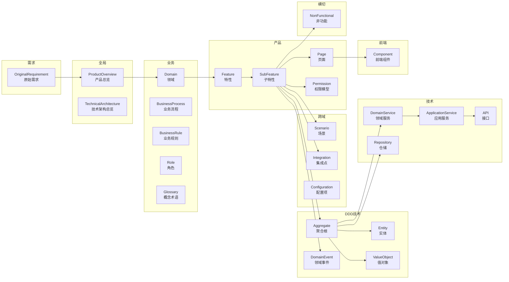
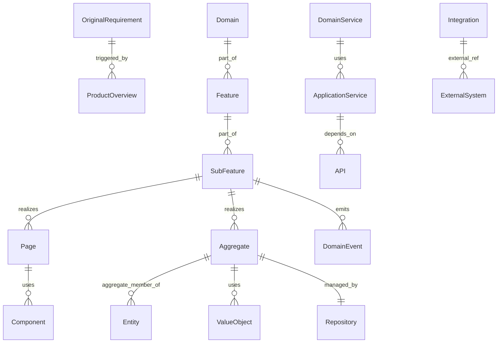
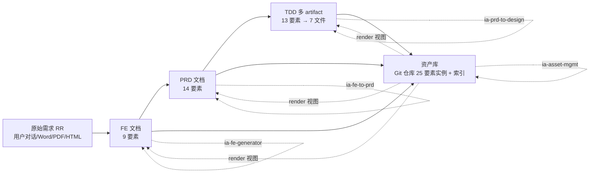
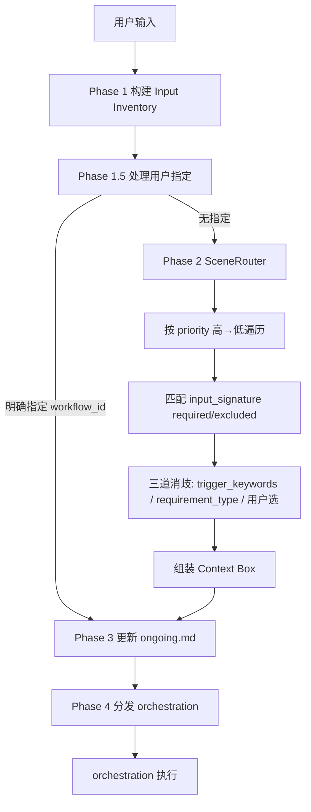
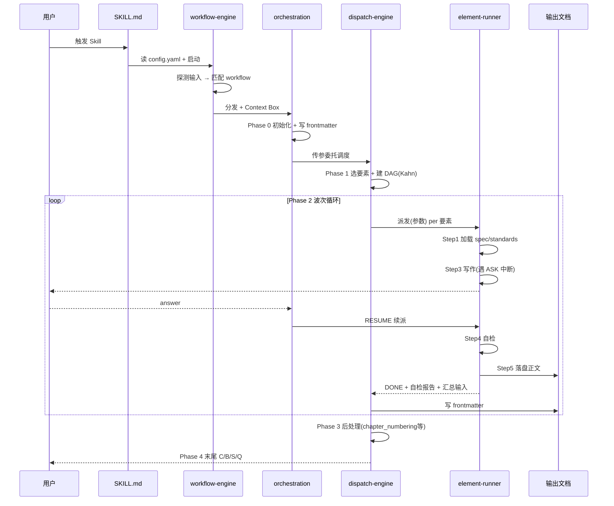
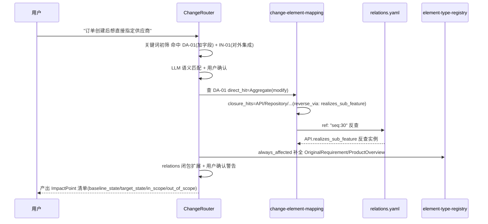

# PRD — 要素驱动 AI 研发方法论

> 本 PRD 将「要素驱动 AI 研发方法论」作为一个产品进行规格化定义。产品本体是一套基于 Skill 的设计文档生成与资产沉淀平台，覆盖 RR → FE → PRD → TDD → Asset 的翻译链，核心目标是把软件研发每一级的解空间收敛到合理解，规避错误解。
>
> 本文档基于仓库 `bakskill/` 与 `docs/` 的实际产物反向推演生成，所有事实均可追溯到源文件。

---

## 一、定位与目标

### 1.1 用户和干系人

| 类型 | 角色名称 | 描述 |
|------|----------|------|
| 目标用户 | 业务方案架构师（FE 作者） | 通过对话式发现或文档导入，把模糊业务想法整理为结构化 FE（业务方案）文档 |
| 目标用户 | 产品经理（PRD 作者） | 把已确认的 FE 翻译为可实施的 PRD，并对历史 PRD 做评审修改与增量设计 |
| 目标用户 | 技术架构师（TDD 作者） | 在已确认 PRD 基础上产出多文件技术方案设计（架构/数据/后端/前端/集成/配置） |
| 目标用户 | 资产管理员 | 维护要素资产库：抽取、合并、渲染、影响分析与代码反向纠偏 |
| 干系人 | AI Coding 工程链路 | 消费 TDD 产出的 code_anchors 与 Story 验收标准，确定性定位代码改动点 |
| 干系人 | 研发管理者 | 关注解空间收敛是否在系统全生命周期持续成立，关注评审质量与一致性门禁 |
| 干系人 | Skill 平台维护者 | 维护引擎权威源、共享元模型、规范扩展机制 |

### 1.2 痛点和价值

| # | 核心问题 | 解决方案 | 预期价值 |
|---|----------|----------|----------|
| 1 | LLM 缺上下文、不发问、不可复现，同一份输入换模型或换次运行就落到不同乃至错误产物 | 用 Skill 逐级生成文档（FE→PRD→TDD），每级让人确认后再往下，并把确认内容沉淀为规格与要素，持续约束解空间 | 同一 PRD 经多次运行/不同模型，产物落在合理范围内（可量化：关键要素复现一致率 ≥ 90%） |
| 2 | SDD 把战场提到 spec 层，但 spec 仍是一句话生成的自然语言文档，解空间依旧大于一、对错未界定 | 用 25 类要素 + 10 种关系 + 字段级 schema 把"这段文档怎么写"的解空间收窄到字段契约级 | 要素字段级契约覆盖率 100%，无悬空 ID / 不可解析 Section |
| 3 | 增量场景下"文档作唯一载体"撞三堵墙：增量须合并回全量、文档膨胀后再生劣化、阶段割裂到不了代码 | 把载体从"文档"升级为"要素"，资产库始终是最新全量；技术要素带 code_anchors 直达代码文件 | 增量分析从"通读历史文档推测"升级为"沿关系图谱分析"，影响分析定位精度到代码文件级 |
| 4 | 引擎与业务耦合，新增场景/要素就要改引擎，难以横向复制到 FE/PRD/TDD/Asset | 五层架构 + 三引擎业务无感知，注册即生效、引擎不动；同类 Skill 共用同一份引擎物理拷贝 | 新增一个要素只改注册表 + 加 spec/standards 文件，引擎零改动；新增同类 Skill 复用率 ≥ 80% |
| 5 | 弱 LLM 也能机械执行建成可运行 Skill 是高门槛工程 | 《设计文档 Skill 构建规范 v1.5》提供完整实现方案 + 红线清单 + 自检清单，照此规范即便能力一般的 LLM 也能机械执行 | 规范覆盖 5 层 / 3 引擎 / 25 要素 / 23 变化点，全部带 MUST 级校验 |

### 1.3 范围和边界

| 包含范围 | 不包含范围 |
|----------|-----------|
| 设计文档 Skill 通用架构（五层 + 三引擎 + 共享元模型） | 不包含具体业务系统的领域实现（订单/采购/供应商等仅为示例） |
| 三个文档生成 Skill：ia-fe-generator / ia-fe-to-prd / ia-prd-to-design | 不包含 ia-asset-mgmt 的完整实现（元模型与抽取规格已定义，运行时占位 planned） |
| 0→1（build）全场景与 1→n（incremental）变化点路由机制 | 不包含 1→n 的 modify/deprecate 全部资产库运行时（占位 planned） |
| 25 类要素 + 39 条关系 + 23 个原子变化点的元模型定义 | 不包含测试三要素（TestScenario/TestCase/TestData）的运行时（暂缓清单，待 ia-test-design 启用） |
| 引擎权威源 docs/engine-canonical 与共享元模型 docs/shared-metamodel | 不包含官方 /skill-creator 本体（仅做兼容契约映射） |
| 三种 dispatch（workflow-engine / dispatch-engine / element-runner） | 不包含部署期 spec→agent 抽取脚本的运行时实现（预留接口） |

> 来源：仓库 `docs/shared-metamodel/README.md` §5 暂缓清单、`docs/4.0 设计文档Skill构建规范_V1.5.md` §6.6 全场景可运行性结论

### 1.4 产品目标

| 目标编号 | 描述 | 优先级 |
|----------|------|--------|
| G1 | 建成设计文档 Skill 通用架构，FE/PRD/TDD/Asset 四 Skill 同构、跑通同一套引擎 | P0 |
| G2 | 把每一级规格的解空间收敛到合理解，规避 LLM 不可复现导致的错误解 | P0 |
| G3 | 支撑 0→1 全量生成与 1→n 增量演进，增量分析沿要素关系图谱而非通读文档 | P0 |
| G4 | 数据与控制绝对分离：引擎业务无感知，业务差异 100% 由 spec/standards/registry 表达 | P1 |
| G5 | 强制对齐官方 /skill-creator，所产 Skill 必过校验 + package_skill.py 打包 | P1 |
| G6 | 把载体从"文档"升级为"要素资产库"，让解空间收敛在系统全生命周期持续成立 | P2 |

### 1.5 成功标准

| 标准 | 衡量方式 | 目标值 |
|------|----------|--------|
| 架构合规性自检清单全绿 | 附录 B 自检项逐条核对 | 100% 通过 |
| 引擎跨 Skill 一致 | 四 Skill 的 engine/ENGINE-VERSION 与 docs/engine-canonical 一致 | 4/4 一致 |
| 元模型一致性门禁全绿 | shared-metamodel §6 四道门禁（三方属性名对齐 / id 闭包 / ref 有效 / 计数） | 25 类 / 39 关系 / 10 evolve / 2 always_affected / 23 变化点全对账 |
| 要素级追溯完整性 | Goal→Requirement→AC→Design facets→Task→Test→Evidence 链可解析 | 0 悬空 ID |
| 弱 LLM 可机械执行 | 能力一般的 LLM 按 spec Step 序列产出符合 MUST 级约束的产物 | 占位符/空内容/缺依赖阻断率 = 0 |
| 跨模型复现一致性 | 同一 PRD 经不同模型/多次运行，关键要素字段一致 | ≥ 90% |

---

## 二、信息架构

> 本章定义产品的核心实体（要素类型）与关系，对应共享元模型 `docs/shared-metamodel/`。要素身份/关系/schema/变化点五件套是唯一权威源，物理拷贝进各 Skill 的 `registry/`，严禁 Skill 内私改。

### 2.1 要素全景（25 类 + 3 暂缓）



### 2.2 要素清单与分阶段归属

| 要素 ID（大驼峰） | 中文名 | 分组 | emerge_stage | evolve_stages | always_affected | single_instance | store_path |
|---|---|---|---|---|---|---|---|
| OriginalRequirement | 原始需求 | 需求 | FE | [] | true | false | `_requirements/{id}.md` |
| ProductOverview | 产品总览 | 全局 | FE | [PRD] | true | true | `_product/product-overview.md` |
| TechnicalArchitecture | 技术架构总览 | 全局 | TDD | [] | false | true | `_product/technical-architecture.md` |
| BusinessProcess | 业务流程 | 业务 | FE | [] | false | false | `_common/processes/{id}.md` |
| BusinessRule | 业务规则 | 业务 | FE | [PRD] | false | false | `{domain}/product/rules/{id}.md` |
| Role | 角色 | 业务 | FE | [] | false | false | `_common/roles/{id}.md` |
| Glossary | 概念术语 | 业务 | any | [] | false | false | `_common/glossary/{id}.md` |
| Domain | 领域 | 业务 | PRD | [] | false | false | `{domain}/domain.md` |
| Feature | 特性 | 产品 | PRD | [] | false | false | `{domain}/product/features/{id}.md` |
| SubFeature | 子特性 | 产品 | FE | [PRD] | false | false | `{domain}/product/sub-features/{id}.md` |
| Page | 页面 | 产品 | FE | [PRD] | false | false | `_pages/{module}/{id}.md` |
| Permission | 权限模型 | 产品 | PRD | [] | false | false | `{domain}/product/permissions/{id}.md` |
| Scenario | 场景 | 跨域 | PRD | [] | false | false | `_common/scenarios/{id}.md` |
| Integration | 集成点 | 跨域 | PRD | [TDD] | false | false | `_common/integrations/{id}.md` |
| Configuration | 配置项 | 跨域 | PRD | [TDD] | false | false | `_common/configurations/{id}.md` |
| Aggregate | 聚合根 | DDD | PRD | [TDD] | false | false | `{domain}/technical/aggregates/{id}.md` |
| Entity | 实体 | DDD | PRD | [TDD] | false | false | `{domain}/technical/entities/{id}.md` |
| ValueObject | 值对象 | DDD | TDD | [] | false | false | `{domain}/technical/value-objects/{id}.md` |
| DomainEvent | 领域事件 | DDD | PRD | [TDD] | false | false | `{domain}/technical/events/{id}.md` |
| DomainService | 领域服务 | 技术 | TDD | [] | false | false | `{domain}/technical/services/{id}.md` |
| ApplicationService | 应用服务 | 技术 | TDD | [] | false | false | `{domain}/application/services/{id}.md` |
| Repository | 仓储 | 技术 | TDD | [] | false | false | `{domain}/technical/repositories/{id}.md` |
| API | 接口 | 技术 | TDD | [] | false | false | `{domain}/technical/apis/{id}.md` |
| Component | 前端组件 | 前端 | TDD | [] | false | false | `_pages/{module}/components/{id}.md` |
| NonFunctional | 非功能 | 横切 | FE | [PRD, TDD] | false | false | `_common/non-functional/{id}.md` |

**暂缓清单**（待 ia-test-design 启用，本阶段不产）：TestScenario / TestCase / TestData，及 6 条测试关系。

### 2.3 关系类型（10 种 / 39 条合法组合）

关系属性名 `source_property` + 编号 `seq` 是唯一权威，三方对齐铁律：**relations.yaml `source_property` ＝ element-types 的关系字段名 ＝ change-element-mapping 的 `reverse_via`**，逐字相等，由门禁强校验。

| 关系名 | 语义 | source_property 示例 | 用途 |
|---|---|---|---|
| part_of | 部分→整体，可独立访问 | — | 分类归属查询 |
| aggregate_member_of | DDD 一致性边界（同事务/级联删/不可独立访问） | aggregate_member_of | 影响分析判断事务边界与级联 |
| uses | 弱引用 | uses | 反向引用查询 |
| depends_on | 强依赖 | depends_on | 影响分析（强约束传播） |
| managed_by | 持久化归属 | managed_by | 仓储归属反查 |
| realizes | 实现 | realizes_sub_feature | 接口/页面 realize 子特性 |
| emits | 发消息 | emits | 消息链路查询 |
| subscribes_to | 订阅 | subscribes_to | 消息链路查询 |
| triggered_by | 溯源 | triggered_by | 血缘回溯到原始需求 |
| external_ref | 跨界 | external_ref | 跨界依赖查询 |

### 2.4 实体详情

#### 2.4.1 OriginalRequirement（原始需求，E-OR）

| 字段 | 类型 | 必填 | 说明 |
|---|---|---|---|
| id | string | 是 | RR-{NNN} 全局唯一 |
| version | string | 是 | 仅本要素有 version 字段 |
| raw_text | text | 是 | 原文一字不改 |
| proposed_by | string | 是 | 提出人 |
| lineage.triggered_by | ref[] | 否 | 触发的下游要素（追溯链起点） |

#### 2.4.2 Aggregate（聚合根，E-AG）

| 字段 | 类型 | 必填 | 说明 |
|---|---|---|---|
| id | string | 是 | AGG-{DOMAIN}-{NAME} |
| domain | ref→Domain | 是 | seq=4 归属领域 |
| fields | Field[] | 是 | 字段级契约（含类型/必填/枚举） |
| state_machine | StateMachine | 否 | seq=状态机 |
| aggregate_member_of | ref→Aggregate | 否 | seq=7 一致性边界 |
| value_object | ref→ValueObject | 否 | seq=18 引用值对象 |
| code_anchors | CodeAnchor[] | 否 | 直达代码文件（"分析到代码"关键） |

> 完整 25 类字段 schema 见 `docs/shared-metamodel/element-types/{Type}.yaml`，此处仅列代表性要素。

### 2.5 实体关系图（ER 概览）



---

## 三、应用架构

### 3.1 五层架构模型

```mermaid
flowchart TB
    L1[L1 入口层<br/>SKILL.md / config.yaml / ongoing.md<br/>触发 + 全局约束 + 路径 + 状态锚点]
    L2[L2 引擎注入层<br/>workflow-engine / dispatch-engine / element-runner<br/>纯抽象 业务无感知 数据驱动]
    L3[L3 元数据注册层<br/>element-type-registry / relations / element-types<br/>change-element-mapping / atomic-change-registry<br/>workflow / spec-template / input-type / standards registry]
    L35[L3.5 变化点路由层<br/>仅 1→n<br/>口语 → 变化点 → 受影响要素]
    L4[L4 场景编排层<br/>orchestration/o-*.md<br/>主 agent = 调度器]
    L5[L5 设计实现层<br/>spec/&#123;element&#125;.md 怎么做<br/>standards/&#123;element&#125;.md 写成啥样]

    L1 --> L2
    L2 --> L3
    L3 --> L35
    L2 --> L4
    L4 --> L2
    L4 --> L35
    L2 --> L5
```



### 3.2 各层职责边界

| 层 | 职责 | 禁止 |
|---|---|---|
| L1 入口 | 触发声明、启动序列、全局约束、完成提示 | 含要素执行逻辑 |
| L2 引擎 | 路由（workflow-engine）；调度循环（dispatch-engine：选要素+建DAG+波次循环+后处理+确认）；要素执行模板（element-runner Step 0–5） | 硬编码 Skill/要素/工具名；写 frontmatter；代写正文 |
| L3 注册 | 只存元数据（YAML） | 含 Prompt 指令或自然语言执行步骤 |
| L3.5 变化点 | 1→n 二级路由（变化点→受影响要素） | build/create 模式启用 |
| L4 编排 | 宏观流程：选要素、建 DAG、派发 element-runner、ASK/RESUME、写 frontmatter、汇总 | 代写正文；直读 spec；绕过 element-runner |
| L5 实现 | 要素 spec（怎么做）+ standards（写成啥样） | 含调度/状态逻辑 |

### 3.3 三引擎

| 引擎 | 文件 | 职责 | 不可做 |
|---|---|---|---|
| workflow-engine | `engine/workflow-engine.md` | 场景路由：探测输入→匹配 workflow→分发 orchestration | 读 spec/standards；派发 subAgent；写正文 |
| dispatch-engine | `engine/dispatch-engine.md` | 调度循环模板：Phase 1 选要素+建 DAG（Kahn 拓扑）→Phase 2 波次循环→Phase 3 后处理（post_generation_steps 列表驱动）→Phase 4 末尾汇总确认 | 硬编码要素名单；写 frontmatter |
| element-runner | `engine/element-runner.md` | 要素执行模板 Step 0–5：接参→加载规范→读上下文→正文写作（含 ASK 中断）→质量自检→落盘+返回 | 硬编码工具名；写 frontmatter；输出 C/B/S/Q 菜单；返回 artifact 全文 |

### 3.4 系统边界与上下游



### 3.5 技术栈与版本基线

| 维度 | 选型 | 版本 |
|---|---|---|
| Skill 规范 | 设计文档 Skill 构建规范 | v1.5.0（v1.3/v1.4 已弃用） |
| 引擎版本 | engine_version | 2.3.0 |
| ia-fe-generator | version / spec_compliance | 2.0.0 / v1.3.0 |
| ia-fe-to-prd | version / spec_compliance | 2.0.0 / v1.3.0 |
| ia-prd-to-design | version / spec_compliance | 2.3.0 / v1.6.0 |
| 元模型 spec_version | shared-metamodel | 1.0.0 |
| 运行载体 | Claude /skill-creator 兼容 Skill | — |
| 资产库载体 | Git 仓库（按版本运作） | — |

---

## 四、功能特性

> 子特性编号 FR-{特性分类}-{特性}-{序号} 由应用架构章节唯一定义，本章节只引用不重新生成。共 4 个特性分类、12 个子特性。

### 4.1 特性分类总览

| 特性分类 | 特性名称 | 子特性编号范围 |
|---|---|---|
| FC-01 文档生成 | FE 生成 / PRD 生成 / TDD 生成 | FR-01-01-001 ~ FR-01-03-003 |
| FC-02 演进与增量 | 变化点路由 / 增量设计 / 续接恢复 / 评审修改 | FR-02-01-001 ~ FR-02-04-001 |
| FC-03 资产沉淀 | 要素抽取 / 合并入库 / 渲染视图 / 影响分析 | FR-03-01-001 ~ FR-03-04-001 |
| FC-04 平台治理 | 引擎共享同步 / 元模型门禁 / 规范热插拔 / 官方兼容 | FR-04-01-001 ~ FR-04-04-001 |

---

### FR-01-01-001 FE 文档生成（ia-fe-generator）

**UIUX 操作步骤**
1. 用户触发 Skill（说"创建 FE"/"整理业务需求"或导入 Word/PDF/HTML）
2. workflow-engine 探测 `workspace/raw_requirements/` 与对话输入，构建 Input Inventory
3. SceneRouter 匹配 `fe-new-build` workflow，分发 `o-tp-new-build` 编排
4. 主 agent 按 emerge_stage=FE 选 9 要素，建 DAG，逐要素派发 element-runner（inline）
5. 每要素 Step 3 触发 ASK 中断，主 agent 承接交互确认后 RESUME 续派
6. 全部要素完成后末尾一次汇总确认，写 frontmatter.status=completed

**实体操作说明**

| 实体 | 操作类型 | 字段 |
|---|---|---|
| OriginalRequirement | create | id/version/raw_text/proposed_by |
| ProductOverview | create | name_cn/scope/always_affected=true |
| Role/BusinessProcess/BusinessRule/SubFeature/Page/NonFunctional/Glossary | create | 按 schema.fields |

**集成点说明**：无外部集成（输入为对话/文档）

**业务规则**
- BR-FE-001：对话式发现每次聚焦 1-2 个问题，避免信息轰炸
- BR-FE-002：文档抽取必须展示给用户确认，禁止未经确认直接写入 FE

**验收标准**
- AC1: Given 用户说"整理一下这个需求" When workflow-engine 路由 Then 命中 `fe-new-build` 且产出 `workspace/requirements/{version}/FE-*.md` 含 9 要素
- AC2: Given 要素含 [交互] 步 When element-runner Step 3 触发 ASK Then 主 agent 必须等待用户响应后 RESUME，禁止自行补全
- AC3: Given 全部要素完成 When Phase 4 末尾汇总 Then frontmatter.status=completed 且无占位符（[待补充]/TODO/XXX）

---

### FR-01-02-001 PRD 文档生成（ia-fe-to-prd）

**UIUX 操作步骤**
1. 用户触发 Skill（"创建 PRD"/"FE 转 PRD"）
2. workflow-engine 探测 `FE_DOC_COMPLETED` 输入，匹配 `tp-new-build`（priority=40）
3. `o-init-build` 编排 Action 0：校验 FE frontmatter.status==completed，做"多项目共存安全检查"
4. Action 1：从 element-type-registry 过滤 belongs_to=TP 的要素，按 chapter_no 排序生成执行序列
5. 创建唯一 PRD 文档，写入初始 frontmatter，进入要素执行循环
6. 每要素经 element-runner 六阶段，操作菜单 C/B/S/Q 后强制挂起
7. 完成阶段 Action A-D：独立审查 / 质量检查 / 知识沉淀 / 状态更新

**实体操作说明**

| 实体 | 操作类型 | 说明 |
|---|---|---|
| Domain/Feature/Permission/Scenario/Aggregate/Entity/DomainEvent | create | emerge@PRD 9 类全量生成 |
| ProductOverview/BusinessRule/SubFeature/Page/NonFunctional | evolve | evolve@PRD 5 类只产 stage_increments.PRD |
| Integration/Configuration | create | optional，无外部依赖时 SKIP |

**集成点说明**：上游消费 ia-fe-generator 的 FE 文档（min_contract_version=1.0.0）

**业务规则**
- BR-PRD-001：单一文档强制约束——执行期间有且只有一个 PRD 文档，禁止中途另起过程稿
- BR-PRD-002：子特性编号 FR-* 由应用架构章节唯一定义，功能特性章节只引用不重新生成
- BR-PRD-003：每个子特性必须含 5 必填项（UIUX≥3步/实体操作/集成点/业务规则引用 BR-xxx/BDD AC≥1）

**验收标准**
- AC1: Given FE 已完成 When 触发 ia-fe-to-prd Then 产出 `workspace/design/{version}/PRD-{project}-{date}.md` 含 14 要素
- AC2: Given feature-spec 要素 When 生成子特性规格 Then 详细规格数量 M == 应用架构子特性总数 N（DC-FEAT-002）
- AC3: Given story-design When 全局收口 Then 独立 Story 文件生成且每个 Story 有 ≥1 条 BDD AC（Given/When/Then）

---

### FR-01-03-001 TDD 多文件设计（ia-prd-to-design）

**UIUX 操作步骤**
1. 用户触发 Skill（"PRD 转设计"/"生成技术方案"）
2. workflow-engine 命中 `design-new-build`，加载 `o-design-new-build`
3. Phase 0 解析 WORKSPACE_ROOT/VERSION/FEATURE_SUBDIR/DESIGN_DIR，判定 CHANGE_SCOPE（frontend/backend/fullstack）
4. Phase 0A 调用 `@ia-overall-designer` 生成 overall-design.md 并获用户确认
5. Phase 1A 从 subagent-registry 生成 effective_sequence，展示执行计划待确认
6. Phase 2 按依赖就绪批次调度，同批写不同 artifact 的 subAgent 并行派发
7. Phase 2A 汇总生成 design.md，Phase 2B 若 story.md 存在则做 US-设计索引回链
8. Phase 3 完成收尾 + C/B/S/Q

**实体操作说明**

| artifact 文件 | 归属要素 |
|---|---|
| architecture.md | technical-architecture |
| data.md | aggregate / entity / value-object |
| backend.md | repository / domain-service / application-service |
| backend-api.md | api |
| integration.md | integration / domain-event |
| config.md | configuration / non-functional |
| frontend.md | component |

**集成点说明**：上游消费 PRD（必选）+ Story（可选）

**业务规则**
- BR-TDD-001：Subagent 直派——orchestration 通过 Task 工具派发，禁止绕过 Subagent 在主会话写正文
- BR-TDD-002：spec/standards 仅 Subagent 加载，orchestration 禁止加载全文
- BR-TDD-003：frontmatter 由 orchestration 写入，Subagent 禁止读写 frontmatter
- BR-TDD-004：每个 ia-*-designer 须对齐 `subagents/_template.md` Step 0–5
- BR-TDD-005：代码信号优先——pattern_match 从代码推断，partial_match 加载关键约束，no_match 才完整加载规范

**验收标准**
- AC1: Given PRD 已完成 When 触发 ia-prd-to-design Then 产出 7 个 artifact + design.md + 可选 overall-design.md
- AC2: Given 同一 ready_batch 内多个要素写不同 artifact When 派发 Then subAgent 可并行；写同一 artifact 必须串行
- AC3: Given Subagent 返回 When 轻量后置校验 Then 必须含 `## 质量自检报告` + `## 汇总输入`，无占位符，否则 [B] 重派

---

### FR-02-01-001 变化点路由（1→n）

**UIUX 操作步骤**
1. 用户用产品语言描述变更（"订单加 supplier_code 字段"）
2. ChangeRouter 用 `atomic-change-registry.yaml` 匹配 detection_keywords（命中 DA-01）
3. 关键词初筛 + LLM 语义匹配 + 用户确认，产 AtomicChange 运行时实例（带 confidence）
4. confidence≠high 必暂停澄清，不得带着不确定继续
5. 沿 `change-element-mapping.yaml` 汇聚受影响要素（direct_hit + closure_hits）
6. always_affected 补全（OriginalRequirement/ProductOverview）
7. relations 闭包反查下游受影响要素，输出警告让用户确认

**实体操作说明**

| 实体 | 操作类型 | 说明 |
|---|---|---|
| AtomicChange | create | 23 变化点之一（RQ/DM/FT/PR/RU/RO/FE/UI/DA/EV/IN/LG/IF/PM/CF/NF/AR） |
| ImpactPoint | create | baseline_ref/baseline_state + target_state + in_scope/out_of_scope |

**集成点说明**：依赖 shared-metamodel 的 atomic-change-registry + change-element-mapping

**业务规则**
- BR-INC-001：四步流程必须完整——变化点识别→要素影响汇聚→always_affected 补全→relations 闭包
- BR-INC-002：每条 ref: "seq:N" 的 N 必在 relations.yaml 的 seq 集合内（门禁 G3）

**验收标准**
- AC1: Given 用户说"订单加 supplier_code 字段" When ChangeRouter 路由 Then 命中 DA-01 且 direct_hit=Aggregate(modify)
- AC2: Given AtomicChange confidence=medium When 进入 Step 2 Then 必暂停询问用户澄清，不得继续
- AC3: Given 变化点 DA-01 When 闭包反查 Then 沿 API.realizes_sub_feature(seq=30) 找到所有 realize 受影响子特性的 API 实例

---

### FR-02-02-001 增量设计

**UIUX 操作步骤**
1. workflow-engine 命中 `tp-incremental-build`（priority=60），加载 `o-tp-incremental`
2. 输入：PRD_HISTORICAL（必）+ FE_DOC_COMPLETED（可选，缺位时对话挖掘兜底）
3. 按 PRD 增量高阶方案 V3.0 第九章七步流程执行
4. Step 7 Story 全局收口：story-design 是 always_affected，每次 incremental 必执行
5. 新版本目录下生成全新独立 Story 文件，只含本次新增/合并的 Story；基线 Story 保留不变

**实体操作说明**

| 实体 | 操作类型 | 说明 |
|---|---|---|
| 要素实例 | merge | 字段级合并，既有不动，新增字段标 `# ← 本次`，产合并后全量 record（非 diff） |
| Story | create | 新版本独立文件，含 4 条追溯字段（source_requirements/source_changes/source_anchors/source_impact_points） |

**集成点说明**：1→n 各阶段输入差异——FE=资产库+需求；PRD=资产库+需求+增量FE(可选)；TDD=资产库+需求+增量PRD(必选)

**业务规则**
- BR-INC-003：资产库恒为全量最新记录；1→n 产出合并后全量 record，不产 diff/patch 指令
- BR-INC-004：跨阶段要素（evolve_stages 非空，共 10 个）同 id 跨阶段 merge，不新建 record
- BR-STORY-001：Functional Story 与 NFR Story 必须分开；跨完全不同角色必须分开

**验收标准**
- AC1: Given 历史 PRD 存在 When 触发增量 Then 只产受影响要素 DELTA，未触及要素不动
- AC2: Given story-design 全局收口 When Step 7 Then 每个 Story 4 条追溯字段均填且 AC 可机器断言
- AC3: Given 合并 Story When 满足 merged-by-same-change Then 必填 merge_info.pattern + rationale

---

### FR-02-03-001 续接恢复 / FR-02-04-001 评审修改

**FR-02-03-001 续接恢复**
- AC1: Given 输出文档 frontmatter.status=in_progress When 用户说"继续" Then 命中 `prd-resume`（priority=100，最高）并从 stepsCompleted 续跑剩余要素

**FR-02-04-001 评审修改**（status=planned，骨架版本）
- AC1: Given PRD_HISTORICAL + REVIEW_COMMENTS When 路由 Then 命中 `review-modify`（priority=80），加载 `o-review-modify`

---

### FR-03-01-001 ~ FR-03-04-001 资产沉淀（ia-asset-mgmt，planned）

| 子特性 | 说明 | 状态 |
|---|---|---|
| FR-03-01-001 要素抽取 | o-asset-extract-doc：遍历 25 要素→定位文档节→派发 element-runner(create)→产 record→落 store_path | 元模型已定义，运行时占位 |
| FR-03-02-001 合并入库 | o-asset-merge(create)：基线空→全 create；主 agent 重建 cross-references.yaml（扫 relations_held 单端→派生反向）+ 回填 lineage.triggered_by→归档 V0 | 占位 |
| FR-03-03-001 渲染视图 | o-asset-render：产视图供 doc 1→n 读 | 占位 |
| FR-03-04-001 影响分析 | 沿反向引用图找相关要素→读 code_anchors 收集代码文件→输出精确影响范围 | 占位 |

**验收标准**
- AC1: Given 资产库 V0 When render 视图 Then 供 FE/PRD/TDD 1→n 读取作为输入源
- AC2: Given "改 Order 加字段" When 影响分析 Then 沿 managed_by/depends_on/aggregate_member_of 逆找仓储/领域服务/子实体，输出代码文件清单

---

### FR-04-01-001 ~ FR-04-04-001 平台治理

| 子特性 | 说明 |
|---|---|
| FR-04-01-001 引擎共享同步 | 改 docs/engine-canonical → 物理拷贝到所有 Skill engine/；禁直接改 Skill 内 engine/*.md |
| FR-04-02-001 元模型门禁 | 四道门禁（三方属性名对齐 / id 闭包 / ref 有效 / 计数）由 consistency_gate.py 作为 CI 卡口 |
| FR-04-03-001 规范热插拔 | 用户扩展 > 内置 standards；extend-rule/INDEX.md 登记映射即覆盖 |
| FR-04-04-001 官方兼容 | 必过 /skill-creator 校验 + package_skill.py 产 .skill；SKILL.md frontmatter 仅 name/description(/compatibility) |

**验收标准**
- AC1: Given 改 engine 权威源 When 同步 Then 四 Skill ENGINE-VERSION 一致才允许发布
- AC2: Given SKILL.md When 官方校验 Then frontmatter 仅 name/description(/compatibility)，body <500 行，不堆 MUST
- AC3: Given 新增要素 When 走扩展流程 Then 先改 shared-metamodel 跑 G1-G4 → 同步拷贝 → 建 spec/standards → 注册 spec-template-registry，引擎零改动

---

## 五、用户交互（页面清单）

> 本产品是 Skill 集合，"页面"对应 workflow 场景入口与编排交互节点。

| 页面 ID | 页面名称 | 触发关键词 | 归属 Skill |
|---|---|---|---|
| PAGE-FE-001 | FE 新建/导入 | 创建FE、生成FE、整理业务需求 | ia-fe-generator |
| PAGE-PRD-001 | PRD 新建 | 创建PRD、生成PRD、FE转PRD | ia-fe-to-prd |
| PAGE-PRD-002 | PRD 续接 | 继续、resume、从上次继续 | ia-fe-to-prd |
| PAGE-PRD-003 | PRD 增量 | 增量设计、优化需求、1-n | ia-fe-to-prd |
| PAGE-PRD-004 | PRD 评审修改 | 评审修改、根据评审意见 | ia-fe-to-prd（planned） |
| PAGE-TDD-001 | TDD 新建 | PRD转设计、生成技术方案 | ia-prd-to-design |
| PAGE-TDD-002 | TDD 增量 | 设计增量、修改设计文档 | ia-prd-to-design |
| PAGE-TDD-003 | TDD 续接 | 继续设计 | ia-prd-to-design |
| PAGE-ASSET-001 | 资产抽取/合并 | 抽取要素、合并入库 | ia-asset-mgmt（planned） |

### 5.1 交互硬规则

- **依赖即确认门**：前序要素没和用户确认清楚，后序必错；依赖未完成不派发
- **ASK 中断协议（工具无关）**：遇 [交互] 步 → 返回 `## ASK {question, 已知上下文, resume_token, 待补字段}` → 立即结束本轮 → 主 agent 承接交互 → RESUME 续派（带 answer + resume_token）
- **末尾一次汇总确认**：全部要素完成后输出一次 C/B/S/Q，等用户整体确认（始终有）
- **操作菜单终止规则**：element-runner 输出 [C]/[B]/[S]/[Q] 后立即终止当前响应，禁止同响应继续执行
- **C/B/S/Q 语义**：C 继续 / B 重跑当前 / S 跳过 / Q 保存退出

---

## 六、集成设计

### 6.1 跨 Skill 上下游契约

| 上游 Skill | 上游产物 | 下游 Skill | 契约字段 |
|---|---|---|---|
| ia-fe-generator | FE 文档（9 要素） | ia-fe-to-prd | frontmatter.status=completed / requirement_type / stepsCompleted |
| ia-fe-to-prd | PRD 文档（14 要素）+ 独立 Story 文件 | ia-prd-to-design | PRD frontmatter + Story frontmatter |
| ia-prd-to-design | 7 artifact + design.md | ia-asset-mgmt | 各 artifact frontmatter |
| ia-asset-mgmt | 资产库 + render 视图 | 全部 Skill（1→n 输入源） | cross-references.yaml + 要素实例记录 |

### 6.2 上游依赖声明（config.yaml）

```yaml
upstream_dependencies:
  - skill_id: "ia-fe-generator"
    min_contract_version: "1.0.0"
    consumed_chapters:
      - source_chapter: "业务流程 → 活动明细"
        used_by_elements: ["app-architecture", "info-architecture", "feature-spec"]
      - source_chapter: "业务功能 → 功能清单"
        used_by_elements: ["app-architecture", "feature-spec"]
      - source_chapter: "用户交互 → 页面清单"
        used_by_elements: ["ui-prototype"]
```

### 6.3 可选 Skill 依赖

| skill_id | purpose | required_for_elements | availability_check |
|---|---|---|---|
| iscit-req2proto | 生成 HTML 可交互原型 | ui-prototype | Skill 调用前由 element-runner Phase 4 探测；不可用时降级策略在 spec 中定义 |

### 6.4 外部集成（资产库侧）

| 集成点 ID | 对端系统 | 协议 | 用途 |
|---|---|---|---|
| INT-CODE-ANCHOR | 代码仓库 | Git + code_anchors 字段 | 技术要素直达代码文件，影响分析定位 |
| INT-GIT-ASSET | 资产库 Git 仓库 | Git | 按版本运作，版本期间冻结、版本结束统一 merge |

---

## 七、非功能需求

| NFR ID | 类别 | 指标 | 目标值 |
|---|---|---|---|
| NFR-01 性能 | 响应时间 | 单要素 element-runner 执行 | < 30s（inline）/ < 60s（subagent） |
| NFR-02 性能 | 并行调度 | 同 ready_batch 写不同 artifact 的 subAgent 并行 | 并行度 ≥ 3 |
| NFR-03 可复现性 | 跨模型一致 | 同一 PRD 经不同模型/多次运行，关键要素字段一致率 | ≥ 90% |
| NFR-04 一致性 | 门禁全绿 | shared-metamodel 四道门禁 + 架构自检清单 | 100% |
| NFR-05 可扩展性 | 新增要素成本 | 引擎改动行数 | 0（只改注册表 + 加 spec/standards） |
| NFR-06 可扩展性 | 新增同类 Skill 复用率 | 复用引擎/注册表/spec 模式 | ≥ 80% |
| NFR-07 可维护性 | 单一权威源 | 每个事实只在一处定义 | 100%（引擎/元模型/状态各一份权威源） |
| NFR-08 兼容性 | 官方 Skill 校验 | /skill-creator + package_skill.py | 必过 |
| NFR-09 韧性 | 引擎版本漂移 | 启动序列自检 ENGINE-VERSION 不一致 | 输出警告不阻断 |
| NFR-10 可追溯性 | 端到端追溯 | Goal→Requirement→AC→Design→Task→Test→Evidence | 0 悬空 ID |
| NFR-11 国际化 | 输出语言 | 默认 zh-CN，frontmatter 声明 language | 100% |

---

## 八、权限设计

### 8.1 角色与确认权限矩阵

| 角色 | FE 确认 | PRD 确认 | TDD 确认 | 资产库 merge | 引擎/元模型修改 |
|---|---|---|---|---|---|
| 业务方案架构师 | ✅ 主确认 | ❌ | ❌ | ❌ | ❌ |
| 产品经理 | ❌ | ✅ 主确认 | ❌ | ❌ | ❌ |
| 技术架构师 | ❌ | ❌ | ✅ 主确认 | ❌ | ❌ |
| 资产管理员 | ❌ | ❌ | ❌ | ✅ | ❌ |
| Skill 平台维护者 | ❌ | ❌ | ❌ | ❌ | ✅（仅 docs/ 权威源） |

### 8.2 写入权限红线

| 资源 | 唯一写者 | 禁止 |
|---|---|---|
| 输出文档 frontmatter | 主 agent（Phase2f/Phase5） | subAgent 写 frontmatter |
| artifact 正文 | element-runner（subAgent） | orchestration 代写正文 |
| 引擎 engine/*.md | docs/engine-canonical 同步脚本 | 直接改 Skill 内 engine/*.md |
| 共享元模型 5 件 | docs/shared-metamodel | Skill 内私改 shared 拷贝 |
| ongoing.md | 各 Skill 主 agent（自身命名空间） | 跨命名空间互写（FE 不写 prd: 字段） |

### 8.3 Authority 边界

- 严格区分 `accepted` / `proposed` / `observed` / `inferred` / `unknown`
- 不得自行签发 Authority Grant
- 不得从代码生成 accepted Goal/Requirement/AC/NFR/Decision/进度/Authority
- 遇 SSOT 冲突 / Baseline 漂移 / blocking Unknown 时停止

---

## 九、场景设计

### 9.1 workflow-registry 路由表（ia-fe-to-prd 示例）

| workflow_id | 名称 | priority | required 输入 | excluded 输入 | status |
|---|---|---|---|---|---|
| prd-resume | 续接恢复 | 100 | PRD_DOC_INPROGRESS | — | active |
| review-modify | PRD 评审修改 | 80 | PRD_HISTORICAL + REVIEW_COMMENTS | PRD_DOC_INPROGRESS | planned |
| tp-incremental-build | TP 增量 PRD 设计 | 60 | PRD_HISTORICAL | PRD_DOC_INPROGRESS + REVIEW_COMMENTS | active |
| tp-new-build | TP 专题需求 PRD 设计 | 40 | FE_DOC_COMPLETED | PRD_HISTORICAL + PRD_DOC_INPROGRESS + REVIEW_COMMENTS | active |
| ap-new-build | AP 专题需求 PRD 设计 | 40 | FE_DOC_COMPLETED | 同上 | planned |

### 9.2 场景路由流程



### 9.3 典型场景：0→1 全量生成端到端流



### 9.4 典型场景：1→n 增量变化点路由（RR-005 示例）



---

## 十、配置设计

### 10.1 配置项

| 配置项 ID | 名称 | 默认值 | 说明 |
|---|---|---|---|
| CF-01 | output_folder_base | workspace/design（PRD）/ workspace/requirements（FE） | 输出基础路径 |
| CF-02 | input_folder_base | workspace/requirements / workspace/raw_requirements | 输入基础路径 |
| CF-03 | default_filename | {output_doc_type}-{project_name}-{date}.md | 输出文件名模板 |
| CF-04 | date_format | YYYYMMDD | 日期格式 |
| CF-05 | execution_dispatch | inline（FE/PRD）/ subagent（TDD） | 全局默认 dispatch；可被 spec 逐要素覆盖 |
| CF-06 | artifact_mode | shared（FE/PRD 单文档）/ dedicated（TDD 多文件） | 产出形态 |
| CF-07 | standards.extend_index | docs/extend-rule/INDEX.md | 用户扩展规范索引 |
| CF-08 | biz_knowledge_library | docs/biz_kl | 业务知识库（可选） |

### 10.2 错误码字典

| 错误码 | 含义 | 处理建议 |
|---|---|---|
| E-ENGINE-VERSION-MISMATCH | 引擎版本与权威源不一致 | 输出警告不阻断；建议 cp docs/engine-canonical/* skills/{skill}/engine/ |
| E-DEPENDENCY-CYCLE | DAG 检测到依赖环 | 阻断，提示依赖缺口或环 |
| E-SUSPENDED-ID | 悬空 ID（引用不存在的要素） | 阻断，validate 返回 1 |
| E-NOT-ATOMIC-SOURCE | 非原子源义务 | 阻断，需拆分为 atomic:true |
| E-PLACEHOLDER | 含占位符 [待补充]/TODO/XXX/待确认/示例值 | 阻断，element-runner Step 4 就地补正 |
| E-ASK-BLOCKED-DOWNSTREAM | ASK 未确认即派发下游 | 阻断，依赖门等待 RESUME |
| E-FRONTMATTER-WRITER-VIOLATION | subAgent 写 frontmatter | 阻断，仅主 agent 写 |
| E-PRIVATE-METAMODEL-EDIT | Skill 内私改 shared 拷贝 | 阻断，改 docs/shared-metamodel 再同步 |

---

## 十一、Story 设计

> Story 详细内容见独立文件 `Story-要素驱动AI研发方法论-20260805.md`。本章节为索引。

### 11.1 Story 清单

| Story 编号 | Story 名称 | Story 类型 | 来源子特性编号 | 优先级 | 独立文件路径 |
|---|---|---|---|---|---|
| S-FR-01-01-001-01 | 生成 FE 业务方案文档 | Functional | FR-01-01-001 | P0 | Story-要素驱动AI研发方法论-20260805.md#S-FR-01-01-001-01 |
| S-FR-01-02-001-01 | 生成 PRD 产品需求文档 | Functional | FR-01-02-001 | P0 | Story-要素驱动AI研发方法论-20260805.md#S-FR-01-02-001-01 |
| S-FR-01-03-001-01 | 生成 TDD 多文件技术设计 | Functional | FR-01-03-001 | P0 | Story-要素驱动AI研发方法论-20260805.md#S-FR-01-03-001-01 |
| S-FR-02-01-001-01 | 增量变化点路由 | Functional | FR-02-01-001 | P0 | Story-要素驱动AI研发方法论-20260805.md#S-FR-02-01-001-01 |
| S-FR-02-02-001-01 | 增量设计与 Story 全局收口 | Functional | FR-02-02-001 | P0 | Story-要素驱动AI研发方法论-20260805.md#S-FR-02-02-001-01 |
| S-FR-04-01-001-01 | 引擎共享与元模型门禁 | Functional | FR-04-01-001 | P1 | Story-要素驱动AI研发方法论-20260805.md#S-FR-04-01-001-01 |
| S-NFR-03-1-01 | 跨模型复现一致性保障 | NFR | NFR-03 | P1 | Story-要素驱动AI研发方法论-20260805.md#S-NFR-03-1-01 |

> **说明**: Story 详细内容（描述、验收标准、关联设计）请查看独立 Story 文件 `Story-要素驱动AI研发方法论-20260805.md`

### 11.2 代表性 Story 详细规格

#### S-FR-02-01-001-01 增量变化点路由

**3.1 Story 描述**
As a 产品经理（在现有 PRD 基础上做增量优化）
I want to 用产品语言描述变更，系统自动识别变化点并精确推导受影响要素
So that 增量分析沿要素关系图谱而非通读历史文档，定位精确且可追溯

**3.2 验收标准**
- AC1: Given 用户说"订单加 supplier_code 字段" When ChangeRouter 路由 Then 命中 DA-01 且 confidence=high，direct_hit=Aggregate(modify)
- AC2: Given AtomicChange confidence=medium When 进入 Step 2 Then 系统暂停询问用户澄清，未获明确确认前不得继续
- AC3: Given 变化点 DA-01 When 闭包反查 Then 沿 API.realizes_sub_feature(seq=30) 找到所有 realize 受影响子特性的 API 实例，并输出警告让用户确认
- AC4: Given always_affected 要素 When Step 3 补全 Then OriginalRequirement 与 ProductOverview 强制纳入
- AC5: Given 产出 ImpactPoint When 落地 Then 每个含 baseline_ref/baseline_state/target_state/in_scope/out_of_scope/boundary_constraints

**3.3 关联详细设计**

| 关联PRD章节 | 章节编号 | 设计文档路径 |
|---|---|---|
| 功能特性-子特性详细描述 | FR-02-01-001 | PRD文档第四章 4.4节 |
| 信息架构-关系详情 | seq=30 | PRD文档第二章 2.3节 |
| 场景设计-增量路由 | 9.4 | PRD文档第九章 9.4节 |

---

## 附录 A：要素实例编号规则

| 要素类型 | 编号前缀 | 示例 |
|---|---|---|
| OriginalRequirement | RR | RR-005 |
| Aggregate | AGG | AGG-ORDER |
| Entity | E | E-ORDERITEM |
| Feature | F | F-ORDER-MGMT |
| SubFeature | SF | SF-ORDER-CREATE |
| Page | P | P-ORDER-CREATE |
| API | API | API-ORDER-CREATE |
| Scenario | SC | SC-ORDER-NORMAL-FLOW |
| Integration | INT | INT-SUPPLIER-LOOKUP |
| Story | S | S-FR-01-01-001-01 |

## 附录 B：架构合规性自检清单（摘要）

- [x] 五层齐全；调用链合法（无 L4→L5 直读 spec、无 subAgent 写 frontmatter、L2 无硬编码工具、无 orchestration 代写正文）
- [x] engine 无 standards-loader；element-runner 为要素执行模板（Step0–5 + ASK 中断 + 按 artifact 写入 + 不写 frontmatter + inline/subagent 双 dispatch）
- [x] registry 无 dependency-graph/element-registry/subagent-registry/私有 element-type-registry；shared 5 件齐且未私改
- [x] spec 按要素名、从 schema+relations 重写、结构化分节、无复制痕迹
- [x] 每要素配置 artifact/execution/depends_on/upstream 齐；depends_on 派生自 relations（含回填反向）
- [x] 交互：依赖门 + 末尾一次汇总；ASK 工具无关
- [x] 单一粒度 25 要素；TDD 13；一要素一阶段一 spec 一处不跨 artifact
- [x] 0→1 填 build/create；1→n 段 planned；三旋钮 + 各阶段输入差异正确
- [x] 主 agent 唯一 frontmatter 写者；subAgent 唯一正文写者
- [x] depends_on 含顺序因果约束；orchestration 写全 Kahn 算法
- [x] 派发为显式 Agent 工具调用规格
- [x] 支持 execution_dispatch 双分支（inline/subagent）
- [x] SKILL.md frontmatter 仅 name/description(/compatibility)；body <500 行
- [x] /skill-creator 校验通过；package_skill.py 产 .skill 成功

## 附录 C：仓库事实追溯表

| PRD 事实 | 仓库证据 |
|---|---|
| 25 类要素 | `docs/shared-metamodel/element-type-registry.yaml` |
| 39 条关系 + 10 类型 | `docs/shared-metamodel/relations.yaml` |
| 23 个原子变化点 | `docs/shared-metamodel/atomic-change-registry.yaml` |
| 五层架构 + 三引擎 | `docs/4.0 设计文档Skill构建规范_V1.5.md` 第一章 |
| ia-fe-generator v2.0.0 | `bakskill/ia-fe-generator/SKILL.md` frontmatter |
| ia-fe-to-prd v2.0.0 | `bakskill/ia-fe-to-prd/SKILL.md` + `config.yaml` |
| ia-prd-to-design v2.3.0 | `bakskill/ia-prd-to-design/SKILL.md` |
| workflow-registry 5 场景 | `bakskill/ia-fe-to-prd/registry/workflow-registry.yaml` |
| o-init-build 编排 | `bakskill/ia-fe-to-prd/orchestration/o-init-build.md` |
| o-design-new-build 编排 | `bakskill/ia-prd-to-design/orchestration/o-design-new-build.md` |
| Story 双文件策略 | `bakskill/ia-fe-to-prd/spec/m-prd-story.md` |
| 三堵墙与资产库转向 | `docs/1.（Why）为什么需要设计要素.md` 第三/四部分 |
| 引擎权威源同步流程 | `docs/engine-canonical/README.md` |

— PRD-要素驱动AI研发方法论-20260805 完 —
