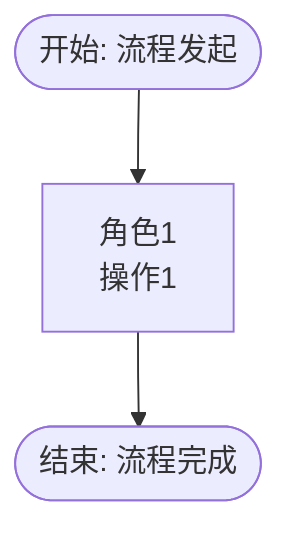
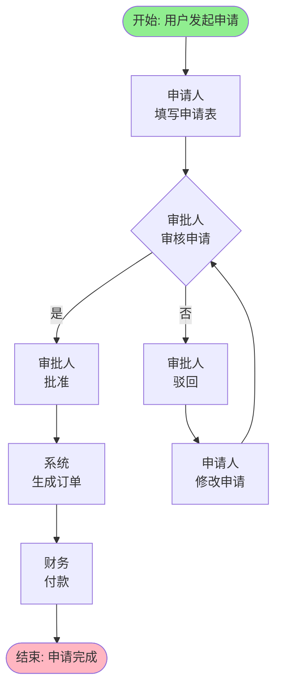

# mermaid-flowchart — Mermaid 业务流程图规范

## 适用范围

本规范适用于 `business-process` 要素的业务流程图生成,定义 Mermaid flowchart TD 格式的标准语法、节点样式、必填要素和验证规则。

适用要素:
- `spec/m-fe-business-process.md` 的 `## 约束 → ### 格式规范` 引用
- element-runner Phase 3 规范注入加载

## 规则定义

### 1. 基础语法要求

**必须使用 flowchart TD 方向**:



**禁止事项**:
- ❌ 禁止使用 `graph TD` (graph 语法适用于页面流转图)
- ❌ 禁止缺少方向声明(必须明确 `TD` top-down)
- ❌ 禁止节点 ID 使用中文或空格(节点 ID 必须为英文+数字,如 `Start`、`Act1`、`Decision1`)

---

### 2. 必填节点类型

每个业务流程图必须包含以下节点类型:

#### 2.1 开始节点(强制)

**格式**: `Start([开始: {发起描述}])`

**示例**:
```mermaid
Start([开始: 用户发起申请])
```

**验证规则**:
- 必须使用圆角矩形节点 `([])` 语法
- 必须包含"开始:"前缀
- 必须有发起描述(如"用户发起申请"、"系统触发"等)

---

#### 2.2 结束节点(强制)

**格式**: `End([结束: {完成描述}])`

**示例**:
```mermaid
End([结束: 申请完成])
```

**验证规则**:
- 必须使用圆角矩形节点 `([])` 语法
- 必须包含"结束:"前缀
- 必须有完成描述(如"申请完成"、"流程结束"等)

---

#### 2.3 决策节点(强制,至少一个)

**格式**: `Decision1{决策描述}`

**示例**:
```mermaid
Decision1{审批人\n审核申请}
Decision1 -- 是 --> Act2[审批人\n批准]
Decision1 -- 否 --> Act3[审批人\n驳回]
```

**验证规则**:
- 必须使用菱形节点 `({})` 语法
- 必须包含决策描述(如"审核申请"、"判断金额"等)
- 必须有分支条件(使用 `-- 是 -->` 或 `-- 否 -->` 语法)
- 至少包含一个决策节点(复杂流程允许多个决策节点)

---

#### 2.4 活动节点(角色标注)

**格式**: `Act1[角色\n操作]`

**示例**:
```mermaid
Act1[申请人\n填写申请表]
Act2[审批人\n批准]
Act3[系统\n生成订单]
```

**验证规则**:
- 使用矩形节点 `[]` 语法
- 必须包含角色标注(使用 `\n` 分隔符)
- 格式: `[角色\n操作]`(角色在上,操作在下)
- 若为系统自动触发,角色标注为"系统"

---

### 3. 连接关系语法

**直线连接**:
```mermaid
Start --> Act1
```

**带条件分支**:
```mermaid
Decision1 -- 是 --> Act2
Decision1 -- 否 --> Act3
```

**循环回退**:
```mermaid
Act3 --> Decision1
```

**验证规则**:
- 连接箭头必须使用 `-->` 语法
- 分支条件必须使用 `-- 条件 -->` 语法
- 禁止缺少连接关系(所有节点必须连通)

---

### 4. 样式标记(强制)

**开始节点样式**:
```mermaid
style Start fill:#90EE90
```

**结束节点样式**:
```mermaid
style End fill:#FFB6C1
```

**验证规则**:
- 必须定义开始节点样式(绿色填充 `#90EE90`)
- 必须定义结束节点样式(粉色填充 `#FFB6C1`)
- 样式定义必须在流程图代码块末尾

---

### 5. 完整示例



---

## 禁止事项

以下做法均为违规:

- ❌ **缺少开始节点**: 流程图必须明确起点
- ❌ **缺少结束节点**: 流程图必须明确终点
- ❌ **缺少决策节点**: 业务流程必然包含决策判断
- ❌ **缺少角色标注**: 活动节点必须标注执行角色
- ❌ **使用 graph TD**: 业务流程图必须使用 flowchart TD
- ❌ **节点 ID 使用中文**: 节点 ID 必须为英文+数字(如 `Start`、`Decision1`)
- ❌ **缺少样式标记**: 开始/结束节点必须定义填充颜色
- ❌ **节点未连通**: 所有节点必须通过箭头连接

---

## 验证检查点

element-runner Phase 5 Mermaid 图验证时,逐项检查:

- [ ] 是否存在 ` ```mermaid ` 代码块
- [ ] 代码块中是否包含 `flowchart TD` 关键词
- [ ] 是否包含开始节点(格式 `([开始...])`)
- [ ] 是否包含结束节点(格式 `([结束...])`)
- [ ] 是否包含至少一个决策节点(格式 `{...}`)
- [ ] 决策节点是否包含分支条件(`-- 是 -->` 或 `-- 否 -->`)
- [ ] 活动节点是否包含角色标注(`[角色\n操作]`)
- [ ] 是否包含样式标记(`style Start fill:#90EE90`)
- [ ] 所有节点是否连通(无孤立节点)

若任一检查项不合格 → 验证失败 → 暂停执行 → 输出问题详情 → 不进入 Phase 6

---

## 兜底约束

若 standards-loader 加载本规范文件失败(文件不存在或 standard_id 未注册):

element-runner Phase 3 将以 `spec/m-fe-business-process.md` 的 `## 约束 → ### 设计约束` 表格作为兜底约束:

| 约束编号 | 级别 | 规则 | 验证方法 |
|----------|------|------|---------|
| `DC-PROC-001` | MUST | 必须生成Mermaid流程图,格式为flowchart TD | 检查输出骨架是否包含flowchart TD语法 |
| `DC-PROC-002` | MUST | 流程图必须包含开始标记([节点名])、结束标记([节点名])、决策节点({决策描述})、角色标注([角色\n操作]) | 检查Mermaid语法正确性 |

---

*本规范版本 1.0.0,遵循设计文档Skill构建规范第三章 3.5.2 强制性结构定义。*