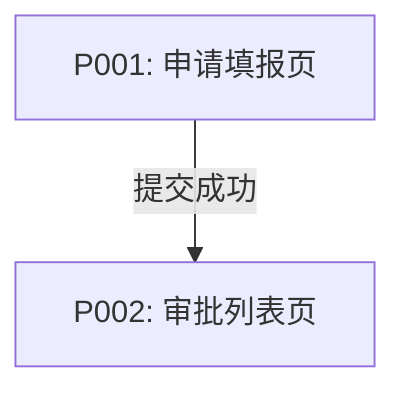
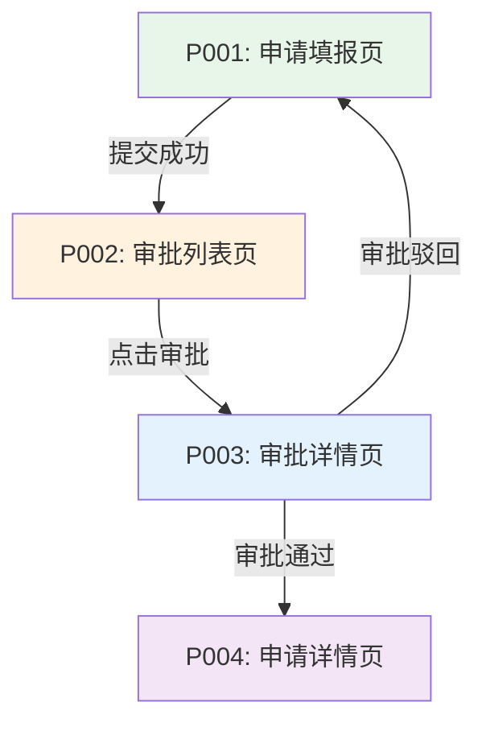

# mermaid-page-flow — Mermaid 页面流转图规范

## 适用范围

本规范适用于 `user-interaction` 要素的页面流转图生成,定义 Mermaid graph TD 格式的标准语法、节点命名、连接条件和验证规则。

适用要素:
- `spec/m-fe-user-interaction.md` 的 `## 约束 → ### 格式规范` 引用
- element-runner Phase 3 规范注入加载

## 规则定义

### 1. 基础语法要求

**必须使用 graph TD 方向**:



**禁止事项**:
- ❌ 禁止使用 `flowchart TD` (flowchart 语法适用于业务流程图)
- ❌ 禁止缺少方向声明(必须明确 `TD` top-down)
- ❌ 禁止节点 ID 使用中文或空格(节点 ID 必须为页面编号,如 `P001`、`P002`)

---

### 2. 节点命名规范

#### 2.1 页面节点格式(强制)

**格式**: `P001[P001: 页面名称]`

**示例**:
```mermaid
P001[P001: 申请填报页]
P002[P002: 审批列表页]
P003[P003: 审批详情页]
```

**验证规则**:
- 节点 ID 必须为页面编号格式 `P001`、`P002`、`P003`...
- 节点描述必须包含页面编号和页面名称
- 格式: `[页面编号: 页面名称]`(编号和名称在同一方括号内)
- 括号必须成对: `[` 和 `]` 不能缺失

---

#### 2.2 页面编号规则

**编号格式**: `P` + 三位数字

**示例**:
- `P001`: 第一个页面
- `P002`: 第二个页面
- `P003`: 第三个页面

**验证规则**:
- 必须使用字母 `P` 开头(大写)
- 必须跟随三位数字(从 `001` 开始)
- 禁止使用 `P1`、`P01` 等非三位数字格式
- 编号必须连续(不能跳跃,如 `P001` → `P003` 缺少 `P002`)

---

### 3. 连接关系语法

**带触发条件的连接**:

```mermaid
P001 -->|提交成功| P002
P002 -->|点击审批| P003
P003 -->|审批通过| P004
```

**循环回退连接**:

```mermaid
P003 -->|审批驳回| P001
```

**验证规则**:
- 连接箭头必须使用 `-->` 语法
- 必须包含触发条件(使用 `-->|触发条件|` 语法)
- 触发条件必须明确(如"提交成功"、"点击审批"、"审批驳回")
- 禁止缺少触发条件(仅写 `P001 --> P002` 不合格)

---

### 4. 完整示例



**注意**: 页面流转图的样式标记为可选(不像业务流程图强制要求开始/结束节点样式),但建议为不同页面类型定义填充颜色以提升可读性。

---

## 禁止事项

以下做法均为违规:

- ❌ **节点格式错误**: 仅写 `P001[页面名称]` 缺少页面编号
- ❌ **括号不成对**: 如 `P001[P001: 页面名称` 缺少闭合括号 `]`
- ❌ **缺少触发条件**: 仅写 `P001 --> P002` 未标注触发条件
- ❌ **使用 flowchart TD**: 页面流转图必须使用 graph TD
- ❌ **节点 ID 使用中文**: 节点 ID 必须为页面编号(如 `P001`)
- ❌ **页面编号不连续**: 如 `P001` → `P003` 缺少 `P002`
- ❌ **节点未连通**: 所有页面节点必须通过箭头连接

---

## 验证检查点

element-runner Phase 5 Mermaid 图验证时,逐项检查:

- [ ] 是否存在 ` ```mermaid ` 代码块
- [ ] 代码块中是否包含 `graph TD` 关键词
- [ ] 节点格式是否为 `P001[P001: 页面名称]`(页面编号+页面名称)
- [ ] 括号是否成对(检查 `[` 和 `]` 是否匹配)
- [ ] 页面编号是否连续(检查是否为 `P001`、`P002`、`P003`...)
- [ ] 连接是否包含触发条件(检查是否为 `-->|触发条件|` 格式)
- [ ] 所有节点是否连通(无孤立节点)

若任一检查项不合格 → 验证失败 → 暂停执行 → 输出问题详情 → 不进入 Phase 6

---

## 兜底约束

若 standards-loader 加载本规范文件失败(文件不存在或 standard_id 未注册):

element-runner Phase 3 将以 `spec/m-fe-user-interaction.md` 的 `## 约束 → ### 设计约束` 表格作为兜底约束:

| 约束编号 | 级别 | 规则 | 验证方法 |
|----------|------|------|---------|
| `DC-UI-001` | MUST | 必须生成Mermaid页面流转图,格式为graph TD | 检查输出骨架是否包含graph TD语法 |
| `DC-UI-002` | MUST | Mermaid节点格式必须为P001[P001:页面名称],括号成对,箭头格式-->|触发条件| | 检查Mermaid语法正确性 |

---

## 与业务流程图的差异对比

| 对比项 | 业务流程图(flowchart) | 页面流转图(graph) |
|--------|----------------------|-----------------|
| 方向语法 | `flowchart TD` | `graph TD` |
| 节点 ID | 英文名称(如 `Start`、`Decision1`) | 页面编号(如 `P001`、`P002`) |
| 节点描述 | `[角色\n操作]` | `[页面编号: 页面名称]` |
| 必填节点 | 开始节点+结束节点+决策节点 | 无强制必填节点类型 |
| 样式标记 | 强制定义开始/结束样式 | 可选(建议定义页面样式) |
| 连接条件 | `-- 是 -->` / `-- 否 -->` | `-->|触发条件|` |

---

*本规范版本 1.0.0,遵循设计文档Skill构建规范第三章 3.5.2 强制性结构定义。*