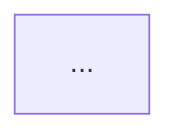

# m-prd-tp-scenario — 场景解决方案

> 从 FE 流程概览和活动明细提取端到端场景（正常流程 + 异常分支），绘制场景清单和 Mermaid 场景集成图，串联功能点、实体对象和外部系统调用。

---

## 目标

**目标说明**

场景解决方案是 PRD 的"端到端视图"，将信息架构（数据）、功能特性（动作）、集成设计（外部交互）串联为完整业务场景。每个场景描述一条从用户触发到结果完成的完整业务路径。

**输出物**

- 场景清单表格（场景编号 | 场景名称 | 场景类型 | 涉及功能编号 | 业务流程摘要）
- Mermaid 场景集成图（`graph TB` 格式，展示场景-功能-实体-外部系统的集成关系）
- 每个核心场景的详细步骤说明（含触发条件、步骤序列、决策节点、输出结果）

**成功标准**

- 场景清单涵盖 FE 流程概览的主流程和 FE 活动明细中所有异常处理分支
- 场景集成图可被 Mermaid 渲染器正确解析
- 每个场景的功能编号引用与应用架构 FR 编号一致

---

## 前置条件

**依赖要素**

| 依赖要素 element_id | 原因 |
|----------------------|------|
| `app-architecture` | 功能编号 FR-xxx 来自应用架构，场景步骤需引用 |
| `info-architecture` | 场景集成图需引用实体对象 |
| `integration-design` | 场景涉及外部系统调用时，需引用集成设计章节 |

**必要输入**

- FE要素链:
  - `FE需求类型-TP类(活动清单表格+活动明细表格)`
  - `FE业务流程-业务流程图`（Mermaid流程图，提取主流程场景）
  - `FE业务流程-业务活动`（活动明细的异常处理字段）
  - `FE用户交互-页面流转`（页面跳转场景）（可选，用于串联页面流转）

---

## 约束

### 格式规范

| standard_id | 规范说明 |
|-------------|---------|
| `app-arch` | 场景集成图必须使用 `graph TB`，与应用架构图风格一致 |

### 设计约束

| 约束编号 | 级别 | 规则 | 验证方法 |
|----------|------|------|---------|
| `DC-SCEN-001` | `MUST` | 场景清单必须包含至少 1 个正常路径场景和 1 个异常/边界场景 | 检查场景类型列是否同时包含"正常路径"和"异常场景/边界场景" |
| `DC-SCEN-002` | `MUST` | 场景步骤中的功能编号必须与应用架构 FR 编号完全一致 | 对照应用架构章节检查 FR 编号引用 |
| `DC-SCEN-003` | `SHOULD` | 场景集成图应标注场景触发条件和关键决策节点 | 检查集成图中是否有菱形决策节点和触发条件标注 |

---

## 执行步骤

**Step 1：生成完整场景清单** `[交互]`

读取 FE 流程概览的主流程 Mermaid 图，提取主流程场景→从FE活动明细的异常处理字段汇聚异常分支场景→形成完整场景清单表格（包含场景编号、场景名称、场景类型、涉及功能编号、业务流程摘要）→引用应用架构FR编号标注涉及功能→统计场景总数N。

> **交互提示**：展示完整场景清单，询问用户："以上场景清单是否完整？是否有遗漏的场景分支？涉及功能编号标注是否准确？"

---

**Step 2：绘制场景集成图** `[交互]`

为核心主流程绘制 Mermaid `graph TB` 集成图，展示场景如何串联功能点（FR）、实体对象（E001…）和外部系统（来自集成设计）。

> **交互提示**：展示场景集成图草稿，询问用户："以上集成关系是否完整？是否有遗漏的功能点或外部系统调用？"

---

**Step 4：补充场景详细步骤** `[交互]`

为每个优先级 P0 的场景补充完整的步骤说明（触发条件 → 步骤序列 → 决策节点 → 输出结果）。

> **交互提示**："以上场景步骤描述是否完整准确？是否有遗漏的步骤或决策分支？"

---

## 输出骨架

```markdown
## 九、场景解决方案

### 9.1 场景清单

| 场景编号 | 场景名称 | 场景类型 | 涉及功能编号 | 业务流程摘要 |
|----------|----------|----------|-------------|-------------|

### 9.2 解决方案集成图



### 9.3 场景详细描述

#### SCEN-001 [场景名称]

**触发条件**：...

**步骤序列**：
1. ...
2. ...

**输出结果**：...
```

---

## 输出格式

### incremental 模式

按 PRD 增量高阶方案 V3.0 第九章七步流程执行。

**前置说明**:
scenario-solution(场景方案)受 PR-01 ~ PR-04 直接影响,以及多要素的 indirect cascade(系统级集成场景)。

#### 输入(由 orchestration 传入)

- `context.base_doc_path`: 基线 PRD 文档路径(只读)
- `context.output_doc_path`: 新版本 PRD 文档路径(本次输出)
- `context.fe_doc_path`: 新版本 FE 文档路径(可选,可能为空字符串)
- `context.fe_doc_available`: bool,新版本 FE 是否存在
- `context.impact_analysis.requirement_register`: RR 列表(整次增量共享)
- `context.impact_analysis.triggered_changes`: AtomicChange 运行时实例列表
- `context.impact_analysis.element_changes`: 本要素相关的变化点列表

#### Step I-1: 读取基线对应章节 `[自动]`

读取基线 PRD 第八章"场景方案"现有内容:
- 8.x 各场景(SCEN-xxx 编号、参与角色、Sequence Diagram、关键步骤、异常处理)

#### Step I-2 ~ I-3: (同通用模板)

合并两个来源:
1. **普通触发条目**:从 `context.impact_analysis.element_changes` 提取 element_id == 当前要素的项
2. **always_affected 虚拟条目**:仅当本要素 always_affected_in 含 "incremental" 时(本要素不命中)

若合并后列表为空 → 跳过本要素(Phase 6 仅记录 SKIP)。

对每个触发条目,沿用本 Spec `## 追问维度`的提问逻辑,但**只针对变化部分追问**,禁止重新挖掘基线已有内容。

证据来源优先级:`fe_doc > baseline_prd > dialog`。

#### Step I-4: 生成 DELTA 标注的增量内容 `[自动]`

DELTA 块内容组织:
- 新增场景(PR-01):完整 Sequence Diagram + 步骤说明
- 既有场景修改(PR-03 调序):局部 Sequence Diagram 重绘

**编号沿用约束**:SCEN-xxx 沿用基线。

#### Step I-5: 累积 ImpactPoint 到 context `[自动]`

示例(以 PR-01 新增场景为例):

```yaml
- id: "IP-scenario-solution-001"
  source_requirement: "RR-01"
  source_change: "PR-01"
  trigger_type: "primary"
  element: "scenario-solution"
  baseline_ref: "基线 PRD §8 场景方案(10 个场景 SCEN-001~SCEN-010)"
  baseline_state: "已有审批场景 SCEN-005"
  action: "新增"
  target_state: "新增 SCEN-011 部门预审场景,含 Sequence Diagram + 4 步骤"
  target_state_evidence: "fe_doc"
  in_scope: ["新增 SCEN-011 完整场景描述"]
  out_of_scope: ["SCEN-001 ~ SCEN-010 既有场景"]
  out_of_scope_reason: "新增场景不影响既有场景"
```

#### 逐变化点追问聚焦点

| 变化点 | 追问聚焦点 | in_scope |
|--------|----------|---------|
| **PR-01 主流程节点新增** | 新场景的角色?Sequence?异常? | 新场景完整描述 |
| **PR-02 主流程节点删除** | 哪个场景的哪一步删除? | 该场景 Sequence 修改 |
| **PR-03 主流程顺序调整** | 哪个场景?新顺序? | 该场景 Sequence 重排 |
| **PR-04 异常分支新增** | 哪个场景?新异常? | 该场景异常处理段 |
| **cascade(UI/FEAT/INT)** | 是否引入新跨系统集成场景? | 可能新增系统级场景 |

#### Step I-6: 用户最终确认 `[交互]`

展示本要素的 DELTA 块和 ImpactPoint 清单,询问"本要素的增量是否准确?",**重点确认**:

1. in_scope / out_of_scope 划分准确性
2. 编号沿用是否正确(无重复、无断号)
3. 与基线的接口/契约一致性

强制获得明确确认后才能进入 Phase 5。
```
