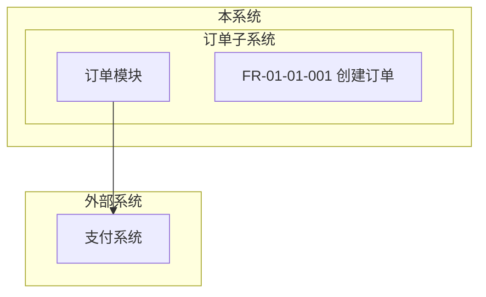
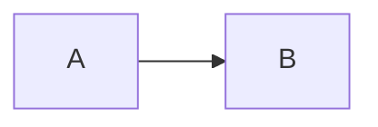

# 应用架构图规范

## 规范目标

统一应用架构的层次表达、Mermaid 图语法和 FR 编号规则，确保架构与功能点能够稳定复用。

## 强制要求（MUST）

- Mermaid 架构图必须使用 `graph TB`。
- 结构至少体现系统、子系统、模块、功能点四层。
- FR 编号必须使用 `FR-xx-xx-xxx`。

## 推荐做法（SHOULD）

- 外部系统单独放置在独立 `subgraph` 中。
- 子系统和模块名称使用业务语义命名。

## 禁止行为（MUST NOT）

- 用自然语言列表代替架构图。
- 使用占位名称如“模块A”“模块B”。
- 把外部系统混进本系统模块层。

## 合规示例（✅）

## 违规示例（❌）

## 验证检查点（供 element-runner Phase 5 引用）

| 检查点 | 级别 | 检查方法 |
|---|---|---|
| 使用 `graph TB` | MUST | 检查 Mermaid 代码块首行 |
| 四层结构存在 | MUST | 检查是否同时有系统、子系统、模块、功能点 |
| FR 编号格式正确 | MUST | 正则校验 `FR-\d{2}-\d{2}-\d{3}` |
