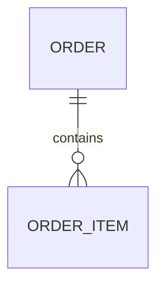
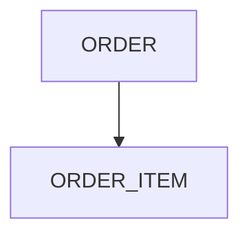

# ER 图规范

## 规范目标

统一 Mermaid `erDiagram` 语法、实体命名和关系符号，避免 ER 图不可解析或业务含义不清。

## 强制要求（MUST）

- ER 图必须使用 `erDiagram`。
- 关系符号必须使用 Mermaid 官方写法，如 `||--o{`、`}|..|{`。
- 实体名称必须与实体清单一致。

## 推荐做法（SHOULD）

- 主键字段在实体详情中显式标注。
- 关系边附带简短关系说明。

## 禁止行为（MUST NOT）

- 使用 `-->` 代替实体关系符号。
- 在 ER 图中出现未定义实体。
- 实体名称中混入中文注释与编号拼接。

## 合规示例（✅）

## 违规示例（❌）

## 验证检查点（供 element-runner Phase 5 引用）

| 检查点 | 级别 | 检查方法 |
|---|---|---|
| 使用 `erDiagram` | MUST | 检查 Mermaid 代码块首行 |
| 关系符号正确 | MUST | 检查是否存在 `||--o{` 等合法符号 |
| 实体名称已定义 | MUST | 对照实体清单校验名称 |
