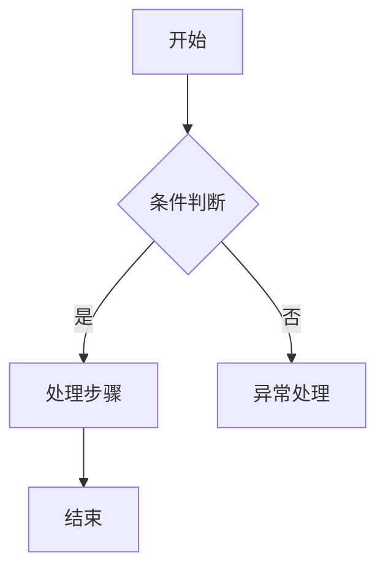
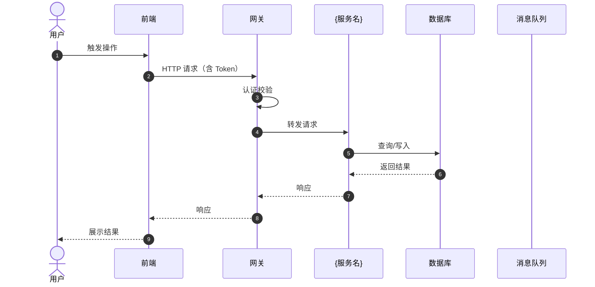
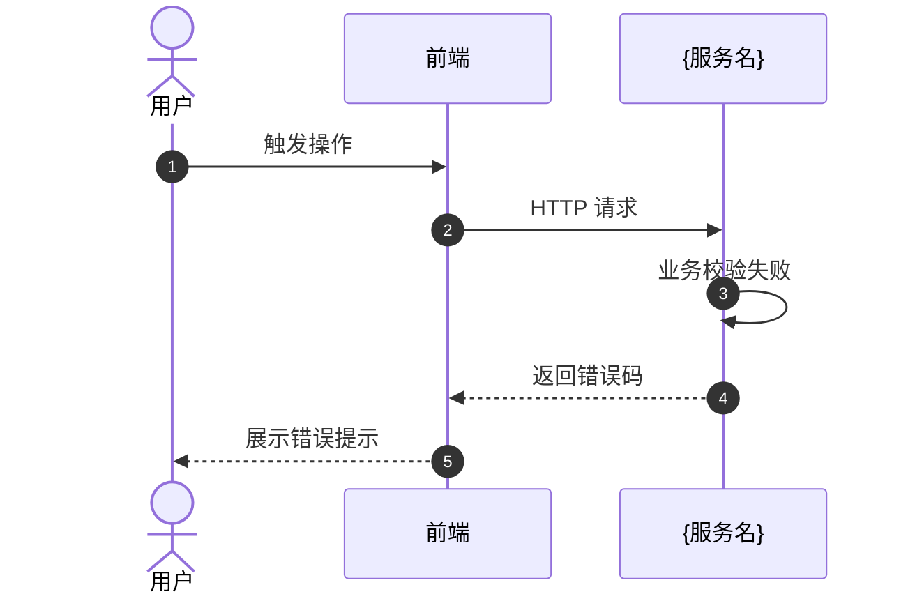
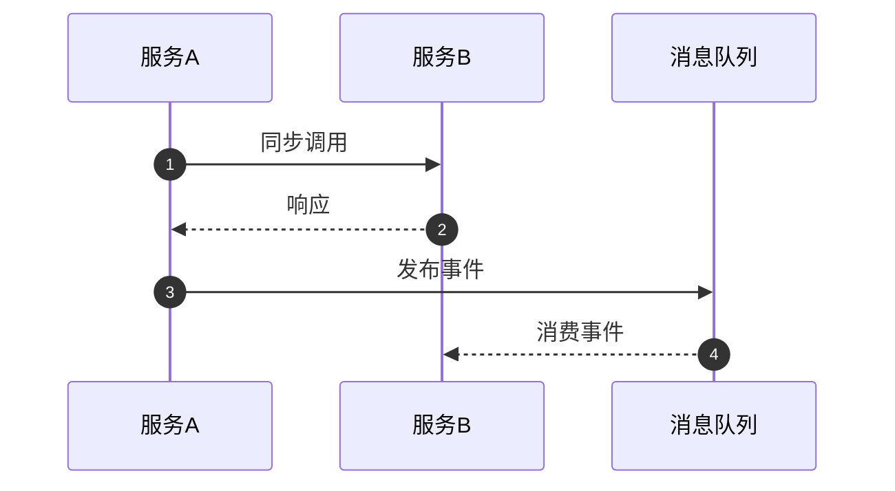

# be-sequence

**规范分段**：`be-sequence`

### 规范条文

# 处理逻辑时序规范（TDD 第3章 §3.3）

## 3.3 处理逻辑时序规范

本要素覆盖 TDD 第3章 §3.3 的全部内容：业务流转（流程图）、时序图、关键分支与异常处理策略。

---

## 业务流程图规范

- 针对复杂业务场景输出流程图（flowchart），覆盖判断分支
- 明确正常路径和各异常分支的处理方式
- 说明与现有流程的异同，以及复用的既有异常处理组件

## 时序图绘制规范

- 使用 Mermaid `sequenceDiagram` 语法
- 启用 `autonumber` 自动编号
- 参与者定义在图的顶部，使用短别名（FE、GW、SVC、DB）

### 参与者命名约定

| 别名 | 代表 |
|------|------|
| User / Actor | 操作用户（使用 `actor` 关键字） |
| FE | 前端 |
| GW | 网关 / BFF |
| SVC | 业务服务（具体命名如 OrderSVC） |
| DB | 数据库 |
| Cache | 缓存（Redis） |
| MQ | 消息队列 |
| EXT | 外部第三方系统 |

### 必须绘制的时序

1. 每个核心功能的主成功路径
2. 关键异常路径（业务校验失败、外部调用失败）
3. 异步流程（MQ 发布/消费）
4. 跨服务调用链路

### 箭头类型

| 类型 | 含义 |
|------|------|
| `->>` | 同步请求 |
| `-->>` | 同步响应 |
| `--)` | 异步消息（MQ） |
| `--)+` | 激活目标（创建新线程） |

## 业务规则设计规范

- 核心业务规则抽象为命名方法，方法名即规则描述，如 `validateOrderCanBeCancelled()`
- 规则校验集中在流程入口，不散落在各处
- 规则违反时抛出业务异常，携带错误码

## 异常处理规范

- 业务异常（可预期）继承 `BusinessException`，携带错误码
- 系统异常（不可预期）由全局异常处理器捕获，返回 500
- 不吞掉异常：catch 后必须记录日志或重新抛出
- 外部调用失败需要有降级处理（返回默认值 / 降级响应）

---

## 项目规范摘录（`规范/` 目录 · IT 设计文档 §2 / §4）

> 来源：`{WORKSPACE_ROOT}/规范/examples/it_design_doc.md`「业务流程时序分析」「核心流程图」。

- 针对「用户需求」核心路径输出**流程图（flowchart）**，覆盖判断分支；说明与现有流程的**异同**。
- 针对关键业务场景输出**交互时序**，明确消息传递与数据流向。
- 流程图侧重单端业务分支，时序图侧重参与者交互，两者互补。

## 输出骨架
# 处理逻辑时序设计（TDD 第3章 §3.3）

---

## 核心业务流程

### {流程名称}

**触发条件**：{描述何种操作或事件触发该流程}

**处理步骤说明**：

| 步骤 | 说明 | 涉及实体/接口 | 异常处理 |
|------|------|-------------|---------|
| 1 | | | |

## 业务规则清单

| 规则ID | 规则描述 | 触发场景 | 违反时处理 |
|--------|---------|---------|----------|
| R001 | | | 抛出业务异常 / 忽略 / 记录日志 |

---

## 主流程时序

### {功能名称} — 主成功路径

## 异常流程时序

### {功能名称} — {异常场景名称}

## 跨服务调用时序

### {跨服务场景名称}

---

## 变更影响（模板 · `规范/examples/it_design_doc.md` §4.6）

### 受影响接口

| 受影响接口 | 影响类型 | 影响描述 | 测试重点 |
|------------|----------|----------|----------|
| | | | |