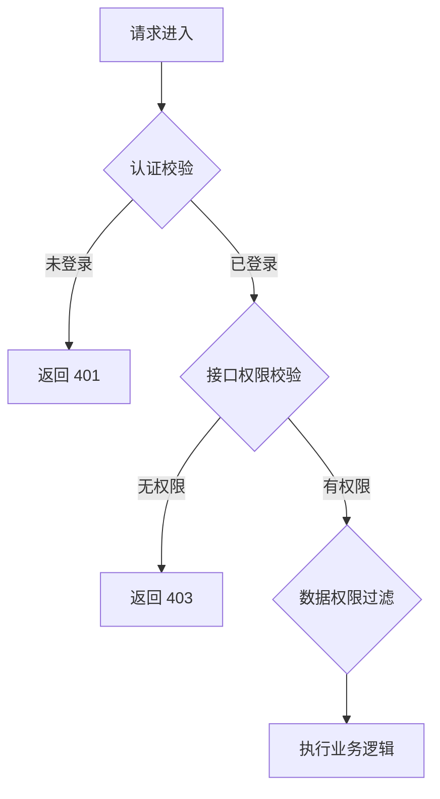

# config-permission

**规范分段**：`config-permission`

### 规范条文

# 权限矩阵设计规范（TDD 第6章 §6.3）

> 本要素整合原 `be-permission`（后端权限校验）与 `fe-permission`（前端权限控制）。
> 权限矩阵是前后端共享的跨层规范，单一源头在此文件，前后端实现均引用此处定义。

## 权限模型

采用 RBAC（基于角色的访问控制）：
- **用户** → 分配 **角色** → 角色拥有 **权限码**
- 权限码同时用于：后端接口鉴权、前端菜单过滤、按钮级 UI 控制

## Jalor权限框架规范

### 注解使用
- **@JalorResource**：用于类级别，标识资源类型
- **@JalorOperation**：用于方法级别，标识操作类型

### 权限编码规范
1. 方法级别优先使用 RequestConstants 接口定义的标准权限编码：
   - `read` - 查看权限
   - `create` - 创建权限
   - `update` - 更新权限
   - `approve` - 审批权限
   - `import` - 导入权限
   - `export` - 导出权限

2. 当一个类下出现多个相同的操作时，使用方法名作为方法的权限编码，用来区分细粒度接口权限：
   - `queryTags` - 查询标签列表
   - `queryTagDetail` - 查询标签详情

## 权限层级定义

| 层级 | 含义 | 适用场景 |
|------|------|---------|
| ALL | 可见全部数据 | 系统管理员 |
| DEPT | 可见本部门及下级部门数据 | 部门主管 |
| SELF | 仅可见本人创建的数据 | 普通用户 |
| CUSTOM | 自定义数据范围 | 特殊授权角色 |

**注意**：ALL 对应"全局数据"，DEPT 对应"部门数据"，SELF 对应"个人数据"

## 数据权限控制规范

### 数据权限范围类型

#### 全局数据（ALL）
- **说明**：所有数据可见
- **适用角色**：系统管理员、高级管理员
- **实现原则**：无需数据过滤

#### 部门数据（DEPT）
- **说明**：本部门及下级部门数据可见
- **适用角色**：部门管理员、部门经理
- **实现原则**：通过部门ID列表过滤

#### 个人数据（SELF）
- **说明**：仅本人数据可见
- **适用角色**：普通用户
- **实现原则**：通过用户ID过滤

#### 自定义范围（CUSTOM）
- **说明**：特定条件过滤
- **适用场景**：特殊业务场景
- **实现原则**：根据业务规则自定义

### 数据权限实现原则

- 数据权限过滤在业务逻辑执行前完成
- 通过 MyBatis 拦截器或业务层条件注入
- 禁止在业务代码中硬编码数据权限过滤条件
- 数据范围参数从用户上下文中获取

## 权限校验流程

### 标准流程
1. **Token解析**：从JWT Token解析用户ID、角色、数据权限范围
2. **操作权限校验**：检查用户是否拥有接口所需操作权限
3. **数据权限校验**：检查数据权限范围，应用数据过滤条件
4. **执行业务逻辑**：权限校验通过后执行业务逻辑

### 权限校验流程图



## 后端实现规范

### Jalor框架注解实现

- 接口层用 Jalor 注解声明权限：
  - 类级别：`@JalorResource(code = "{类名}", desc = "{类中文描述}")`
  - 方法级别：`@JalorOperation(code = RequestConstants.CREATE, desc = RequestConstants.CREATE_DESC)`
- 未认证返回 401，无权限返回 403（错误码见 config/dict-error.md）
- 数据权限通过在业务逻辑层获取数据范围参数，带入到SQL条件过滤

## 前端实现规范

- 登录后将权限码列表存入 Pinia Store（持久化到 sessionStorage）
- 路由 meta 中声明权限码，路由守卫（`router.beforeEach`）统一校验
- **无权限的元素用 `v-if` 不渲染**，不仅 `disabled`（禁用仍暴露功能存在）
- 前端权限控制只用于 UI 展示，不是安全边界，后端必须独立校验

## 前后端联动约定

- 权限码定义在权限矩阵文件（单一源头），前后端各自实现
- 前端隐藏不代表后端放行
- 权限变更后在线用户下次请求时重新加载（Token 续签或缓存失效）
- 权限变更记录审计日志

## 特殊权限场景

- **超级管理员**：可配置绕过权限校验（需在配置中明确）
- **多租户场景**：租户ID作为数据隔离条件之一
- **动态权限**：权限变更需实时生效时使用缓存失效机制

## 输出骨架
# 权限矩阵设计（TDD 第6章 §6.3）

<!--
变更标注约定：
- ✨ 新增：本次新增的角色或权限码
- 🔧 修改：变更角色权限范围或数据权限
-->

## 变更概要

| 动作 | 对象（角色/权限码） | 说明 |
|------|-----------------|------|
| ✨ 新增 | | |
| 🔧 修改 | | |

---

## 角色定义

| 角色编码 | 角色名称 | 角色说明 | 数据权限范围 | 动作 |
|----------|----------|----------|----------|------|
| | | | ALL/DEPT/SELF/CUSTOM | ✨/🔧 |

**表格字段说明**：
- **角色编码**：角色唯一标识，使用uppercase格式
- **角色名称**：角色显示名称
- **角色说明**：角色职责说明
- **数据权限范围**：全局数据/部门数据/个人数据/自定义范围

---

## 权限码清单

| 权限编码 | 权限名称 | 权限类型 | 归属模块 | 关联接口 | 拥有角色 | 动作 |
|----------|----------|----------|----------|----------|----------|------|
| | | 操作权限/数据权限 | | | | ✨/🔧 |

**表格字段说明**：
- **权限编码**：使用RequestConstants标准编码（read/create/update/approve/import/export）或自定义方法名
- **权限名称**：权限显示名称
- **权限类型**：操作权限/数据权限
- **归属模块**：权限所属业务模块
- **关联接口**：权限对应的接口路径
- **拥有角色**：拥有该权限的角色列表（逗号分隔）

---

## 角色-权限矩阵

| 权限编码 \ 角色 | {角色1} | {角色2} | {角色3} |
|-------------|---------|---------|---------|
| `{权限码1}` | ✅ | ❌ | ✅ |
| `{权限码2}` | ❌ | ✅ | ✅ |
| `{权限码3}` | ✅ | ✅ | ❌ |

---

## 数据权限设计

| 角色 | 数据范围 | SQL 过滤条件 | 说明 |
|------|---------|------------|------|
| 系统管理员 | ALL（全局数据） | 无需过滤 | 可查看和操作所有数据 |
| 部门管理员 | DEPT（部门数据） | `dept_id IN (:userDeptIds)` | 可查看和操作本部门及下级部门数据 |
| 普通用户 | SELF（个人数据） | `created_by = :userId` | 仅可查看和操作本人创建的数据 |
| {特殊角色} | CUSTOM（自定义） | {自定义SQL条件} | {特殊业务场景说明} |

---

## 权限校验流程


---

## 前端路由鉴权配置

| 路由路径 | 路由名称 | 所需权限码 | keepAlive | 说明 |
|---------|---------|-----------|---------|------|
| `/path` | `RouteName` | `{模块}:{资源}:view` | Y/N | |

**路由 meta 示例**：

```typescript
{
  path: '/orders',
  meta: {
    requiresAuth: true,
    permission: ['order:list:view'],
    keepAlive: true,
    title: '订单列表'
  }
}
```

---

## 菜单与按钮权限映射

| 菜单/页面 | 按钮/操作 | 权限码 | v-if 条件 | 说明 |
|---------|---------|--------|---------|------|
| | | | `hasPermission('xxx:xxx:xxx')` | |

---

## 数据权限SQL过滤示例

> 根据实际业务场景调整SQL条件，以下为通用示例

### 部门数据权限示例

```sql
SELECT * FROM orders
WHERE (
    -- 全局权限
    :dataPermission = 'ALL'
    OR
    -- 部门权限
    (:dataPermission = 'DEPT' AND dept_id IN (:userDeptIds))
)
AND deleted_flag = 'N'
```

### 个人数据权限示例

```sql
SELECT * FROM orders
WHERE (
    -- 全局权限
    :dataPermission = 'ALL'
    OR
    -- 部门权限
    (:dataPermission = 'DEPT' AND dept_id IN (:userDeptIds))
    OR
    -- 个人权限
    (:dataPermission = 'SELF' AND created_by = :userId)
)
AND deleted_flag = 'N'
```

**参数说明**：
- `:dataPermission` - 数据权限范围（ALL/DEPT/SELF/CUSTOM）
- `:userDeptIds` - 用户所在部门及下级部门ID列表
- `:userId` - 用户ID

---

## 后端权限注解示例

### 类级别注解

```java
@JalorResource(code = "OrderController", desc = "订单管理")
public class OrderController {
    // ...
}
```

### 方法级别注解

```java
@JalorOperation(code = RequestConstants.READ, desc = RequestConstants.READ_DESC)
public ApiResponse<OrderListVO> queryOrders(QueryRequest request) {
    // 查看订单列表权限
}

@JalorOperation(code = RequestConstants.CREATE, desc = RequestConstants.CREATE_DESC)
public ApiResponse<OrderVO> createOrder(CreateRequest request) {
    // 创建订单权限
}

@JalorOperation(code = RequestConstants.EXPORT, desc = RequestConstants.EXPORT_DESC)
public ApiResponse<ExportTaskVO> exportOrders(ExportRequest request) {
    // 导出订单权限
}
```

### 自定义权限编码（细粒度权限）

```java
@JalorOperation(code = "queryTags", desc = "查询标签列表")
public ApiResponse<TagListVO> queryTags(QueryRequest request) {
    // 查询标签列表（细粒度权限）
}

@JalorOperation(code = "queryTagDetail", desc = "查询标签详情")
public ApiResponse<TagVO> queryTagDetail(@PathVariable String id) {
    // 查询标签详情（细粒度权限）
}
```

---

## 特殊权限说明

{描述超级管理员绕过、多租户数据隔离、动态路由等特殊场景}

**示例内容**：

### 超级管理员权限
- 超级管理员角色编码：`SUPER_ADMIN`
- 可配置绕过所有权限校验（通过配置项控制）
- 数据权限范围：全局数据（ALL）

### 多租户数据隔离
- 租户ID字段：`renter_id`（审计标准字段）
- 数据隔离条件：`renter_id = :tenantId`（全局附加）
- 与业务数据权限条件组合使用

### 动态权限变更
- 权限变更触发：角色权限调整、用户角色变更
- 实时生效策略：Token续签或Redis缓存失效
- 变更记录：记录审计操作日志