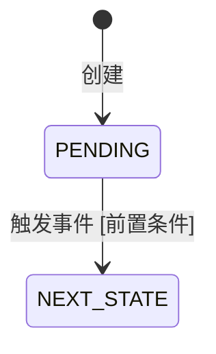

# data-state-machine

**规范分段**：`data-state-machine`

### 规范条文

# 实体流转关系规范（TDD 第2章 §2.3）

## 2.3 实体流转关系规范

### 状态机设计原则

- 每个有状态实体必须有明确的状态枚举（存储为整数，注释说明含义）
- 状态转移必须通过方法调用触发，禁止直接修改 status 字段
- 每次状态变更记录时间戳和操作人（审计字段）
- 非法状态转移必须抛出业务异常，携带错误码

### 状态枚举命名

```java
public enum OrderStatus {
    PENDING(0, "待审批"),
    APPROVED(1, "已通过"),
    REJECTED(2, "已驳回"),
    CANCELLED(3, "已撤销");
}
```

- 枚举值存数据库使用 `int`，不存字符串（节省空间，字典翻译见 config/dict.md）
- 枚举类放 domain 包，不放 common/constant 包

### 状态转移流转图（Mermaid）

```
stateDiagram-v2
    [*] --> PENDING : 创建
    PENDING --> APPROVED : 审批通过 [approver != null]
    PENDING --> REJECTED : 审批驳回
    PENDING --> CANCELLED : 用户撤销
    APPROVED --> CANCELLED : 审批后撤销 [未执行]
```

### 触发事件约定

- 状态变更后必须发布领域事件（`OrderStatusChangedEvent`）
- 事件包含：entityId、fromStatus、toStatus、operator、timestamp
- 监听方（通知、日志、统计）订阅事件，不耦合到状态机核心逻辑

## 输出骨架
# 实体流转关系设计（TDD 第2章 §2.3）

<!--
变更标注约定：
- ✨ 新增：本次新增的状态机
- 🔧 修改：在现有基础上变更（新增状态/转移）
- ⏭️ 跳过：PRD 无对应需求，本次不输出
-->

## 变更概要

| 动作 | 对象 | 说明 |
|------|------|------|
| ✨/🔧 | | |

---

## 2.3 实体流转关系（状态机）

> ⏭️ **跳过说明**：{若实体无状态流转需求，填写原因，删除以下内容}

### 状态机清单

| 实体 | 状态字段 | 状态数 | 动作 | 说明 |
|------|---------|--------|------|------|
| | | | ✨/🔧 | |

### ✨/🔧 {实体名} 状态机

> 🔧 **变更说明**：{仅修改时填写，说明新增了哪些状态/转移，及原因}

**状态枚举**：

| 枚举值（int） | 枚举名 | 中文含义 | 说明 |
|------------|--------|---------|------|
| 0 | PENDING | 待处理 | 初始状态 |

**状态转移图**：



**状态转移规则**：

| 起始状态 | 目标状态 | 触发事件 | 前置条件 | 后置事件 | 处理方法 |
|---------|---------|---------|---------|---------|---------|
| PENDING | | | | | `{ServiceImpl}.{method}()` |

**后置事件定义**：

| 事件类名 | 触发状态 | 事件字段 | 说明 |
|---------|---------|---------|------|
| `{Entity}StatusChangedEvent` | | entityId, fromStatus, toStatus, operator | |

**对应数据库字段**：
- 表：`{table_name}`（见 data/data-table.md）
- 字段：`status`（TINYINT，字典翻译见 config/dict.md §{字典分类}）