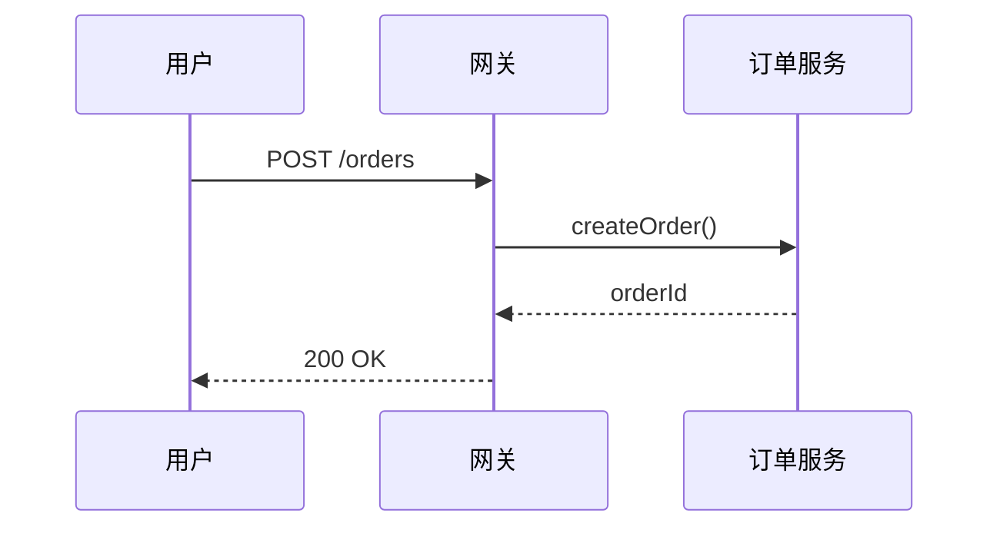

# 图片分类与多模态描述

> 本文档定义图片的 5 维描述格式、类型分类，以及图表/时序图的多模态还原策略。

## 5 维描述格式

对每张提取的图片，生成结构化描述块：

```markdown
> **【图片说明】**
> - **图片类型**：{原型界面截图|业务流程图|表格截图|系统架构图|数据流图|...}
> - **图片标题**：{图片标题或"无"}
> - **详细描述**：{图片内容的详细文字描述，100-300字}
> - **关键要素清单**：{图中关键元素列举，逗号分隔}
> - **流程/逻辑说明**：{业务流程或逻辑关系说明，编号列表}
> - **源文档位置**：第{N}页幻灯片
> - **图片编号**：IMG-{XXX}
```

图片引用格式：``

### 字段说明

| 字段 | 要求 | 示例 |
|------|------|------|
| 图片类型 | 从预定义类型选择或自定义 | 原型界面截图 |
| 图片标题 | 简短标题，无则填"无" | 用户管理界面 |
| 详细描述 | 100-300 字详细描述 | 该图片展示了一个用户管理界面，包含用户列表、搜索框... |
| 关键要素清单 | 逗号分隔的关键元素 | 用户列表、搜索框、新增按钮、编辑按钮 |
| 流程/逻辑说明 | 编号列表的业务流程 | 1. 用户通过搜索框筛选 2. 点击新增按钮添加 |
| 源文档位置 | 图片在源文档中的位置 | 第15页幻灯片 |
| 图片编号 | 全局唯一编号 IMG-XXX | IMG-042 |

---

## 图片类型分类

| 类型 | 说明 | 示例 |
|------|------|------|
| 原型界面截图 | UI 原型图、界面截图 | 系统登录页、数据列表页 |
| 业务流程图 | 业务流程、工作流 | 审批流程、数据流转 |
| 表格截图 | 数据表格、报表 | Excel 表格、统计报表 |
| 系统架构图 | 系统架构、部署图 | 微服务架构、网络拓扑 |
| 数据流图 | 数据流向、ETL 流程 | 数据同步、数据仓库 |
| 系统处理逻辑图 | 处理逻辑、算法流程 | 计算逻辑、校验规则 |
| 数据模型图 | 数据模型、ER 图 | 实体关系、数据表结构 |
| 流程图 | 通用流程图 | 决策流程、操作步骤 |
| 时序图 | 交互时序 | 接口调用时序、消息流转 |
| 架构图 | 系统架构 | 分层架构、组件关系 |

> 装饰性图片黑名单见 [denoise-rules.md](denoise-rules.md#图片类型黑名单)。

---

## 图表与时序图多模态还原

设计文档中高频出现架构图、时序图、流程图。单纯丢图给 LLM 不利于 RAG 检索。对这类图片，调用多模态 LLM 还原为**结构化文本描述**，提升可检索性。

### 还原策略

| 图片类型 | 还原目标格式 | 说明 |
|---------|-------------|------|
| 时序图 | Mermaid `sequenceDiagram` | 参与者 + 消息流转 |
| 流程图 | Mermaid `flowchart` | 决策分支 + 操作步骤 |
| 架构图 | 结构化文字 + Mermaid `graph` | 分层描述 + 组件关系 |
| 数据模型图 | Mermaid `erDiagram` | 实体 + 关系 + 基数 |
| 状态图 | Mermaid `stateDiagram-v2` | 状态 + 转移条件 |

### 多模态还原提示词

```
你是文档图表分析专家。请分析以下图片，还原为结构化描述。

## 还原要求
1. 识别图片类型（时序图/流程图/架构图/ER图/状态图）
2. 提取所有参与元素（角色、组件、实体、状态）
3. 提取元素间的关系和交互
4. 输出 Mermaid 代码 + 自然语言说明

## 输出格式
### Mermaid 还原
\`\`\`mermaid
{mermaid代码}
\`\`\`

### 自然语言说明
{对图表内容的结构化文字描述}

### 关键元素
{参与元素清单}
```

### 输出嵌入

还原后的 Mermaid 代码块嵌入到 MD 文件中图片引用之后，保留原图引用作为备查：

```markdown
> **【图片说明】**
> - **图片类型**：时序图
> - **图片标题**：订单创建时序
> ...
> - **图片编号**：IMG-042


#### 图表还原（Mermaid）


```

### 质量控制

- Mermaid 代码必须语法正确（可渲染）
- 参与元素名称与源文档术语一致
- 消息方向正确（调用 vs 返回）
- 若图片模糊无法还原，标注"图片质量不足，仅提供 5 维描述"

---

## 图片提取技术

| 场景 | 方法 | 说明 |
|------|------|------|
| 嵌入图片 | API 直接提取 | python-pptx / python-docx / openpyxl |
| SmartArt | WPS 渲染提取 | 捕获 API 遗漏的组合形状 |
| 组合形状 | WPS 渲染提取 | 多对象组合 |
| PDF 图片 | pdfimages / PyMuPDF | 提取嵌入图片 |
| PDF 矢量图 | 页面渲染为 PNG | 整页或区域截图 |
