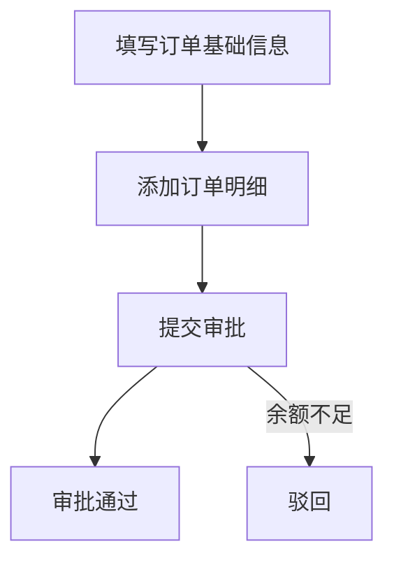
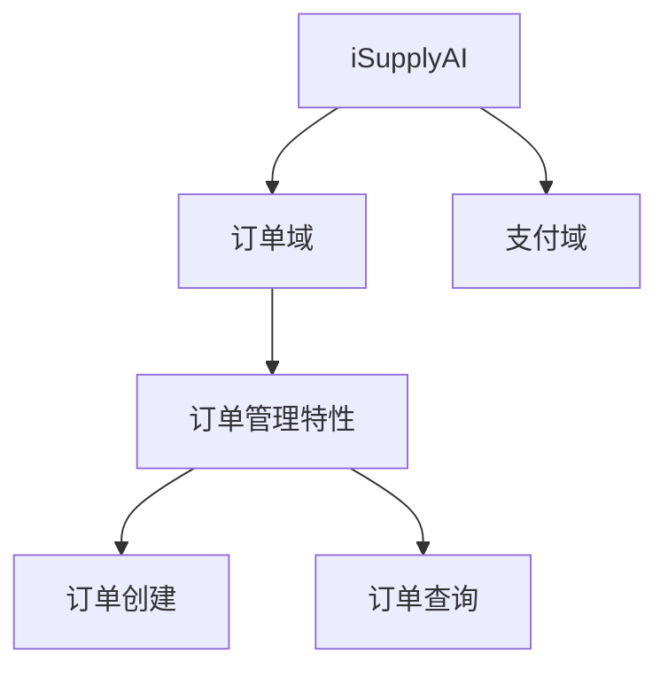
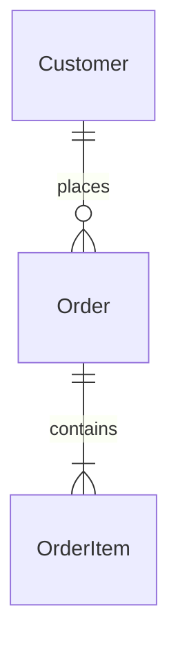
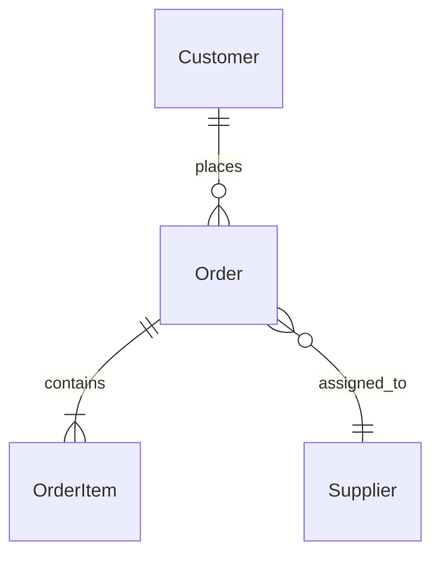
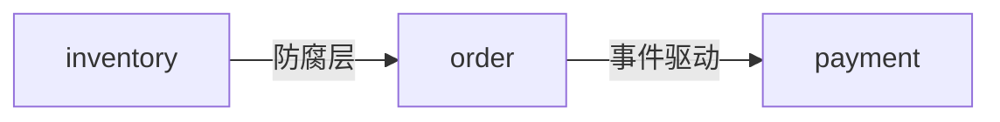
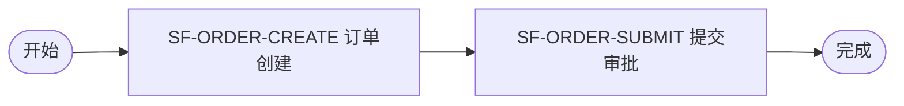
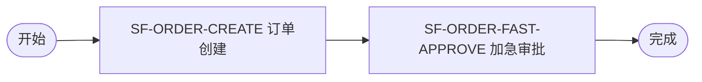
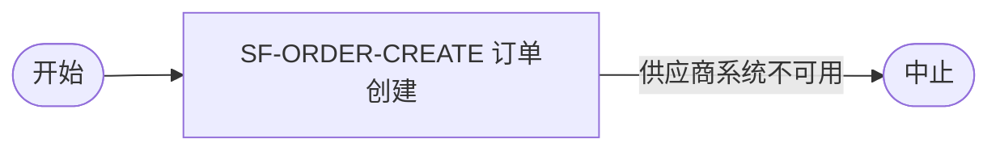

> **版本**:v3.0
> **定位**:本文是一份**自包含**的高阶方案,收齐 25 个要素的 0→1/1→n 产生方式、要素关系、变化点影响映射、四个 Skill 架构,作为后续阶段一~四"Skill 怎么改"方案设计的**唯一基础**。读本文不需再翻其他文档。
> **口径**:本阶段元模型纳入 **25 类要素**(测试三要素 TestScenario/TestCase/TestData 及 ia-test-design 待定 Skill 暂缓,已验证其被测对象在 25 要素中均有落点);ia-asset-mgmt 只从标准 FE/PRD/TDD 文档抽取,不涉及代码;文档生成 Skill 只产纯文档,不产 manifest。

---

# 第一部分 · 总纲

## 1. 目标:让解空间的收敛在全生命周期持续成立

软件研发是把意图逐级翻译为可执行行为的链条(意图→需求 FE→产品设计 PRD→技术设计 TDD→代码)。每一级翻译的解空间都大于一,且有损耗,执行者换成不可复现的 LLM 后,产物极易落入错误解。

**本方案的解法**:用 Skill 逐级生成文档、每一级让人确认后再往下,并把人确认的内容沉淀为**资产**,持续约束解空间趋向**合理解**。沉淀的载体,是把每个要素从"只有文档形态"升级为"文档形态 + 资产库形态",资产库成为机器消费的确定性上下文输入源——让收敛不止在第一次生成成立,而在每次增量、整个生命周期持续成立。

两个要点贯穿全文:**① 人始终在回路并前置把关**(每级文档由人确认,确认点写进每个要素的"规格");**② 沉淀使确认成本随时间下降**(资产越完善,解空间约束越窄)。

## 2. 核心概念

**要素(Element)**:产品从需求到部署产生的各组成单元。一个要素**身份恒定**,有两副面孔:
- **文档形态**:写在 FE/PRD/TDD 文档里,给人评审。文档里**只有要素节**,节标题=要素中文名,**绝无要素之外的章节**(无"信息架构""数据模型"等旧章节);一个要素跨阶段丰富时,各阶段往**同一个要素节**补内容。
- **资产库形态**:存资产库的结构化记录(YAML),给机器消费;汇集成资产库——产品的数字孪生、唯一真相源。

**资产库**:汇集资产库形态要素的 Git 仓库,含 25 要素实例 + `_index`(机器生成的索引,含 cross-references 反向引用图)。不含元模型(元模型在 Skill 侧共享)。

**四个 Skill 一套架构**:三个文档 Skill(ia-fe-generator/ia-fe-to-prd/ia-prd-to-design)做"文档生成",ia-asset-mgmt 做"资产沉淀+分析",四者跑在同一五层架构、共享同一份元模型,差别只在 L4/L5 取值。

## 3. 全局约束与口径(本方案的硬边界)

| # | 约束 | 含义 |
|---|---|---|
| C1 | 一要素两形态 | 同一身份,文档形态给人、资产形态给机器,不是两个东西 |
| C2 | 文档只有要素节 | 每要素一节,节名=要素中文名,无任何旧混合章节 |
| C3 | 文档 Skill 不产 manifest | 三个文档 Skill 只产纯文档;资产格式只在 ia-asset-mgmt 产生 |
| C4 | 只从文档抽取 | ia-asset-mgmt 只从标准 FE/PRD/TDD 文档抽,不读代码 |
| C5 | 关系单端纯净 | 关系只在源端存属性,目标端不存反向,反向由 cross-references 派生 |
| C6 | 只存直接关系 | 能链式推出的不重复存(SubFeature/Entity/DomainEvent 不存 domain) |
| C7 | 不做版本管理 | 除 RR 有 version,其余要素只保持最新,演进靠 lineage.triggered_by |
| C8 | 25 要素 | 测试三要素暂缓;不强行让某阶段产出它信息不足以产出的要素 |

---

# 第二部分 · 要素体系

## 4. 25 要素总览

按萌芽阶段分组(每个要素只在信息足够的最早阶段萌芽,产不出就往后推):

| 组 | 要素 | 萌芽 | 跨阶段演进 | 产出 Skill |
|---|---|---|---|---|
| 需求 | OriginalRequirement | FE 起 | — | ia-fe-generator |
| 全局 | ProductOverview | FE | →PRD(应用架构/LDM) | fe-gen + fe-to-prd |
| 全局 | TechnicalArchitecture | TDD | — | ia-prd-to-design |
| 业务 | BusinessProcess | FE | — | ia-fe-generator |
| 业务 | BusinessRule | FE | →PRD(补) | fe-gen + fe-to-prd |
| 业务 | Role | FE | — | ia-fe-generator |
| 业务 | Glossary | 任意 | 各阶段追加 | 全部 |
| 业务 | Domain | PRD | — | ia-fe-to-prd |
| 产品 | Feature | PRD | — | ia-fe-to-prd |
| 产品 | SubFeature | FE | →PRD(操作+AC) | fe-gen + fe-to-prd |
| 产品 | Page | FE | →PRD(完整) | fe-gen + fe-to-prd |
| 产品 | Permission | PRD | — | ia-fe-to-prd |
| 跨域 | Scenario | PRD | — | ia-fe-to-prd |
| 跨域 | Integration | PRD | →TDD(适配) | fe-to-prd + prd-to-design |
| 跨域 | Configuration | PRD | →TDD(技术+错误码) | fe-to-prd + prd-to-design |
| DDD | Aggregate | PRD | →TDD(状态机/表/全字段) | fe-to-prd + prd-to-design |
| DDD | Entity | PRD | →TDD(字段/表) | fe-to-prd + prd-to-design |
| DDD | ValueObject | TDD | — | ia-prd-to-design |
| DDD | DomainEvent | PRD | →TDD(MQ/订阅) | fe-to-prd + prd-to-design |
| 技术 | DomainService | TDD | — | ia-prd-to-design |
| 技术 | ApplicationService | TDD | — | ia-prd-to-design |
| 技术 | Repository | TDD | — | ia-prd-to-design |
| 技术 | API(UIAPI) | TDD | — | ia-prd-to-design |
| 前端 | Component | TDD | — | ia-prd-to-design |
| 横切 | NonFunctional | FE | →PRD(指标)→TDD(方案) | 三个文档 Skill |

> **跨阶段要素(9 个)**:ProductOverview、BusinessRule、SubFeature、Page、Integration、Configuration、Aggregate、Entity、DomainEvent、NonFunctional——它们在萌芽阶段 create、后续阶段对同一 id 补字段(0→1 是字段补全,1→n 是真 modify)。这是 merge 字段级合并的主要对象。

## 5. 关系总表(单端 · 纯净)

**关系七铁律**:① 关系只在**源端**存一个属性,值=对方 id;② 目标端不存反向,反向由 `_index/cross-references.yaml` 派生;③ 能链式推出的不重复存;④ `triggered_by` 是唯一进 `lineage` 的关系;⑤ `subscribers` 是唯一反向存储例外(订阅方常在库外);⑥ 砍除全部反向冗余属性;⑦ 每要素只声明自己持有的正向关系。

> 本表是后续所有要素卡 YAML、变化点 reverse_via 的**唯一权威**;三处属性名必须与本表一致。

| #   | 源要素                                                                                                                         | 关系类型                | 目标要素                 | 源端属性                                                                       |
| --- | --------------------------------------------------------------------------------------------------------------------------- | ------------------- | -------------------- | -------------------------------------------------------------------------- |
| 1   | 任意要素                                                                                                                        | triggered_by        | OriginalRequirement  | `lineage.triggered_by`                                                     |
| 2   | Feature                                                                                                                     | part_of             | Domain               | `domain`                                                                   |
| 3   | SubFeature                                                                                                                  | part_of             | Feature              | `feature`                                                                  |
| 4   | Aggregate/<br>BusinessRule/<br>Permission/<br>Configuration/<br>DomainService/<br>ApplicationService/<br>Repository/<br>API | part_of             | Domain               | `domain`                                                                   |
| 5   | BusinessProcess/Scenario                                                                                                    | part_of             | Domain(多)            | `involves_domains`                                                         |
| 6   | Page                                                                                                                        | (弱)part_of          | 前端模块                 | `domain`                                                                   |
| 7   | Entity                                                                                                                      | aggregate_member_of | Aggregate            | `aggregate_member_of`                                                      |
| 8   | BusinessProcess 活动                                                                                                          | uses                | Role                 | `activities[].role`                                                        |
| 9   | BusinessProcess 活动                                                                                                          | uses                | BusinessRule         | `activities[].rules`                                                       |
| 10  | SubFeature                                                                                                                  | uses                | BusinessRule         | `referenced_rules`                                                         |
| 11  | SubFeature                                                                                                                  | uses                | Role                 | `performed_by_roles`                                                       |
| 12  | SubFeature                                                                                                                  | uses                | Integration          | `integration_points`                                                       |
| 13  | Page                                                                                                                        | uses                | API                  | `called_apis`                                                              |
| 14  | Page                                                                                                                        | uses                | Component            | `used_components`                                                          |
| 15  | Permission                                                                                                                  | uses                | Role                 | `role_permission_matrix[].role` /<br>`data_permissions[].applies_to_roles` |
| 16  | Scenario                                                                                                                    | 派生(uses 变体)         | BusinessProcess      | `from_process`                                                             |
| 17  | Scenario                                                                                                                    | uses(有序路径)          | SubFeature           | `sub_feature_path`                                                         |
| 18  | Aggregate 字段                                                                                                                | uses                | ValueObject          | `fields[].value_object`                                                    |
| 19  | DomainService                                                                                                               | uses                | BusinessRule         | `operations[].enforces_rules`                                              |
| 20  | ApplicationService                                                                                                          | uses                | DomainService        | `orchestration_uses.services`                                              |
| 21  | ApplicationService                                                                                                          | uses                | Repository           | `orchestration_uses.repositories`                                          |
| 22  | ApplicationService                                                                                                          | uses                | Integration          | `uses_integrations`                                                        |
| 23  | API                                                                                                                         | uses                | 错误码字典(Configuration) | `error_codes[].ref`                                                        |
| 24  | DomainService                                                                                                               | depends_on          | Aggregate            | `collaborates_with_entities`                                               |
| 25  | ApplicationService                                                                                                          | depends_on          | Aggregate            | `involves_aggregates`                                                      |
| 26  | API                                                                                                                         | depends_on          | ApplicationService   | `depends_on`                                                               |
| 27  | Aggregate                                                                                                                   | managed_by          | Repository           | `managed_by_repository`                                                    |
| 28  | Page                                                                                                                        | realizes            | SubFeature           | `realizes_sub_features`                                                    |
| 29  | Permission 功能权限点                                                                                                            | realizes            | SubFeature           | `function_permissions[].from_sub_feature`                                  |
| 30  | API                                                                                                                         | realizes            | SubFeature           | `realizes_sub_feature`                                                     |
| 31  | Aggregate                                                                                                                   | emits               | DomainEvent          | `emits_events`                                                             |
| 32  | (外部订阅方)                                                                                                                     | subscribes_to       | DomainEvent          | `subscribers`(唯一反向)                                                        |
| 33  | Integration                                                                                                                 | external_ref        | 外部 APP 要素            | `external_system`                                                          |
| 34  | Aggregate 字段                                                                                                                | external_ref        | 外部 APP 要素            | `fields[].external_ref`                                                    |
| 35  | NonFunctional                                                                                                               | 作用于(uses 变体)        | SubFeature/Page      | `applies_to`                                                               |
| 36  | Domain                                                                                                                      | 协作(非要素边)            | Domain               | `boundary_with_other_domains`                                              |

**无关系边的要素**:Glossary(`applies_scope` 软关联)、TechnicalArchitecture(全局背景)、Role/ValueObject/Component(只被反向引用)、ProductOverview(`describes`/`domain_context_map` + 应用架构图/LDM 视图)。

**已砍除的反向冗余/链式可推属性**:`BusinessRule.applies_to`、`Feature.sub_features`、`Aggregate.aggregate_members`、`API.called_by_pages`、`Component.used_by_pages`、`DomainEvent.emitted_by`、`Repository.serves_aggregate_root`、`SubFeature.domain`、`Entity.domain`、`DomainEvent.domain`、布尔 `aggregate_root`、版本 `Feature.milestone`。

> **测试相关 6 条关系暂缓**(待 ia-test-design):TestScenario→Scenario、TestScenario→API、TestCase→AC、TestCase→TestScenario、TestCase→被测要素、TestData→Entity。

## 6. 物理组织(资产库落库路径)

```
ars-elements/
├── _requirements/                 ← OriginalRequirement
├── _product/                      ← ProductOverview + TechnicalArchitecture(单实例)
├── _common/                       ← 跨域:roles/ processes/ rules/ scenarios/
│                                     integrations/ configurations/ value-objects/
│                                     glossary/ non-functional/ entities(技术表)/
├── _pages/{module}/               ← Page + components/(前端,独立于后端域)
├── _index/                        ← requirement-map / sub-feature-map / aggregate-map /
│                                     api-map / cross-references / external-refs(机器生成)
└── {domain}/                      ← 各领域
    ├── domain.md
    ├── product/{features,sub-features,permissions}/
    ├── application/services/
    └── technical/{aggregates,entities,value-objects,events,services,repositories,apis}/
```

落库路径在 asset-extract-mapping 中逐要素声明(见第 14 节)。

---

# 第三部分 · 25 要素详细设计(每要素一张全息卡)

> **卡片结构**:萌芽/演进 →【文档形态】(▸0→1 输出 / ▸1→n 输出,各含完整样例)→【资产库形态】(▸0→1 输出 / ▸1→n 输出)→ 关系说明(三列表格)→ 0→1 与 1→n 要点。
> **样例叙事**:0→1 演示"初次建立订单域"(根需求 RR-001,Order 无 supplier_code);1→n 统一演示 RR-005"订单创建增加供应商指定"。两段串成同一个产品演进故事。
>
> **两条输出铁律(本部分通用,务必遵守)**:
> 1. **资产库形态永远是全量最新 record**——0→1 是首次 create 产生的全量;**1→n 展示的是 merge 把增量合并进基线后的"新全量 YAML"**(用 `# ← 本次` 注释标出哪些字段是本次新增/改动),**绝不写 `changes:/add:` 这类 diff 指令**。diff/变更指令是 ia-asset-mgmt 的 merge 中间产物,只出现在第五部分 §14,不出现在要素卡。
> 2. **文档形态 1→n 输出**只产受影响要素的增量片段;若增量是整张表格,用 `<!-- DELTA: change={变化点}, op={add/modify}, requirement={RR} -->` 与 `<!-- /DELTA -->` 把**整张表格上下框住**(不破坏表格列结构);若增量是小节/条目,同样用 DELTA 注释对包裹。

---

## 7.1 OriginalRequirement(原始需求)
**萌芽**:需求入口(FE 起始) · 非跨阶段 · ia-fe-generator

### 【文档形态】
**输入**:【人输入】业务方原话 + 来源(谁/何时/渠道)。无要素依赖(溯源根)。
**规格**:原话一字不改 → 补来源三要素 → 提取关键信息矩阵 → 判需求类型(TP/AP/AI/IT)。**人确认点**:原话无歪曲、类型判对。

**▸ 0→1 输出**(节「原始需求」,全量)
```markdown
## 原始需求
### RR-001 订单管理能力建设
> 我们需要一套订单管理,采购员能创建订单、填明细、提交审批,并能查询订单状态。
| 提出人 | 时间 | 渠道 | 需求类型 |
|---|---|---|---|
| 产品部 | 2026-06-01 | 立项评审 | TP |
```

**▸ 1→n 输出**(新需求追加一条 RR,整表用 DELTA 框住)
```markdown
## 原始需求
<!-- DELTA: change=RQ-01, op=add, requirement=RR-005 -->
### RR-005 订单创建增加供应商指定
> 订单创建后采购员需事后关联供应商…能否创建时就指定?供应商列表从供应商管理系统拉取。
| 提出人 | 时间 | 渠道 | 需求类型 |
|---|---|---|---|
| 张总(采购部) | 2026-08-10 | 月度需求会议 | TP |
<!-- /DELTA -->
```

### 【资产库形态】
**输入**:文档「原始需求」节。
**规格**:抽 raw_description/source/requirement_type;triggered_changes 由各要素入库回填。

**▸ 0→1 输出**(create,全量 record)
```yaml
id: RR-001
element_type: OriginalRequirement
name: 订单管理能力建设
status: implemented
version: V1                       # 仅 RR 有 version
raw_description: "我们需要一套订单管理…"
source: { raised_by: 产品部, raised_at: 2026-06-01, channel: 立项评审 }
requirement_type: TP
triggered_changes: { affected_elements: [F-ORDER-MGMT, SF-ORDER-CREATE, Order, ...] }
```

**▸ 1→n 输出**(每个新需求是一条**独立新 record**,全量;旧 RR 不动)
```yaml
id: RR-005                        # ← 本次新建(永不 modify 旧 RR)
element_type: OriginalRequirement
name: 订单创建增加供应商指定
status: implemented
version: V1
raw_description: "订单创建后采购员需事后关联供应商…能否创建时就指定?…"
source: { raised_by: 张总(采购部), raised_at: 2026-08-10, channel: 月度需求会议 }
requirement_type: TP
triggered_changes:
  affected_elements: [Order, BR-ORDER-008, INT-SUPPLIER-LOOKUP, SF-ORDER-CREATE, P-ORDER-CREATE,
                      DS-ORDER-LIFECYCLE, AS-ORDER-PLACEMENT, API-ORDER-CREATE, API-SUPPLIER-LIST,
                      SupplierCard, NF-SUPPLIER-LOOKUP-PERF, SC-ORDER-SUPPLIER-UNAVAILABLE]
```

### 关系说明
| 关系 | 属性 | 指向 |
|---|---|---|
| (溯源根,无正向关系) | — | — |
| 被指向(反查,不存) | 各要素 `lineage.triggered_by` | 本 RR |

> `affected_elements` 是 merge 回填的派生索引(非手工真相源)。

**0→1 要点**:ia-fe-generator 在 FE 起始 create RR-001。
**1→n 要点**:每条新需求 **create** 一条新 RR;它是本次增量所有变化点的 source_requirement。

---

## 7.2 BusinessProcess(业务流程)
**萌芽**:FE · 非跨阶段 · ia-fe-generator

### 【文档形态】
**输入**:【人输入】端到端流程描述。【要素】RR(界定范围)。产出时反向萌生 Role/BusinessRule。
**规格**:引导讲主流程 → 探测遗漏点(申请/审批/通知/异常/并行)→ 逐活动追问五件套(角色/输入/输出/规则/异常)→ Mermaid。**人确认点**:流程覆盖完整。

**▸ 0→1 输出**(节「业务流程」= flowchart + 活动明细表,全量)
```markdown
## 业务流程
### 订单全生命周期流程(PROC-ORDER-LIFECYCLE)

| 活动 | 执行角色 | 输入 | 输出 | 约束规则 | 异常分支 |
|---|---|---|---|---|---|
| 填写订单基础信息 | 采购员 | 客户信息、商品清单 | 订单草稿 | BR-ORDER-001 | 客户不存在→中止 |
| 提交审批 | 采购员 | 订单草稿 | 待审批订单 | BR-ORDER-002 | 余额不足→驳回 |
```

**▸ 1→n 输出**(命中 PR-01:在既有流程插入活动,只产新增活动行,整表用 DELTA 框住)
```markdown
### 订单全生命周期流程(PROC-ORDER-LIFECYCLE)— 新增活动
<!-- DELTA: change=PR-01, op=modify, requirement=RR-005 -->
| 活动 | 执行角色 | 输入 | 输出 | 约束规则 | 异常分支 |
|---|---|---|---|---|---|
| 指定供应商(插入"添加明细"与"提交审批"间) | 采购员 | 供应商列表 | 订单关联供应商 | BR-ORDER-008 | 供应商系统不可用→拒绝 |
<!-- /DELTA -->
```

### 【资产库形态】
**输入**:文档「业务流程」节。
**规格**:抽 activities 序列,角色/规则引用化。

**▸ 0→1 输出**(create,全量 record)
```yaml
id: PROC-ORDER-LIFECYCLE
element_type: BusinessProcess
name: 订单全生命周期流程
status: active
involves_domains: [order]                 # part_of → Domain
activities:
  - { activity_id: ACT-001, name: 填写订单基础信息, role: ROLE-OPERATOR,
      inputs: [客户信息, 商品清单], outputs: [订单草稿],
      rules: [BR-ORDER-001], exceptions: [客户不存在→中止] }
  - { activity_id: ACT-002, name: 提交审批, role: ROLE-OPERATOR,
      inputs: [订单草稿], outputs: [待审批订单],
      rules: [BR-ORDER-002], exceptions: [余额不足→驳回] }
flow_diagram_mermaid: |
  flowchart TD
    A-->B-->C
lineage: { triggered_by: RR-001 }
```

**▸ 1→n 输出**(merge 后的**全量 record**:activities 已含新活动,其余原值保留)
```yaml
id: PROC-ORDER-LIFECYCLE
element_type: BusinessProcess
name: 订单全生命周期流程
status: active
involves_domains: [order]
activities:
  - { activity_id: ACT-001, name: 填写订单基础信息, role: ROLE-OPERATOR,
      inputs: [客户信息, 商品清单], outputs: [订单草稿],
      rules: [BR-ORDER-001], exceptions: [客户不存在→中止] }
  - { activity_id: ACT-005, name: 指定供应商, role: ROLE-OPERATOR,          # ← 本次新增
      inputs: [供应商列表], outputs: [订单关联供应商],
      rules: [BR-ORDER-008], exceptions: [供应商系统不可用→拒绝] }
  - { activity_id: ACT-002, name: 提交审批, role: ROLE-OPERATOR,
      inputs: [订单草稿], outputs: [待审批订单],
      rules: [BR-ORDER-002], exceptions: [余额不足→驳回] }
flow_diagram_mermaid: |
  flowchart TD
    A-->B-->指定供应商-->C
lineage: { triggered_by: RR-001, last_modified_by: RR-005 }   # ← lineage 追加本次需求
```

### 关系说明
| 关系 | 属性 | 指向 |
|---|---|---|
| part_of | `involves_domains` | Domain |
| uses | `activities[].role` | Role |
| uses | `activities[].rules` | BusinessRule |
| triggered_by | `lineage.triggered_by` | RR |

> `inputs/outputs` 是业务物描述,非关系。

**0→1 要点**:ia-fe-generator create 整条流程(全部活动)。
**1→n 要点**:命中 PR-01 → merge 把新活动并入 activities,产出全量 record;新活动引用的新 Role/BR 由 RO-01/RU-01 连带 create。

---

## 7.3 BusinessRule(业务规则)
**萌芽**:FE · 演进:PRD 补 · ia-fe-generator + ia-fe-to-prd

### 【文档形态】
**输入**:【要素】BusinessProcess 活动的规则字段。【人输入】精确约束与异常。
**规格**:归纳规则类型(准入/路由/计算/校验/时限/权限/额度)→ 分配 BR 编号 → 写约束与异常 → 关联错误码。**人确认点**:规则表述与业务一致。

**▸ 0→1 输出**(节「业务规则」= 规则清单表,全量)
```markdown
## 业务规则
| 编号 | 名称 | 类型 | 约束描述 | 异常分支 | 关联错误码 |
|---|---|---|---|---|---|
| BR-ORDER-001 | 客户有效性 | 校验规则 | 订单客户必须存在且未冻结 | 客户冻结→中止 | E-ORDER-CUST-INVALID |
| BR-ORDER-002 | 下单额度 | 额度规则 | 单笔不超过客户可用额度 | 超额→驳回 | E-ORDER-OVER-LIMIT |
```

**▸ 1→n 输出**(命中 RU-01:新增规则行,整表用 DELTA 框住)
```markdown
## 业务规则
<!-- DELTA: change=RU-01, op=add, requirement=RR-005 -->
| 编号 | 名称 | 类型 | 约束描述 | 异常分支 | 关联错误码 |
|---|---|---|---|---|---|
| BR-ORDER-008 | 供应商必填 | 校验规则 | supplier_code 必填且为有效供应商 | 系统不可用→拒绝创建 | E-ORDER-SUPPLIER-INVALID |
<!-- /DELTA -->
```

### 【资产库形态】
**输入**:文档「业务规则」节。
**规格**:抽 rule_type/description/exception_branches/error_code;域私有放域内,跨域放公共。

**▸ 0→1 输出**(create,全量 record;每条规则一个独立 record)
```yaml
id: BR-ORDER-002
element_type: BusinessRule
name: 下单额度
status: active
domain: order                       # part_of → Domain
rule_type: 额度规则
description: 单笔订单不超过客户可用额度
error_code: E-ORDER-OVER-LIMIT      # uses → 错误码字典
exception_branches: [{ condition: 超额, action: 驳回 }]
lineage: { triggered_by: RR-001 }
```

**▸ 1→n 输出**(新规则是**独立新 record**,全量;改约束则展示改后的全量 record)
```yaml
id: BR-ORDER-008                    # ← 本次新建
element_type: BusinessRule
name: 供应商必填
status: active
domain: order
rule_type: 校验规则
description: supplier_code 必填且必须是有效供应商;供应商系统不可用则拒绝创建
error_code: E-ORDER-SUPPLIER-INVALID
exception_branches: [{ condition: 供应商系统不可用, action: 拒绝创建 }]
lineage: { triggered_by: RR-005 }
```

### 关系说明
| 关系 | 属性 | 指向 |
|---|---|---|
| part_of | `domain` | Domain |
| uses | `error_code` | 错误码字典(Configuration) |
| triggered_by | `lineage.triggered_by` | RR |

> 已砍 `applies_to`(被谁 uses 由 SubFeature.referenced_rules / 活动 rules / DS.enforces_rules 反查)。

**0→1 要点**:FE create(从活动萌芽),PRD 可补域内规则。
**1→n 要点**:命中 RU-01 → 新规则 **create** 独立 record;改约束 → 展示改后全量 record。

---

## 7.4 Role(角色)
**萌芽**:FE · 非跨阶段 · ia-fe-generator

### 【文档形态】
**输入**:【要素】BusinessProcess 活动的执行角色。【人输入】角色类型/动态分配/代理委托。
**规格**:识别角色 → 区分类型(用户/系统/外部系统)→ 追问职责边界/动态分配/代理委托。**人确认点**:角色与职责边界。

**▸ 0→1 输出**(节「角色」= 角色清单表,全量)
```markdown
## 角色
| 编号 | 名称 | 类型 | 职责边界 | 动态分配 | 代理委托 |
|---|---|---|---|---|---|
| ROLE-OPERATOR | 采购员 | 用户角色 | 发起订单、填明细、提交审批 | 否 | 否 |
| ROLE-MANAGER | 主管 | 用户角色 | 审批订单 | 否 | 是 |
```

**▸ 1→n 输出**(命中 RO-01:新增角色行,整表用 DELTA 框住)
```markdown
## 角色
<!-- DELTA: change=RO-01, op=add, requirement=RR-008(示例) -->
| 编号 | 名称 | 类型 | 职责边界 | 动态分配 | 代理委托 |
|---|---|---|---|---|---|
| ROLE-SUPPLIER-ADMIN | 供应商管理员 | 用户角色 | 维护供应商主数据 | 否 | 否 |
<!-- /DELTA -->
```
> RR-005 沿用 ROLE-OPERATOR,Role 未命中 RO-01,不动;上表为 RO-01 命中时的格式示意。

### 【资产库形态】
**输入**:文档「角色」节。
**规格**:抽 role_category/responsibility_boundary;放公共目录。

**▸ 0→1 输出**(create,全量 record)
```yaml
id: ROLE-OPERATOR
element_type: Role
name: 采购员
status: active
role_category: 用户角色
responsibility_boundary: 发起订单、填明细、提交审批
dynamic_assignment: false
delegation_supported: false
lineage: { triggered_by: RR-001 }
```

**▸ 1→n 输出**(新角色是独立新 record;改职责则展示改后全量 record)
```yaml
id: ROLE-SUPPLIER-ADMIN             # ← 本次新建(命中 RO-01 时)
element_type: Role
name: 供应商管理员
status: active
role_category: 用户角色
responsibility_boundary: 维护供应商主数据
dynamic_assignment: false
delegation_supported: false
lineage: { triggered_by: RR-008 }
```

### 关系说明
| 关系 | 属性 | 指向 |
|---|---|---|
| (跨域,无正向关系) | — | — |
| 被指向(反查) | BusinessProcess `activities[].role` / Permission `role_permission_matrix[].role` | 本 Role |
| triggered_by | `lineage.triggered_by` | RR |

**0→1 要点**:ia-fe-generator create。
**1→n 要点**:命中 RO-01 → 新角色 **create** 独立 record;改职责 → 展示改后全量 record。

---

## 7.5 Glossary(概念术语)
**萌芽**:任意(FE 起) · 各阶段追加 · 全部 Skill

### 【文档形态】
**输入**:【人输入】对话中出现的专有名词(由出现触发)。
**规格**:追踪未解释术语 → 追问定义/别名/范围 → 去重。**人确认点**:定义准确。

**▸ 0→1 输出**(节「概念术语」= 术语表,全量)
```markdown
## 概念术语
| 术语 | 定义 | 别名 | 适用范围 |
|---|---|---|---|
| SKU | Stock Keeping Unit,最小库存单元 | 库存单元 | 商品域 |
```

**▸ 1→n 输出**(新术语追加一行,整表用 DELTA 框住)
```markdown
## 概念术语
<!-- DELTA: change=(随需求), op=add, requirement=RR-005 -->
| 术语 | 定义 | 别名 | 适用范围 |
|---|---|---|---|
| 供应商指定 | 在订单创建时即选定供应商,替代事后关联 | — | 订单域 |
<!-- /DELTA -->
```

### 【资产库形态】
**输入**:各文档「概念术语」节。
**规格**:抽 term/definition/aliases/applies_scope;每术语一个独立 record。

**▸ 0→1 输出**(create,全量 record)
```yaml
id: G-SKU
element_type: Glossary
name: SKU
status: active
definition: Stock Keeping Unit,最小库存单元
aliases: [库存单元]
applies_scope: 商品域
lineage: { triggered_by: RR-001 }
```

**▸ 1→n 输出**(新术语独立新 record,不动旧术语)
```yaml
id: G-SUPPLIER-ASSIGN               # ← 本次新建
element_type: Glossary
name: 供应商指定
status: active
definition: 在订单创建时即选定供应商,替代事后关联
aliases: []
applies_scope: 订单域
lineage: { triggered_by: RR-005 }
```

### 关系说明
| 关系 | 属性 | 指向 |
|---|---|---|
| (无要素级关系) | — | — |
| 软关联 | `applies_scope` | 领域(文本) |
| triggered_by | `lineage.triggered_by` | RR |

**0→1 要点**:全程追加 create。
**1→n 要点**:新术语 **create** 独立 record(不动旧术语)。

---

## 7.6 ProductOverview(产品总览,单实例)
**萌芽**:FE(定位/范围) · 演进:PRD(应用架构图 + 数据架构 LDM 图) · ia-fe-generator + ia-fe-to-prd

**定位**:ProductOverview 承载三块全局视图——① 定位与范围(产品级共识)、② 应用架构(应用→Domain→特性→子特性的层级分解,配应用架构图)、③ 数据架构 LDM(全部逻辑实体及关系,从逻辑视角画的逻辑数据模型图,非物理表)。应用架构图节点来自 Domain/Feature/SubFeature,LDM 来自 Aggregate/Entity——都是对已有要素的**全局俯瞰视图**,不重复定义要素本体。单实例。

### 【文档形态】
**输入**:FE【人输入】定位/范围/价值;PRD【要素】Domain+Feature+SubFeature(应用架构图)、Aggregate+Entity(LDM 图)。
**规格**:FE 写定位/痛点/范围/干系人;PRD 汇总应用架构层级图 + 逻辑数据模型图。**人确认点**:产品级架构共识。

**▸ 0→1 输出**(节「产品总览」,FE 出定位 → PRD 补两图,全量)
```markdown
## 产品总览

### 1. 定位与范围
- 定位:面向采购的订单管理系统
- 范围:含订单创建/审批/查询;不含财务结算

### 2. 应用架构(应用 → Domain → 特性 → 子特性)        # PRD 补


### 3. 数据架构 · 逻辑数据模型 LDM(逻辑实体 + 关系,非物理表)    # PRD 补

```

**▸ 1→n 输出**(命中 DM-01/FT-01 或实体关系变化 → 重绘对应图,用 DELTA 框住增量小节)
```markdown
### 3. 数据架构 · 逻辑数据模型 LDM(重绘)
<!-- DELTA: change=DA-01, op=modify, requirement=RR-005 -->
LDM 增加 Order → Supplier(外部)引用关系:

<!-- /DELTA -->
```

### 【资产库形态】
**输入**:FE 定位/范围节 + PRD 应用架构/LDM 节。
**规格**:单实例;两图由相关要素层级/关系派生,merge 可自动重绘。

**▸ 0→1 输出**(create,全量 record)
```yaml
id: PO-ARS
element_type: ProductOverview
name: iSupplyAI 产品总览
status: active
positioning: 面向采购的订单管理系统
scope: { included: [订单创建, 审批, 查询], excluded: [财务结算] }
application_architecture_mermaid: |        # 应用架构图(应用→域→特性→子特性)
  flowchart TD
    APP-->order-->F-ORDER-MGMT-->SF-ORDER-CREATE
data_architecture_ldm_mermaid: |           # 数据架构 LDM(逻辑实体图)
  erDiagram
    Customer ||--o{ Order : places
    Order ||--|{ OrderItem : contains
domain_context_map:                        # 领域间协作(由各 Domain.boundary 汇总)
  - { from: order, to: payment, mode: 事件驱动 }
lineage: { triggered_by: RR-001 }
```

**▸ 1→n 输出**(单实例,merge 后的**全量 record**:受影响的图已重绘,其余原值保留)
```yaml
id: PO-ARS
element_type: ProductOverview
name: iSupplyAI 产品总览
status: active
positioning: 面向采购的订单管理系统
scope: { included: [订单创建, 审批, 查询], excluded: [财务结算] }
application_architecture_mermaid: |
  flowchart TD
    APP-->order-->F-ORDER-MGMT-->SF-ORDER-CREATE
data_architecture_ldm_mermaid: |           # ← 本次重绘:加 Order→Supplier 外部引用
  erDiagram
    Customer ||--o{ Order : places
    Order ||--|{ OrderItem : contains
    Order }o--|| Supplier : assigned_to
domain_context_map:
  - { from: order, to: payment, mode: 事件驱动 }
lineage: { triggered_by: RR-001, last_modified_by: RR-005 }
```

### 关系说明
| 关系 | 属性 | 指向 |
|---|---|---|
| describes(逻辑描述) | (应用架构图节点) | Domain/Feature/SubFeature |
| (LDM 视图) | (LDM 图节点) | Aggregate/Entity |
| 协作汇总(非要素边) | `domain_context_map` | Domain↔Domain |
| triggered_by | `lineage.triggered_by` | RR |

> 两张架构图是对其他要素的视图投影,不新建要素级关系;merge 时由 Domain/Feature/SubFeature/Aggregate/Entity 自动重绘。

**0→1 要点**:FE create(定位/范围)→ PRD 补应用架构图 + LDM(单实例,同 record 丰富)。
**1→n 要点**:命中 DM-01/FT-01(领域/特性变)→ 重绘应用架构图;实体关系变 → 重绘 LDM。属 always_affected(结构变更必重绘),产出仍是单实例全量 record。

---

## 7.7 Domain(领域)
**萌芽**:PRD(FE 信息不足,推后) · 非跨阶段 · ia-fe-to-prd

### 【文档形态】
**输入**:【要素】Feature(特性清单)+ Aggregate/Entity(逻辑实体清单)。【人输入】边界确认与命名。
**规格**:读特性+实体 → 按内聚聚类 → 识别限界上下文 → 命名 → 每个特性/实体归唯一领域(回填其 domain)→ 标上下游 → context map。**人确认点**:`[交互]` 确认边界。**约束**:无孤儿、无重叠。

**▸ 0→1 输出**(节「领域划分」= 领域清单表 + context map,全量)
```markdown
## 领域划分
| 编号 | 名称 | 子域类型 | 职责 |
|---|---|---|---|
| order | 订单域 | core | 管理订单全生命周期 |
| payment | 支付域 | core | 处理订单支付 |

```

**▸ 1→n 输出**(命中 DM-01:需求超出现有领域,新增领域,整表用 DELTA 框住)
```markdown
## 领域划分
<!-- DELTA: change=DM-01, op=add, requirement=RR-020(示例) -->
| 编号 | 名称 | 子域类型 | 职责 |
|---|---|---|---|
| supplier | 供应商域 | supporting | 管理供应商主数据 |
<!-- /DELTA -->
```
> RR-005 落在现有 order 域内,Domain 未命中 DM-01,不动;上表为需求完全超出现有域时的格式示意。

### 【资产库形态】
**输入**:文档「领域划分」节。
**规格**:每行一个独立 Domain record;关系图 → boundary 字段;协作总览汇入 ProductOverview。

**▸ 0→1 输出**(create,全量 record;每个领域一个)
```yaml
id: order
element_type: Domain
name: 订单域
status: active
subdomain_type: core
short_description: 管理订单全生命周期
boundary_with_other_domains:
  - { domain: payment, relation: 下游, mode: 事件驱动 }
  - { domain: inventory, relation: 上游, mode: 防腐层 }
lineage: { triggered_by: RR-001 }
```

**▸ 1→n 输出**(新领域是独立新 record;既有领域边界变则展示改后全量 record)
```yaml
id: supplier                        # ← 本次新建(命中 DM-01 时)
element_type: Domain
name: 供应商域
status: active
subdomain_type: supporting
short_description: 管理供应商主数据
boundary_with_other_domains:
  - { domain: order, relation: 下游, mode: 接口调用 }
lineage: { triggered_by: RR-020 }
```

### 关系说明
| 关系 | 属性 | 指向 |
|---|---|---|
| 协作(非要素边) | `boundary_with_other_domains` | Domain↔Domain |
| 被指向(反查) | 各要素自身 `domain`/`involves_domains` | 本 Domain |
| triggered_by | `lineage.triggered_by` | RR |

> 成员靠各要素自身 domain 反查,Domain 不回存成员列表。

**0→1 要点**:ia-fe-to-prd 在 PRD 聚类产出全部领域。与 Feature 同阶段两步(先出特性/实体 → 聚类成域 → 回填各要素 domain)。
**1→n 要点**:命中 DM-01(需求超出现有领域)→ 新领域 **create** 独立 record;边界变 → 展示改后全量 record;连带 ProductOverview 应用架构图重绘。

---

## 7.8 Feature(特性)
**萌芽**:PRD · 非跨阶段 · ia-fe-to-prd

### 【文档形态】
**输入**:【要素】SubFeature(萌芽,归组来源)。【人输入】特性价值确认。
**规格**:按能力归组子特性 → 推导特性 → 写实质 description + business_value。**人确认点**:特性划分与价值。

**▸ 0→1 输出**(节「特性」= 特性清单,全量;不列"含子特性",层级图在 ProductOverview)
```markdown
## 特性
| 编号 | 名称 | 领域 | 描述 | 业务价值 |
|---|---|---|---|---|
| F-ORDER-MGMT | 订单管理 | order | 订单创建/修改/查询/取消 | 提升下单效率 |
```

**▸ 1→n 输出**(命中 FT-01:新增特性,整表用 DELTA 框住)
```markdown
## 特性
<!-- DELTA: change=FT-01, op=add, requirement=RR-020(示例) -->
| 编号 | 名称 | 领域 | 描述 | 业务价值 |
|---|---|---|---|---|
| F-SUPPLIER-MGMT | 供应商管理 | supplier | 供应商建档/审核/查询 | 统一供应商主数据 |
<!-- /DELTA -->
```
> RR-005 在 F-ORDER-MGMT 内细化,不新增特性,Feature 不动;上表为 FT-01 命中时的格式示意。

### 【资产库形态】
**输入**:文档「特性」节。
**规格**:每特性一个独立 record。

**▸ 0→1 输出**(create,全量 record)
```yaml
id: F-ORDER-MGMT
element_type: Feature
name: 订单管理特性
status: active
domain: order                       # part_of → Domain
description: 覆盖订单创建、修改、查询、取消的完整管理能力
business_value: 提升采购下单效率,降低人工错误
lineage: { triggered_by: RR-001 }
```

**▸ 1→n 输出**(新特性是独立新 record;改价值则展示改后全量 record)
```yaml
id: F-SUPPLIER-MGMT                 # ← 本次新建(命中 FT-01 时)
element_type: Feature
name: 供应商管理特性
status: active
domain: supplier
description: 覆盖供应商建档、审核、查询的管理能力
business_value: 统一供应商主数据,支撑订单供应商指定
lineage: { triggered_by: RR-020 }
```

### 关系说明
| 关系 | 属性 | 指向 |
|---|---|---|
| part_of | `domain` | Domain |
| 被指向(反查) | SubFeature `feature` | 本 Feature |
| triggered_by | `lineage.triggered_by` | RR |

> 已删 `milestone`(不做版本管理)、`sub_features`(反向冗余)。

**0→1 要点**:ia-fe-to-prd create 全部特性。
**1→n 要点**:命中 FT-01 → 新特性 **create** 独立 record;改价值 → 展示改后全量 record。新特性下的子特性由 FE-01 连带。

---

## 7.9 SubFeature(子特性,枢纽节点)
**萌芽**:FE(business_description) · 演进:PRD(操作+AC) · ia-fe-generator + ia-fe-to-prd

### 【文档形态】
**输入**:FE【要素】BusinessProcess;PRD【要素】Feature(归属)+ Page + BusinessRule。
**规格**:FE 给业务描述;PRD 补 page/entity/logic 操作 + BDD 验收标准。**约束:PRD 不产 UIAPI,只描述操作**。**人确认点**:业务理解(FE)、操作与 AC(PRD)。

**▸ 0→1 输出**(节「子特性」,FE 描述 → PRD 补操作/AC,全量)
```markdown
## 子特性
### SF-ORDER-CREATE 订单创建(FR-ORDER-001)
- 业务描述:采购员发起新订单,录入基础信息、添加明细、提交审批
- 页面操作:在创建页录入信息、添加明细、提交           # PRD 补
- 实体操作:创建 Order,关联 OrderItem                  # PRD 补
- 处理逻辑:校验客户与额度 → 创建订单 → 待审批          # PRD 补
- 执行角色:采购员(ROLE-OPERATOR)
| AC 编号 | Given | When | Then |
|---|---|---|---|
| AC-001 | 客户额度不足 | 点击提交 | 提示超额,订单不创建 |
```

**▸ 1→n 输出**(命中 FE-02/DA-01 连带:对既有 SF 追加操作+AC,用 DELTA 框住增量片段)
```markdown
### SF-ORDER-CREATE 订单创建 — 增量
<!-- DELTA: change=FE-02,DA-01, op=modify, requirement=RR-005 -->
- 页面操作(追加):在创建页选择供应商
- 实体操作(追加):设置 Order.supplier_code
- 处理逻辑(追加):校验供应商有效性
- 新增验收标准:
| AC 编号 | Given | When | Then |
|---|---|---|---|
| AC-RR005-001 | 已填明细未选供应商 | 点击提交 | 提示请指定供应商,订单不创建 |
<!-- /DELTA -->
```

### 【资产库形态】
**输入**:文档「子特性」节(FE 描述 + PRD 操作/AC)。
**规格**:跨阶段同一 record 字段补全;1→n 展示合并后全量。

**▸ 0→1 输出**(create,全量 record;FE 萌芽→PRD 补字段后的完整态)
```yaml
id: SF-ORDER-CREATE
element_type: SubFeature
name: 订单创建
status: active
fr_code: FR-ORDER-001
feature: F-ORDER-MGMT                 # part_of → Feature(domain 链式推)
business_description: 采购员发起新订单,录入基础信息、添加明细、提交审批
page_operations: 在创建页录入信息、添加明细、提交
entity_operations: 创建 Order,关联 OrderItem
logic_description: 校验客户与额度 → 创建订单 → 待审批
referenced_rules: [BR-ORDER-001, BR-ORDER-002]   # uses → BusinessRule
performed_by_roles: [ROLE-OPERATOR]              # uses → Role
integration_points: []                            # uses → Integration
priority: P0
acceptance_criteria:
  - { ac_id: AC-001, given: 客户额度不足, when: 点击提交, then: 提示超额,订单不创建 }
lineage: { triggered_by: RR-001 }
```

**▸ 1→n 输出**(merge 后的**全量 record**:操作描述、referenced_rules、AC 均已合并,旧 AC 保留)
```yaml
id: SF-ORDER-CREATE
element_type: SubFeature
name: 订单创建
status: active
fr_code: FR-ORDER-001
feature: F-ORDER-MGMT
business_description: 采购员发起新订单,录入基础信息、添加明细、提交审批
page_operations: 在创建页录入信息、添加明细、提交;选择供应商                      # ← 本次追加"选择供应商"
entity_operations: 创建 Order,关联 OrderItem;设置 Order.supplier_code            # ← 本次追加
logic_description: 校验客户与额度 → 创建订单 → 待审批;校验供应商有效性               # ← 本次追加
referenced_rules: [BR-ORDER-001, BR-ORDER-002, BR-ORDER-008]   # ← 本次新增 BR-ORDER-008
performed_by_roles: [ROLE-OPERATOR]
integration_points: []
priority: P0
acceptance_criteria:
  - { ac_id: AC-001, given: 客户额度不足, when: 点击提交, then: 提示超额,订单不创建 }
  - { ac_id: AC-RR005-001, given: 已填明细未选供应商, when: 点击提交, then: 提示请指定供应商,订单不创建 }  # ← 本次新增
lineage: { triggered_by: RR-001, last_modified_by: RR-005 }
```

### 关系说明
| 关系 | 属性 | 指向 |
|---|---|---|
| part_of | `feature` | Feature(domain 链式推) |
| uses | `referenced_rules` | BusinessRule |
| uses | `performed_by_roles` | Role |
| uses | `integration_points` | Integration |
| triggered_by | `lineage.triggered_by` | RR |

> 不存 `domain`(链式推)。被 Page/API realizes、Permission/Scenario/NonFunctional 指向(反查)。

**0→1 要点**:FE create business_description → PRD 同 record 补操作+AC。
**1→n 要点**:命中 FE-01(新能力)→ 新 SF 独立 record;命中 FE-02/DA-01 连带 → 合并增量后产出全量 record(旧 AC 保留,新 AC、新 referenced_rules、操作追加)。

---

## 7.10 Page(页面)
**萌芽**:FE(业务期望) · 演进:PRD(完整) · ia-fe-generator + ia-fe-to-prd

### 【文档形态】
**输入**:FE【人输入】页面期望;PRD【要素】SubFeature(realizes)。
**规格**:FE 列页面清单+类型;PRD 补字段/防呆/pageflow/引用组件。**人确认点**:界面与交互。

**▸ 0→1 输出**(节「页面」,FE 萌芽 → PRD 完整,全量)
```markdown
## 页面
### P-ORDER-CREATE 订单创建页
- 类型:表单页  路由:/order/create  实现:SF-ORDER-CREATE
| 字段 | 控件 | 必填 | 校验 |
|---|---|---|---|
| customer | 下拉 | 是 | 必选 |
防呆:客户未选→禁用保存按钮。跳转:提交成功→P-ORDER-LIST。
```

**▸ 1→n 输出**(命中 UI-01:加字段/控件/组件,用 DELTA 框住增量片段)
```markdown
### P-ORDER-CREATE 订单创建页 — 增量
<!-- DELTA: change=UI-01, op=modify, requirement=RR-005 -->
新增字段:
| 字段 | 控件 | 必填 | 校验 |
|---|---|---|---|
| supplier_select | 下拉 | 是 | 必选 |
新增防呆:未选供应商→禁用保存按钮。新引用组件:SupplierCard。新调用接口:API-SUPPLIER-LIST。
<!-- /DELTA -->
```

### 【资产库形态】
**输入**:文档「页面」节。
**规格**:跨阶段同一 record;1→n 展示合并后全量。

**▸ 0→1 输出**(create,全量 record)
```yaml
id: P-ORDER-CREATE
element_type: Page
name: 订单创建页
status: active
domain: order                                 # 前端模块逻辑归属(弱 part_of)
page_type: 表单页
route_path: /order/create
realizes_sub_features: [SF-ORDER-CREATE]      # realizes → SubFeature
fields: [{ name: customer, type: 下拉, required: true, validation: 必选 }]
used_components: []                            # uses → Component
called_apis: []                               # uses → API(TDD 后填)
fool_proofing: [{ scene: 客户未选, strategy: 禁用保存按钮 }]
pageflow: { flows_to: [{ target: P-ORDER-LIST, trigger: 提交成功 }] }
lineage: { triggered_by: RR-001 }
```

**▸ 1→n 输出**(merge 后的**全量 record**:各数组已合并,既有项保留)
```yaml
id: P-ORDER-CREATE
element_type: Page
name: 订单创建页
status: active
domain: order
page_type: 表单页
route_path: /order/create
realizes_sub_features: [SF-ORDER-CREATE]
fields:
  - { name: customer, type: 下拉, required: true, validation: 必选 }
  - { name: supplier_select, type: 下拉, required: true, validation: 必选 }   # ← 本次新增
used_components: [SupplierCard]               # ← 本次新增
called_apis: [API-SUPPLIER-LIST]              # ← 本次新增
fool_proofing:
  - { scene: 客户未选, strategy: 禁用保存按钮 }
  - { scene: 未选供应商, strategy: 禁用保存按钮 }   # ← 本次新增
pageflow: { flows_to: [{ target: P-ORDER-LIST, trigger: 提交成功 }] }
lineage: { triggered_by: RR-001, last_modified_by: RR-005 }
```

### 关系说明
| 关系 | 属性 | 指向 |
|---|---|---|
| realizes | `realizes_sub_features` | SubFeature |
| uses | `used_components` | Component |
| uses | `called_apis` | API |
| (弱)part_of | `domain` | 前端模块 |
| triggered_by | `lineage.triggered_by` | RR |

**0→1 要点**:FE create 萌芽 → PRD 同 record 完整化。
**1→n 要点**:命中 UI-01 → 合并增量后产出全量 record(`fields`/`fool_proofing`/`used_components`/`called_apis` 已含新项,既有保留)。

---

## 7.11 Permission(权限模型)
**萌芽**:PRD · 非跨阶段 · ia-fe-to-prd

### 【文档形态】
**输入**:【要素】SubFeature(功能权限点来源)+ Role。【人输入】数据权限规则。
**规格**:基于子特性划功能权限点 → 角色-权限矩阵 → 数据权限维度。**人确认点**:权限矩阵与数据隔离。一域一实例。

**▸ 0→1 输出**(节「权限模型」= 功能权限 + 角色矩阵 + 数据权限,全量)
```markdown
## 权限模型
功能权限:order:create(来自 SF-ORDER-CREATE)、order:query(来自 SF-ORDER-QUERY)
| 角色 | 权限 |
|---|---|
| 采购员 | order:create, order:query |
数据权限:组织维度——采购员只看本部门订单。
```

**▸ 1→n 输出**(命中 PM-01:加功能权限点/改矩阵,用 DELTA 框住增量片段)
```markdown
### 权限模型 — 增量
<!-- DELTA: change=PM-01, op=modify, requirement=RR-005(示例) -->
功能权限(追加):order:assign-supplier(来自 SF-ORDER-CREATE 新操作)
角色矩阵(追加):
| 角色 | 新增权限 |
|---|---|
| 采购员 | order:assign-supplier |
<!-- /DELTA -->
```
> RR-005 若供应商指定不单设权限点,则 Permission 不动;上表为 PM-01 命中时的格式示意。

### 【资产库形态】
**输入**:文档「权限模型」节。
**规格**:一域一实例;1→n 展示合并后全量。

**▸ 0→1 输出**(create,全量 record)
```yaml
id: PERM-ORDER
element_type: Permission
name: 订单权限模型
status: active
domain: order                       # part_of → Domain
function_permissions:
  - { code: order:create, name: 创建订单, from_sub_feature: SF-ORDER-CREATE }   # realizes → SubFeature
  - { code: order:query, name: 查询订单, from_sub_feature: SF-ORDER-QUERY }
role_permission_matrix:
  - { role: ROLE-OPERATOR, permissions: [order:create, order:query] }            # uses → Role
  - { role: ROLE-MANAGER, permissions: [order:query, order:approve] }
data_permissions:
  - { dimension: 组织维度, rule: 只看本部门订单, applies_to_roles: [ROLE-OPERATOR] }
lineage: { triggered_by: RR-001 }
```

**▸ 1→n 输出**(merge 后的**全量 record**:功能权限点与矩阵已合并)
```yaml
id: PERM-ORDER
element_type: Permission
name: 订单权限模型
status: active
domain: order
function_permissions:
  - { code: order:create, name: 创建订单, from_sub_feature: SF-ORDER-CREATE }
  - { code: order:query, name: 查询订单, from_sub_feature: SF-ORDER-QUERY }
  - { code: order:assign-supplier, name: 指定供应商, from_sub_feature: SF-ORDER-CREATE }  # ← 本次新增
role_permission_matrix:
  - { role: ROLE-OPERATOR, permissions: [order:create, order:query, order:assign-supplier] }  # ← 本次追加权限
  - { role: ROLE-MANAGER, permissions: [order:query, order:approve] }
data_permissions:
  - { dimension: 组织维度, rule: 只看本部门订单, applies_to_roles: [ROLE-OPERATOR] }
lineage: { triggered_by: RR-001, last_modified_by: RR-005 }
```

### 关系说明
| 关系 | 属性 | 指向 |
|---|---|---|
| part_of | `domain` | Domain |
| realizes | `function_permissions[].from_sub_feature` | SubFeature |
| uses | `role_permission_matrix[].role` | Role |
| uses | `data_permissions[].applies_to_roles` | Role |
| triggered_by | `lineage.triggered_by` | RR |

**0→1 要点**:ia-fe-to-prd create。
**1→n 要点**:命中 PM-01 → 合并增量后产出全量 record(`function_permissions`/`role_permission_matrix`/`data_permissions` 已含新项)。

---

## 7.12 Scenario(场景)
**萌芽**:PRD · 非跨阶段 · ia-fe-to-prd

**定位**:场景 = 业务流程按某"区分维度"细分出的一条具体路径。同一条订单创建流程,因区分维度取值不同(订单类型=普通/紧急/大宗)而成为不同场景;**不同场景串起的子特性路径不同**。Scenario 显式记录:派生自哪条流程、区分维度及取值、本场景串起的有序子特性路径,并用 Mermaid 画**该场景特有的子特性调用路径**(非照抄流程图)。

### 【文档形态】
**输入**:【要素】BusinessProcess(母流程)+ SubFeature(被串起者)。【人输入】区分维度及其取值。
**规格**:识别母流程 → 识别区分维度(订单类型/客户等级/渠道…)→ 每取值定义一个场景 → 确定该场景的有序子特性路径(含分支/异常)→ 画子特性调用路径图。**人确认点**:维度划分与各场景路径。

**▸ 0→1 输出**(节「场景」,该流程下所有区分维度的场景一次性铺开,全量)
```markdown
## 场景

### SC-ORDER-NORMAL 普通订单创建(normal)
- 派生流程:PROC-ORDER-LIFECYCLE  区分维度:订单类型 = 普通
- 子特性路径:SF-ORDER-CREATE → SF-ORDER-SUBMIT


### SC-ORDER-URGENT 紧急订单创建(edge)
- 派生流程:PROC-ORDER-LIFECYCLE  区分维度:订单类型 = 紧急
- 子特性路径:SF-ORDER-CREATE → SF-ORDER-FAST-APPROVE(加急审批,跳过常规审批)

```

**▸ 1→n 输出**(命中 PR-02:新增场景,用 DELTA 框住增量小节)
```markdown
### SC-ORDER-SUPPLIER-UNAVAILABLE 供应商不可用场景(exception)
<!-- DELTA: change=PR-02, op=add, requirement=RR-005 -->
- 派生流程:PROC-ORDER-LIFECYCLE  区分维度:供应商系统状态 = 不可用
- 子特性路径:SF-ORDER-CREATE →(中止,提示供应商不可用)

<!-- /DELTA -->
```

### 【资产库形态】
**输入**:文档「场景」节。
**规格**:每场景一个独立 record;抽 from_process / discriminator / sub_feature_path / 调用路径图。

**▸ 0→1 输出**(create,全量 record;每场景一个)
```yaml
id: SC-ORDER-NORMAL
element_type: Scenario
name: 普通订单创建场景
status: active
scenario_type: normal
from_process: PROC-ORDER-LIFECYCLE          # 派生(uses 变体)→ BusinessProcess
discriminator: { dimension: 订单类型, value: 普通 }
involves_domains: [order]                    # part_of → Domain
sub_feature_path: [SF-ORDER-CREATE, SF-ORDER-SUBMIT]   # uses(有序)→ SubFeature
call_path_mermaid: |
  flowchart LR
    SF-ORDER-CREATE --> SF-ORDER-SUBMIT
lineage: { triggered_by: RR-001 }
```

**▸ 1→n 输出**(新场景是独立新 record;改既有场景路径则展示改后全量 record)
```yaml
id: SC-ORDER-SUPPLIER-UNAVAILABLE   # ← 本次新建
element_type: Scenario
name: 供应商不可用场景
status: active
scenario_type: exception
from_process: PROC-ORDER-LIFECYCLE
discriminator: { dimension: 供应商系统状态, value: 不可用 }
involves_domains: [order]
sub_feature_path: [SF-ORDER-CREATE]
call_path_mermaid: |
  flowchart LR
    SF-ORDER-CREATE -->|供应商不可用| 中止
lineage: { triggered_by: RR-005 }
```

### 关系说明
| 关系 | 属性 | 指向 |
|---|---|---|
| 派生(uses 变体) | `from_process` | BusinessProcess |
| part_of | `involves_domains` | Domain |
| uses(有序路径) | `sub_feature_path` | SubFeature |
| triggered_by | `lineage.triggered_by` | RR |

> `sub_feature_path` 取代旧的 `involves_sub_features`——既表达 uses,又保留调用顺序(场景本质)。被 TestScenario 派生(反向,不存)。

**0→1 要点**:ia-fe-to-prd 按区分维度 create 各场景。
**1→n 要点**:命中 PR-02(新场景)→ 新场景 **create** 独立 record;改路径 → 展示改后全量 record(`sub_feature_path` replace)。

---

## 7.13 Integration(集成点,机机交互)
**萌芽**:PRD(系统边界) · 演进:TDD(适配+容错) · ia-fe-to-prd + ia-prd-to-design

### 【文档形态】
**输入**:PRD【要素】Domain 边界 +【人输入】集成接口规范;TDD 同节补适配/重试/熔断。
**规格**:PRD 识别接入点+方式(api-SOA/mq/data_sync/file_exchange)+契约;TDD 同节补 fault_tolerance + 外部适配。**人确认点**:契约与降级策略。

**▸ 0→1 输出**(节「集成点」,PRD 契约 → TDD 补容错,全量)
```markdown
## 集成点
### INT-CUSTOMER-LOOKUP 客户查询集成
- 方式:api(SOA)  方向:outbound  外部系统:CRM-APP  契约:GET /customer/{id}
- 容错(TDD 补于本节):timeout 3000,retry 1,降级=阻断下单
```

**▸ 1→n 输出**(命中 IN-01:新增集成,用 DELTA 框住增量小节)
```markdown
## 集成点
<!-- DELTA: change=IN-01, op=add, requirement=RR-005 -->
### INT-SUPPLIER-LOOKUP 供应商查询集成
- 方式:api(SOA)  方向:outbound  外部系统:SUPPLIER-APP  契约:GET /supplier/list
- 容错:timeout 3000,retry 1,降级=订单创建拒绝
<!-- /DELTA -->
```

### 【资产库形态】
**输入**:文档「集成点」节(PRD 契约 + TDD 容错,同一节)。
**规格**:跨阶段同一 record(PRD 契约 → TDD 补容错);新集成是独立新 record。

**▸ 0→1 输出**(create,全量 record;PRD→TDD 补全后的完整态)
```yaml
id: INT-CUSTOMER-LOOKUP
element_type: Integration
name: 客户查询集成
status: active
domain: order                        # part_of → Domain
integration_type: api
direction: outbound
external_system: CRM-APP             # external_ref → 外部 APP 要素
interface_contract: { url: /customer/{id}, method: GET, auth: SOA }
fault_tolerance: { timeout_ms: 3000, retry: 1, fallback: 阻断下单 }
lineage: { triggered_by: RR-001 }
```

**▸ 1→n 输出**(新集成是独立新 record,全量)
```yaml
id: INT-SUPPLIER-LOOKUP             # ← 本次新建
element_type: Integration
name: 供应商查询集成
status: active
domain: order
integration_type: api
direction: outbound
external_system: SUPPLIER-APP        # external_ref → 外部 APP 要素
interface_contract: { url: /supplier/list, method: GET, auth: SOA }
fault_tolerance: { timeout_ms: 3000, retry: 1, fallback: 订单创建拒绝 }
lineage: { triggered_by: RR-005 }
```

### 关系说明
| 关系 | 属性 | 指向 |
|---|---|---|
| part_of | `domain` | Domain |
| external_ref | `external_system` | 外部 APP 要素 |
| triggered_by | `lineage.triggered_by` | RR |

> 被 ApplicationService `uses_integrations` / SubFeature `integration_points` uses(反查)。

**0→1 要点**:PRD create 契约 → TDD 同 record 补容错。
**1→n 要点**:命中 IN-01 → 新集成 **create** 独立 record;补容错 → 展示改后全量 record。

---

## 7.14 Configuration(配置项)
**萌芽**:PRD(业务配置) · 演进:TDD(技术配置 + 错误码字典) · ia-fe-to-prd + ia-prd-to-design

### 【文档形态】
**输入**:PRD【要素】BusinessRule 可配项;TDD【人输入】技术/运维配置 + 错误码体系(同节)。
**规格**:PRD 识别业务可配置项;TDD 同节补技术配置 + 全局错误码字典(DICT-ERROR-CODES)。**人确认点**:配置项与默认值。

**▸ 0→1 输出**(节「配置项」,PRD 业务 → TDD 技术+错误码,全量)
```markdown
## 配置项
| 编号 | 名称 | 类型 | 默认值 | 作用域 | 动态刷新 | 影响 |
|---|---|---|---|---|---|---|
| CFG-ORDER-AMOUNT-THRESHOLD | 审批金额阈值 | 业务配置 | 1000000 | 模块级 | 是 | 超阈值需主管审批 |
| DICT-ERROR-CODES | 错误码字典 | 技术配置 | — | 全局 | — | 全局错误码集合(TDD 补) |
```

**▸ 1→n 输出**(命中 CF-01:错误码字典加条目,用 DELTA 框住增量片段)
```markdown
### 配置项 — 增量
<!-- DELTA: change=CF-01, op=modify, requirement=RR-005 -->
错误码字典 DICT-ERROR-CODES 追加条目:
| 错误码 | 含义 |
|---|---|
| E-ORDER-SUPPLIER-INVALID | 供应商无效 |
<!-- /DELTA -->
```

### 【资产库形态】
**输入**:文档「配置项」节(PRD 业务 + TDD 技术,同一节)。
**规格**:每配置一个独立 record;DICT-ERROR-CODES 是含条目数组的特殊 record,1→n 展示合并后全量。

**▸ 0→1 输出**(create,全量 record)
```yaml
id: CFG-ORDER-AMOUNT-THRESHOLD
element_type: Configuration
name: 订单审批金额阈值
status: active
domain: order                       # part_of → Domain
config_type: 业务配置
default_value: 1000000
scope: 模块级
dynamic_refresh: true
impact: 超过阈值的订单需主管审批
lineage: { triggered_by: RR-001 }
---
id: DICT-ERROR-CODES                # 错误码字典(特殊实例,含条目数组)
element_type: Configuration
name: 全局错误码字典
status: active
config_type: 技术配置
scope: 全局
error_codes:
  - { code: E-ORDER-CUST-INVALID, message: 客户无效 }
  - { code: E-ORDER-OVER-LIMIT, message: 超出额度 }
lineage: { triggered_by: RR-001 }
```

**▸ 1→n 输出**(DICT-ERROR-CODES 合并后的**全量 record**:error_codes 已含新条目)
```yaml
id: DICT-ERROR-CODES
element_type: Configuration
name: 全局错误码字典
status: active
config_type: 技术配置
scope: 全局
error_codes:
  - { code: E-ORDER-CUST-INVALID, message: 客户无效 }
  - { code: E-ORDER-OVER-LIMIT, message: 超出额度 }
  - { code: E-ORDER-SUPPLIER-INVALID, message: 供应商无效 }   # ← 本次新增条目
lineage: { triggered_by: RR-001, last_modified_by: RR-005 }
```

### 关系说明
| 关系 | 属性 | 指向 |
|---|---|---|
| part_of | `domain` | Domain |
| triggered_by | `lineage.triggered_by` | RR |

> DICT-ERROR-CODES 为 Configuration 特殊实例,被 API `error_codes[].ref` / BusinessRule `error_code` 反查。

**0→1 要点**:PRD create 业务配置 → TDD create 技术配置 + 错误码字典。
**1→n 要点**:命中 CF-01 → 新配置 **create** 独立 record;错误码字典加条目 → 展示合并后全量 record。

---

## 7.15 Aggregate(聚合根)
**萌芽**:PRD(轻量 DDD) · 演进:TDD(状态机/物理表/全字段) · ia-fe-to-prd + ia-prd-to-design

### 【文档形态】
**输入**:PRD【人输入+要素推演】识别逻辑实体与聚合根;TDD 同节补物理表/状态流转。
**规格**:PRD 轻量(聚合根+聚合边界+业务字段);TDD 同节补字段约束、state_machine(states 列合法状态全集)、物理表、emits、managed_by。**约束**:不写 aggregate_root 布尔;物理表/状态机写在「聚合根」节内,禁止另立章节。**人确认点**:聚合边界(业务方)、字段与状态机(技术方)。

**▸ 0→1 输出**(节「聚合根」,PRD 轻量 → TDD 补状态机/物理表,全量)
```markdown
## 聚合根
### Order 订单聚合根
- 聚合边界:单订单及明细同事务(成员:OrderItem)
- 字段:order_id(PK)、customer_id、amount、status(枚举)
- 状态机(TDD 补):DRAFT→SUBMITTED→APPROVED→COMPLETED;DRAFT/SUBMITTED→CANCELLED
- 物理表(TDD 补):t_order(索引 idx_customer)
```

**▸ 1→n 输出**(命中 DA-01:加字段;DA-02:改状态机,用 DELTA 框住增量片段)
```markdown
### Order 订单聚合根 — 增量
<!-- DELTA: change=DA-01, op=modify, requirement=RR-005 -->
新增字段:
| 字段 | 类型 | 约束 | 说明 |
|---|---|---|---|
| supplier_code | String(32) | 非空 | 引用 SUPPLIER-APP:Supplier,关联 BR-ORDER-008 |
DDL 新增唯一索引:uk_supplier。
<!-- /DELTA -->
```

### 【资产库形态】
**输入**:文档「聚合根」节(PRD 业务字段+边界 + TDD 物理表/状态机,同一节)。
**规格**:跨阶段同一 record(PRD 轻量 → TDD 补全);1→n 展示合并后全量。

**▸ 0→1 输出**(create,全量 record;PRD→TDD 补全后的完整态)
```yaml
id: Order
element_type: Aggregate              # 类型已表明是聚合根,无 aggregate_root 布尔
name: 订单聚合根
status: active
domain: order                        # part_of → Domain
consistency_boundary: 单订单及其明细的事务一致性
fields:
  - { name: order_id, type: Long, pk: true }
  - { name: customer_id, type: Long }
  - { name: amount, type: Decimal, value_object: Money }   # 字段 uses → ValueObject
  - { name: status, type: Enum }
state_machine:
  states: [DRAFT, SUBMITTED, APPROVED, COMPLETED, CANCELLED]
  transitions:
    - { from: DRAFT, to: SUBMITTED, event: submit, triggered_by: ROLE-OPERATOR, guards: [BR-ORDER-002] }
managed_by_repository: REPO-ORDER    # managed_by → Repository
emits_events: [DE-ORDER-SUBMITTED]   # emits → DomainEvent
ddl: { table: t_order, indexes: [{ name: idx_customer, fields: [customer_id] }] }
lineage: { triggered_by: RR-001 }
```

**▸ 1→n 输出**(merge 后的**全量 record**:fields 已含 supplier_code,既有字段保留)
```yaml
id: Order
element_type: Aggregate
name: 订单聚合根
status: active
domain: order
consistency_boundary: 单订单及其明细的事务一致性
fields:
  - { name: order_id, type: Long, pk: true }
  - { name: customer_id, type: Long }
  - { name: amount, type: Decimal, value_object: Money }
  - { name: status, type: Enum }
  - { name: supplier_code, type: String, length: 32, nullable: false,                # ← 本次新增字段
      external_ref: "SUPPLIER-APP:Entity:Supplier", related_to_rule: BR-ORDER-008 }
state_machine:
  states: [DRAFT, SUBMITTED, APPROVED, COMPLETED, CANCELLED]
  transitions:
    - { from: DRAFT, to: SUBMITTED, event: submit, triggered_by: ROLE-OPERATOR, guards: [BR-ORDER-002] }
managed_by_repository: REPO-ORDER
emits_events: [DE-ORDER-SUBMITTED]
ddl:
  table: t_order
  indexes:
    - { name: idx_customer, fields: [customer_id] }
    - { name: uk_supplier, fields: [supplier_code], type: unique }                    # ← 本次新增索引
lineage: { triggered_by: RR-001, last_modified_by: RR-005 }
```

### 关系说明
| 关系 | 属性 | 指向 |
|---|---|---|
| part_of | `domain` | Domain |
| managed_by | `managed_by_repository` | Repository |
| emits | `emits_events` | DomainEvent |
| uses(字段) | `fields[].value_object` | ValueObject |
| external_ref(字段) | `fields[].external_ref` | 外部 APP 要素 |
| triggered_by | `lineage.triggered_by` | RR |

> 成员由 Entity `aggregate_member_of` 反查(不存 aggregate_members);已删 `aggregate_root` 布尔。

**0→1 要点**:PRD create(业务字段+边界)→ TDD 同 record 补状态机/物理表/全字段。
**1→n 要点**:命中 DA-01 → 合并新字段后产出全量 record(既有字段不动);命中 DA-02 → state_machine 合并后产出全量 record。

---

