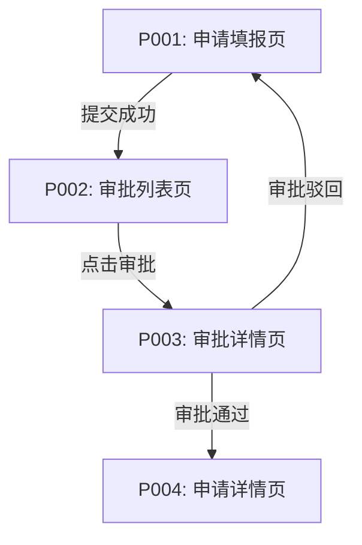

# m-fe-user-interaction — 用户交互设计(TP专用)

> 从业务活动识别界面需求,推导页面类型(表单页/审批页/列表页/详情页),分配页面编号,绘制Mermaid页面流转图,强制生成ASCII低保真草图(不容跳过)。每张草图必须包含标题、核心字段、主要按钮、交互说明。

## 目标

**目标说明**

基于业务活动识别界面需求,从活动操作推导页面类型,为每个页面分配编号,绘制页面流转关系图,强制生成ASCII低保真草图。

**输出物**

- 页面清单表格(页面编号、页面名称、页面类型、对应功能、核心功能、对应页面编号)
- Mermaid页面流转图(graph TD格式,标注页面跳转关系和触发条件)
- ASCII低保真草图(每个关键页面至少1个,必须包含:标题、核心字段、主要按钮、交互说明)

**成功标准**

- 页面清单覆盖所有关键界面需求
- 页面类型正确推导(表单页/审批页/列表页/详情页)
- Mermaid页面流转图语法正确(节点格式、分支条件)
- ASCII草图强制生成,不容跳过
- ASCII草图包含四个要素(标题区域、核心字段、主要按钮、交互说明)
- 所有草图已获得用户确认
- confirmed_pool.pages_design.key_pages 已记录

---

## 前置条件

**依赖要素**

| 依赖要素 element_id | 原因 |
|----------------------|------|
| business-function | 功能清单已生成,功能详细描述包含操作步骤 |
| business-process(构思) | 活动明细包含界面呈现线索(对应页面、按钮) |

**必要输入**

- 功能清单表格
- 业务活动明细(构思:活动操作可推导页面)

---

## 约束

### 格式规范

| standard_id | 规范说明 |
|-------------|---------|
| mermaid-page-flow | 页面流转 Mermaid graph TD 格式规范 |

### 设计约束

| 约束编号 | 级别 | 规则 | 验证方法 |
|----------|------|------|---------|
| `DC-UI-001` | MUST | 必须生成Mermaid页面流转图,格式为graph TD | 检查输出骨架是否包含graph TD语法 |
| `DC-UI-002` | MUST | Mermaid节点格式必须为P001[P001:页面名称],括号成对,箭头格式-->|触发条件| | 检查Mermaid语法正确性 |
| `DC-UI-003` | MUST | ASCII草图必须强制生成,不容跳过 | 检查执行步骤是否包含拒绝跳过的逻辑 |
| `DC-UI-004` | MUST | ASCII草图必须包含四个要素:标题区域、核心字段、主要按钮、交互说明 | 检查草图质量是否满足四个要素 |
| `DC-UI-005` | MUST | ASCII草图核心字段不能全为占位符(如字段1/字段2/XXX),必须包含至少2个具体业务字段 | 检查草图核心字段是否存在占位符 |
| `DC-UI-006` | MUST | ASCII草图必须获得用户确认后才允许继续 | 检查对话记录是否包含草图确认环节 |
| `DC-UI-007` | MUST | confirmed_pool.pages_design.key_pages 必须记录 | 检查 frontmatter 或 context 是否记录 key_pages |

---

## 执行步骤

**Step 1: 基于业务活动识别界面需求** `[自动]`

读取 `business-function` 要素的功能清单和功能详细描述:
- 从功能详细描述的"操作步骤"提取界面需求
- 从活动明细的"界面呈现"提取对应页面线索(构思)

示例推导:
- "用户在'申请填报'页面点击'提交'按钮" → 页面:申请填报页(表单页)
- "审批人在'审批列表'页面点击'审批'按钮" → 页面:审批列表页(列表页)、审批详情页(审批页)

---

**Step 2: 推导页面类型** `[自动]`

从活动操作推导页面类型:

| 页面类型 | 推导依据 |
|---------|---------|
| **表单页** | 用户发起/填写/修改内容的操作 |
| **审批页** | 审批人查看待办并执行审批操作 |
| **列表页** | 查询记录、筛选搜索的操作 |
| **详情页** | 查看完整信息、状态跟踪 |

识别核心操作:
- 填写/修改 → 表单页
- 审批/驳回 → 审批页
- 查询/筛选 → 列表页
- 查看/详情 → 详情页

---

**Step 3: 分配页面编号** `[自动]`

为每个页面分配编号:
- 格式: `P001`、`P002`、`P003`...
- 按页面出现顺序编号

---

**Step 4: 形成页面清单表格** `[自动]`

| 页面编号 | 页面名称 | 页面类型 | 对应功能 | 核心功能 | 对应页面编号 |
|---------|---------|---------|---------|---------|-------------|
| P001 | {页面名称} | 表单页/审批页/列表页/详情页 | FR-xxx | {功能描述} | P002(跳转页面) |

标注对应功能编号(FR-xxx)和对应页面编号(跳转关系)。

---

**Step 5: 绘制Mermaid页面流转图** `[自动]`

基于页面清单绘制页面跳转关系:



**关键要求**:
- 节点格式: `P001[P001:页面名称]`,括号成对
- 箭头格式: `-->|触发条件|`
- 覆盖所有关键页面
- Mermaid语法正确性验证(节点格式、括号成对、箭头格式)

---

**Step 6: ASCII低保真草图强制生成** `[交互]` ⚠️ **核心强制环节**

**Step 6.1: 宣布强制生成(不容跳过)**

> "接下来我要为每个关键页面绘制低保真草图,这是设计的重要环节,**不容跳过**。
>
> 草图会帮助我们:
> - 确认页面核心字段是否齐全
> - 确认主要操作按钮是否合理
> - 确认交互流程是否符合预期
>
> 让我们逐个页面开始绘制。"

**Step 6.2: 为第一个页面生成ASCII草图**

示例草图格式:

```
┌─────────────────────────────┐
│      【申请填报页】           │
│                             │
│  申请标题: [___________]    │
│  申请类型: [下拉选择]       │
│  申请金额: [___________]    │
│  申请说明: [文本框]         │
│                             │
│  [提交]  [取消]  [保存草稿] │
│                             │
│  注:提交后跳转到审批列表页   │
└─────────────────────────────┘
```

**关键要求**:
- 标题区域: 页面名称清晰标注
- 核心字段: 至少包含2个具体业务字段(不能是字段1/字段2/XXX等占位符)
- 主要按钮: 操作按钮完整(如提交/取消/保存草稿)
- 交互说明: 至少包含1条交互行为描述

---

**Step 6.3: 质量检查(不合格立即暂停)** ⚠️ **强制质量检查**

**检查草图是否满足四个要素**:

| 检查项 | 不合格表现 | 处理方式 |
|--------|-----------|---------|
| 标题区域 | 仅标题无字段 | 立即暂停,要求重新生成 |
| 核心字段 | 全为占位符(字段1/字段2/XXX) | 立即暂停,追问"这个页面至少包含哪些具体业务字段?" |
| 主要按钮 | 缺少主要操作按钮 | 立即暂停,追问"用户在这个页面主要能做什么操作?" |
| 交互说明 | 缺少交互说明 | 立即暂停,追问"提交后跳转到哪个页面?" |

**不合格立即暂停并追问**:

若检查不合格:

> "不好意思,这个草图还不够详细。请告诉我:
> - 这个页面至少包含哪些**具体业务字段**?(不能是字段1/字段2等占位符)
> - 用户在这个页面主要能做什么**操作**?(如提交、保存、取消)
> - 点击'提交'按钮后会发生什么?(跳转到哪个页面/触发什么动作)"

追问直至草图满足四个要素。

---

**Step 6.4: 用户确认后才允许继续** ⚠️ **强制确认环节**

展示草图并追问:

> "这是'{页面名称}'的低保真草图:
>
> {展示ASCII草图}
>
> 这个草图是否准确?核心字段和按钮是否齐全?"

**强制获得明确确认** ("准确"/"没问题"/"对的")

若用户说"差不多就行"/"先这样吧":
- 持续追问直至获得明确确认
- 若核心字段不全,追问"还缺少哪些字段?"

用户确认后,才允许继续绘制下一个页面草图。

---

**Step 6.5: 重复绘制所有关键页面草图** `[交互]`

逐个页面绘制草图,每个草图都经过质量检查和用户确认:
- 页面1草图 → 质量检查 → 用户确认 → 继续
- 页面2草图 → 质量检查 → 用户确认 → 继续
- ...

**关键要求**:
- 每个关键页面至少1个草图(核心页面可多个草图,如不同状态)
- 每个草图必须包含四个要素
- 每个草图必须获得用户明确确认后才继续

---

**Step 7: 记录 confirmed_pool.pages_design.key_pages** `[自动]`

用户确认所有草图后,立即记录:

- frontmatter.confirmed_pool.pages_design.key_pages = "[P001,P002,P003,...]"
- 或 context.confirmed_pool.pages_design.key_pages

---

**Step 8: 用户最终确认** `[交互]`

整理页面清单、页面流转图、ASCII草图并展示:

> "我已经整理好了用户交互设计,包含:
> - 页面清单(页面编号/名称/类型/对应功能)
> - 页面流转图(Mermaid格式)
> - ASCII低保真草图(所有关键页面,已包含标题/核心字段/主按钮/交互说明)
>
> 这个信息是否准确?"

强制获得明确确认。

---

**Step 9: 写入文档** `[自动]`

### incremental 模式

> 适用于增量构建场景。基线为 context.base_doc_path 指向的历史 FE。
> 本节仅生成"变更增量"(用 DELTA 标注块包裹),不重写已有内容。

**Step I-1: 读取基线对应章节** `[自动]`

读取 `context.base_doc_path` 中本要素对应章节(依据 `chapter_info.l1_no`)的现有内容,作为基线。
若基线对应章节不存在(异常情况) → 暂停并报错,提示用户基线 FE 不完整。

**Step I-2: 提取本要素相关的变化点** `[自动]`

从 `context.impact_analysis.element_changes` 提取本要素相关的变化点列表,每项含:
- `change_id`(如 PR-01)
- `user_description`(用户原话)
- `impact_level`(certain/likely/conditional/always_affected)

若 `element_changes` 为空 → 跳过本要素(在 Phase 6 仅记录 SKIP)。

聚焦:针对 UI-* 变化点。UI-01 追问新页面草图;UI-02 追问字段控件变化(强制 ASCII 草图);UI-03 追问跳转关系变化;UI-04 追问下线页面级联

**Step I-3: 对话挖掘变化细节** `[交互]`

对每个变化点,沿用本 Spec `## 追问维度` 的提问内核,但**只针对变化部分追问**,禁止重新挖掘基线已有内容。

具体追问聚焦点见下方"逐 Spec 微调点"。

每完成一个变化点的细节挖掘,做小结并请用户确认,确认后才继续下一个变化点。

**Step I-4: 生成 DELTA 标注的增量内容** `[自动]`

按 element-runner Phase 4 incremental 分支的 DELTA 格式输出:

```
<!-- DELTA: change={change_id}, chapter={element_id}, op={add|modify|delete}, level={certain|likely|conditional} -->
{增量内容,保留 Markdown 格式,含表格/Mermaid/列表}
<!-- /DELTA -->
```

注意:
- 仅输出增量部分,不复述基线已有内容
- 多个变化点对应多个 DELTA 块
- `op=modify` 必须明确"修改自基线哪一节"(在 DELTA 块内首行写"基线引用: {chapter}")
- `op=delete` 必须明确"删除基线哪一节"(在 DELTA 块内写"删除目标: {chapter}, 原因: {...}")

**Step I-5: 累积 ImpactPoint** `[自动]`

将本要素本次产生的影响点写入 `context.impact_analysis.impact_points`,数据结构遵循规范 §3.7.3:

```yaml
- id: "IP-{全局递增}"
  source_change: "{change_id}"
  trigger_type: "primary"
  element: "{当前 element_id}"
  kind: "modify"
  baseline_ref: "{基线章节引用}"
  baseline_state: "{基线现状描述}"
  action: "新增 | 修改 | 删除"
  target_state: "{目标状态}"
  in_scope: ["{明确包含的对象}"]
  out_of_scope: ["{明确排除的对象}"]
```

**Step I-6: 用户最终确认** `[交互]`

展示本要素本次的全部 DELTA 块和 ImpactPoint 清单,询问"本要素的增量是否准确?"。

强制获得明确确认("准确"/"没问题"/"对的")后才能进入 Phase 5 质量验证。

---

## 引导开场(对话模式)

接下来我要为每个关键页面绘制低保真草图,这是设计的重要环节,**不容跳过**。

草图会帮助我们确认页面核心字段是否齐全、主要操作按钮是否合理、交互流程是否符合预期。

让我们逐个页面开始绘制。

---

## 追问维度

### 页面清单

- 页面类型: 表单页/审批页/列表页/详情页推导是否合理?
- 对应功能: 是否与功能编号对应?
- 跳转关系: 页面跳转是否合理?

### 页面流转图

- 节点格式: P001[P001:页面名称]是否正确?
- 触发条件: -->|触发条件|标注是否准确?

### ASCII草图

- 标题区域: 页面名称是否清晰标注?
- 核心字段: 至少包含2个具体业务字段(不能是占位符)?
- 主要按钮: 操作按钮是否完整?
- 交互说明: 至少包含1条交互行为描述?

---

## 完整性检查

检查必要信息是否完整:
- [ ] 页面清单已生成(包含页面编号、页面名称、页面类型、对应功能)
- [ ] 页面流转图已生成(Mermaid语法正确)
- [ ] ASCII草图已强制生成(不容跳过)
- [ ] 每个草图包含四个要素(标题/核心字段/主按钮/交互说明)
- [ ] 核心字段不是占位符(至少2个具体业务字段)
- [ ] 每个草图已获得用户明确确认
- [ ] confirmed_pool.pages_design.key_pages 已记录

---

## 用户确认

展示页面清单、页面流转图、ASCII草图,询问:"这个页面设计是否准确?"

强制获得明确确认。

**特别要求**:
- ASCII草图必须强制生成,拒绝用户跳过请求
- 草图必须包含四个要素,不合格立即暂停追问
- 每个草图必须获得用户确认后才允许继续

---

## 强制质量检查

- ✅ 页面清单已生成,页面类型正确推导
- ✅ 页面流转图语法正确(节点格式、括号成对、箭头格式)
- ✅ ASCII草图强制生成,不容跳过
- ✅ 每个草图包含四个要素(标题/核心字段/主按钮/交互说明)
- ✅ 核心字段不是占位符(至少2个具体业务字段)
- ✅ 每个草图已获得用户确认
- ✅ confirmed_pool.pages_design.key_pages 已记录
- ✅ 无占位符

---

## 输出骨架

```markdown
## 六、用户交互

### 页面清单

| 页面编号 | 页面名称 | 页面类型 | 对应功能 | 核心功能 | 对应页面编号 |
|---------|---------|---------|---------|---------|-------------|
| P001 | {页面名称} | 表单页/审批页/列表页/详情页 | FR-xxx | {功能描述} | P002 |

### 页面流转图


### 页面低保真草图

**P001: {页面名称}**

```
┌─────────────────────────────┐
│      【页面标题】             │
│                             │
│  {具体业务字段1}: [___]     │
│  {具体业务字段2}: [___]     │
│  {具体业务字段3}: [___]     │
│                             │
│  [提交]  [取消]  [保存]     │
│                             │
│  注:{交互行为描述}           │
└─────────────────────────────┘
```

**P002: {页面名称}**

```
┌─────────────────────────────┐
│      【页面标题】             │
│                             │
│  {具体业务字段1}: [___]     │
│  {具体业务字段2}: [___]     │
│                             │
│  [操作按钮1]  [操作按钮2]   │
│                             │
│  注:{交互行为描述}           │
└─────────────────────────────┘
```

(重复所有关键页面草图)

> 注:本要素强制生成ASCII低保真草图,不容跳过。每个草图必须包含标题区域、核心字段(至少2个具体业务字段)、主要按钮、交互说明。所有草图已获得用户确认,confirmed_pool.pages_design.key_pages 已记录。

> ⚠️ **特别说明**: ASCII草图核心字段不能是占位符(字段1/字段2/XXX),必须包含具体业务字段(如申请标题、申请金额、审批意见等)。
```