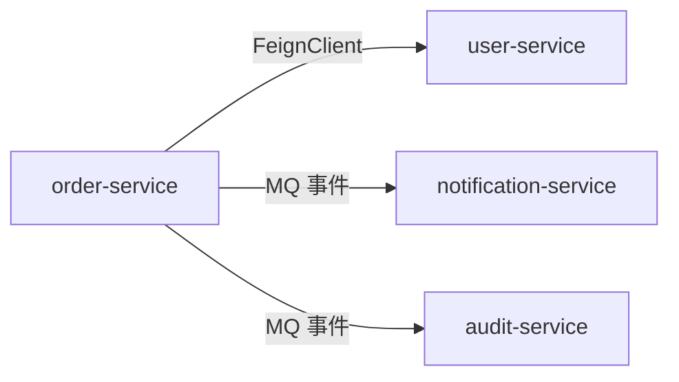
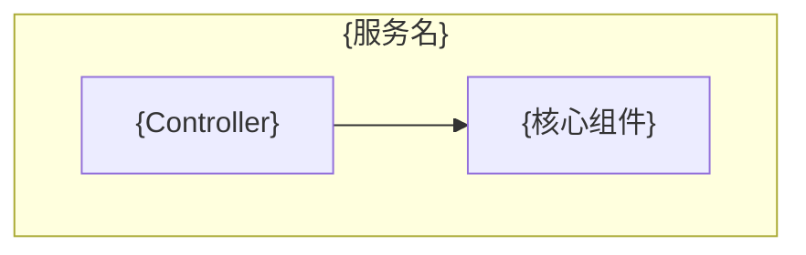

# design-architecture

内建规范；域 **`architecture`**；子分段：`arch-tech-stack`, `arch-deployment`, `arch-microservice`, `arch-feature-toggle`, `arch-code-structure`, `arch-common-lib`, `arch-common-component`。
每节含「规范条文」与「交付模板」（若该分段定义了模板章节）。

## 分段：`arch-tech-stack`


**规范分段**：`arch-tech-stack`

### 规范条文

# 技术选型与代码架构规范（TDD 第1章 §1.1 / §1.5 / §1.6 / §1.7）

> **仅在 greenfield 模式下输出。**

## 1.1 技术选型规范

### 版本锁定原则

- 所有依赖必须锁定到具体版本号（major.minor.patch），禁止使用 LATEST 或范围版本
- 优先使用公司内部经过安全审计的版本基线
- Spring Boot、Vue 等主框架使用当前 LTS（Long-Term Support）版本

### 技术栈分层

| 层次 | 选型范围 |
|------|---------|
| 后端框架 | Spring Boot（推荐 3.x）|
| 服务治理 | Spring Cloud Alibaba（Nacos + Sentinel + Seata）|
| 数据层 | MySQL 8.0 + MyBatis-Plus / JPA |
| 缓存 | Redis 7.x（Redisson 客户端）|
| 消息队列 | RocketMQ 5.x |
| 前端框架 | Vue 3 + Vite 5 + TypeScript |
| 前端状态 | Pinia |
| 前端 UI 组件库 | Element Plus / 内部组件库 |
| 构建工具 | Maven 3.9（后端）/ Vite 5（前端）|

## 1.5 代码架构规范

### 分层结构（DDD 四层）

```
src/
├── interfaces/        # 接口层：API / DTO / Converter / 参数校验 / MQ Consumer
├── application/       # 应用层：APPService
├── domain/            # 领域层：Service/ Entity/VO/Command / Repository 接口 / DomainEvent / 枚举 / 常量
└── infrastructure/    # 基础设施层：RepositoryImpl / MQ Producer / DAO / PO / DTO / Converter
```

### 依赖方向约束

- Domain 层禁止依赖 Infrastructure
- Application 层禁止直接操作数据库（通过 Repository 接口）
- Interface 层禁止包含业务逻辑
- 使用防腐层（ACL）隔离外部模型，禁止将外部 DTO 直接渗透到内部领域层

### 包命名规范

- 根包：`com.{company}.{product}.{service}`
- 模块包：`com.{company}.{product}.{service}.{module}`（如 `order`、`user`）

## 1.6 公共基础库规范

### 必须封装的公共能力

| 能力 | 封装形式 | 模块 |
|------|---------|------|
| 统一响应封装 | `ApiResponse<T>` 泛型响应体  | `common-core` |
| 全局异常处理 | `@ControllerAdvice` + `GlobalExceptionHandler` | `common-core` |
| 工具类 | `DateUtils`, `JsonUtils`, `StringUtils` | `common-util` |
| 请求封装（前端） | Axios 封装 + Token 注入 + 错误拦截 | `request.ts` |

## 1.7 公共组件规范

### 切面组件

| 注解 | 功能 | 切面织入时机 |
|------|------|------------|
| `@Idempotent` | 幂等控制 | 方法执行前（Redis SETNX 去重）|
| `@DistributedLock` | 分布式锁 | 方法执行前后（Redisson，自动释放）|
| `@AuditLog` | 操作审计日志 | 方法执行后（记录操作人、入参摘要、结果）|
| `@Desensitize` | 响应字段脱敏 | Jackson 序列化时（手机号/身份证等）|

### 切面设计约定

- 切面逻辑不包含业务判断，只做横切关注点处理
- 切面异常不影响主业务流程（最多记录日志）
- 幂等键的有效期与业务 TTL 对齐

### 公共二方件
| 编号 | 模块名称            | 功能描述 | 适用场景                                |
|:----:|:----------------|:---------|:------------------------------------|
| **01** | **异步任务实现**      | Jalor框架异步消息系统完整实现流程 | 需要后台异步处理的长耗时任务、批量操作、线程池管理           |
| **02** | **Excel导入实现**   | 支持CXF和DDD架构的Excel导入完整实现 | 批量导入数据、Excel文件解析、多Sheet处理、分页处理、错误收集 |
| **03** | **Excel导出实现**   | Jalor框架Excel导出功能实现 | 数据导出为Excel文件、同步/异步导出、字段转换           |
| **04** | **审批流集成**       | IAOne审批流完整功能实现指南 | 创建审批流程、审批操作、流程查询、流程管理               |
| **05** | **RPC接口实现**     | IAOne RPC标准化接口配置和实现 | 跨服务调用、标准化RPC接口配置、服务间通信              |
| **06** | **AE数据查询**      | 审计单元数据、组织信息、业务场景查询 | 查询AE数据、组织层级、责任田数据、产业信息              |
| **07** | **RU数据查询**      | 审计资源数据查询完整指南 | 查询审计资源、审计单元关联数据                     |
| **08** | **数据字典配置查询**    | jalor数据字典查询实现 | 查询数据字典配置数据                          |
| **09** | **Lookup查询工具**  | Lookup数据快速查询工具实现 | 快速查询Lookup配置数据、下拉选项数据               |
| **10** | **Todos SDK集成** | IAOne待办任务SDK完整集成指南 | 待办任务管理、任务状态查询、任务通知                  |
| **11** | **Espace消息集成**  | IAOne Espace消息通知SDK集成 | 企业空间消息推送、提醒通知                       |
| **12** | **权限注解生成**      | 权限控制注解自动生成工具 | 生成权限控制注解、配置权限点                      |
| **13** | **异常处理规范**      | Jalor框架业务异常定义和使用规范 | 业务异常定义、异常抛出、异常码规范、国际化消息             |
| **14** | **编号生成器**       | 统一的编号生成、占用、释放和查询功能 | 业务编号生成、编号生命周期管理、编号预览、批量生成           |
| **15** | **DDD代码生成**     | DDD架构四层代码框架生成规范 | 领域对象代码生成、四层架构规范、命名约定                |
| **16** | **EDM SDK集成**   | EDM文档管理SDK完整集成指南 | 文档上传下载、PDF转换、水印加密、批量文档操作             |


## 项目规范摘录（`规范/` 目录 · IT 设计文档 §4.2.2）

> 来源：`{WORKSPACE_ROOT}/规范/examples/it_design_doc.md`「新引入三/二方库声明」。

- 若引入新依赖，须声明：**坐标与版本**、**引入目的**、**替代方案评估**（含为何不采用现有工具/二方库/自研）。
- **技术评估**须包含：许可证、稳定性与成熟度、与当前技术栈兼容性、性能与安全考量。

### 交付模板

# 技术选型与代码架构设计（TDD 第1章 §1.1 / §1.5 / §1.6 / §1.7）

> **仅 greenfield 模式输出。** 本文件确定后，后续版本迭代不重新生成，变更需走架构评审。

---

## 1.1 技术选型

### 后端技术栈

| 层次 | 技术选型 | 版本 | 说明 / 选型原因 |
|------|---------|------|--------------|
| 主框架 | Spring Boot | {3.2.x} | |
| 服务注册/配置中心 | Nacos | {2.x} | |
| 数据库 | MySQL | {8.0} | |
| ORM | MyBatis-Plus | {3.5.x} | |
| 缓存 | Redis + Redisson | {7.x / 3.x} | |
| 消息队列 | RocketMQ | {5.x} | |
| 分布式事务 | Seata | {2.x} | 若有跨服务事务 |
| 服务熔断/限流 | Resilience4j / Sentinel | | |
| 构建工具 | Maven | {3.9} | |
| 容器化 | Docker + Kubernetes | | |

### 前端技术栈

| 层次 | 技术选型 | 版本 | 说明 / 选型原因 |
|------|---------|------|--------------|
| 框架 | Vue | {3.4.x} | |
| 构建工具 | Vite | {5.x} | |
| 语言 | TypeScript | {5.x} | strict 模式 |
| 状态管理 | Pinia | {2.x} | |
| UI 组件库 | {Element Plus / 内部库} | {版本} | |
| HTTP 客户端 | Axios | {1.x} | |
| 路由 | Vue Router | {4.x} | |

### 待确认项

- [ ] {技术选型中的不确定项，如 DB 类型、消息队列选型等}

---

## 1.5 代码架构

### 分层结构

```
{根包名}/
├── interfaces/        # Controller / DTO / Converter
│   └── {module}/
├── application/       # Service 接口 + ServiceImpl
│   └── {module}/
├── domain/            # Entity / Repository 接口 / DomainEvent / Enum
│   └── {module}/
└── infrastructure/    # RepositoryImpl / MQ / FeignClient / Cache
    └── {module}/
```

### 包命名

- 根包：`com.{company}.{product}.{service}`
- 示例：`com.example.mall.order`

### 依赖方向防腐说明

{描述本项目特殊的防腐层设计，如对外部系统模型的隔离策略}

---

## 1.6 公共基础库

### 后端公共模块

| 模块名 | 提供能力 | 引入方式 |
|--------|---------|---------|
| `common-core` | `Result<T>`响应封装、`GlobalExceptionHandler`、`BusinessException` | Maven 依赖 |
| `common-util` | `DateUtils`、`JsonUtils`、`PageUtils` | Maven 依赖 |
| `common-framework` | AOP 切面（幂等/锁/审计/脱敏）| Maven 依赖 |

### 前端公共模块

| 模块/文件 | 提供能力 |
|---------|---------|
| `src/utils/request.ts` | Axios 封装，统一 Token 注入、错误拦截、Loading 控制 |
| `src/composables/usePermission.ts` | `hasPermission()` 权限判断 Hook |
| `src/composables/useDict.ts` | 字典缓存与翻译 Hook |

---

## 1.7 公共组件（AOP 切面）

| 注解 | 功能 | 参数说明 | 使用示例 |
|------|------|---------|---------|
| `@Idempotent` | 幂等控制 | `key`（SpEL 表达式）, `ttl`（秒） | `@Idempotent(key="#req.orderNo", ttl=300)` |
| `@DistributedLock` | 分布式锁 | `key`, `timeout`（毫秒） | `@DistributedLock(key="#orderId", timeout=3000)` |
| `@AuditLog` | 操作审计 | `action`（操作名） | `@AuditLog(action="审批订单")` |
| `@Desensitize` | 字段脱敏 | `type`（PHONE/ID_CARD 等） | Jackson 序列化时自动触发 |

---

## 新引入三/二方库声明（模板 · `规范/examples/it_design_doc.md` §4.2.2）

> 迭代版本中若新增依赖，按行填写；无则写「无」。

| 库名称与版本 | 引入目的 | 替代方案评估 | 许可证 | 稳定性与成熟度 | 兼容性 | 性能与安全 |
|----------------|----------|--------------|--------|----------------|--------|--------------|
| | | | | | | |

## 分段：`arch-deployment`


**规范分段**：`arch-deployment`

### 规范条文

# 部署架构规范（TDD 第1章 §1.2）

> **仅在 greenfield 模式下输出。**

## 1.2 部署架构规范

### 容器化与编排

- 所有服务必须容器化（Docker），通过 Kubernetes 编排
- 每个微服务定义独立的 `Deployment` + `Service`（K8s 资源）
- 资源配置（CPU/Memory Request/Limit）必须明确，禁止不设 limit（防止资源争抢）
- 生产环境最小副本数 ≥ 2（可用性保障）

### 容灾部署

- 双机房主备容灾（同城）或多活（异地）
- Pod 亲和性配置：同一 Deployment 的 Pod 不部署在同一节点
- 数据库使用主从复制，读写分离

### CI/CD 流水线节点

```
代码提交 → 静态检查（lint）→ 单元测试 → 打包构建
    → 镜像构建（Docker Build）→ 推送镜像仓库（Harbor）
    → 部署到测试环境 → 集成测试 → 部署到预发环境
    → 冒烟测试 → 部署到生产环境（灰度 → 全量）
```

### 关键配置规范

- 所有配置通过 ConfigMap/Secret 注入，禁止硬编码在镜像中
- 健康检查：`livenessProbe` + `readinessProbe` 必须配置
- 滚动更新策略：`maxSurge=1, maxUnavailable=0`，保证零停机发布

---

## 项目规范摘录（`规范/` 目录 · IT 设计文档 §2）

> 来源：`{WORKSPACE_ROOT}/规范/examples/it_design_doc.md`「需求上下文 — 架构组件分析」。

- 建议输出节点拓扑图（Mermaid `flowchart` 或等价 UML），展示负载均衡、网关、微服务、数据层的层次关系。
- 须说明 Pod 资源分配、副本数、CI/CD 流水线关键节点与容灾策略。

### 交付模板

# 部署架构设计（TDD 第1章 §1.2）

> **仅 greenfield 模式输出。** 本文件确定后，后续版本迭代不重新生成，变更需走架构评审。

---

## 1.2 部署架构

### 节点拓扑

```
[ 用户 / 外部系统 ]
        │
  [ 负载均衡 / CDN ]
        │
  [ API Gateway（Spring Cloud Gateway）]
        │  限流、鉴权、路由
  ┌─────┴──────────────────┐
  │                        │
[ 业务微服务 A ]     [ 业务微服务 B ]
  │                        │
[ 数据库 / 缓存 / MQ ]
```

### 微服务列表

| 服务名 | 职责 | 副本数（生产） | 端口 |
|--------|------|------------|------|
| `{service-name}` | | ≥2 | 8080 |

### Pod 资源配置

| 服务 | CPU Request | CPU Limit | Mem Request | Mem Limit |
|------|------------|----------|------------|---------|
| `{service-name}` | 500m | 2000m | 512Mi | 2Gi |

### CI/CD 流水线

```
main 分支提交
    → Jenkins/GitLab CI：单元测试 + 构建
    → Docker Build → Harbor 推送
    → 自动部署到 dev 环境
    → （手动触发）部署 test → 预发 → 生产灰度 10% → 生产全量
```

### 容灾策略

| 维度 | 策略 |
|------|------|
| Pod 容灾 | 同一 Deployment Pod 反亲和，分布在不同 Node |
| 机房容灾 | {双机房主备 / 单机房} |
| 数据库容灾 | 主从复制，读写分离（写主读从）|

## 分段：`arch-microservice`


**规范分段**：`arch-microservice`

### 规范条文

# 微服务架构规范（TDD 第1章 §1.3）

> **仅在 greenfield 模式下输出。**

## 1.3 微服务架构规范

### 服务划分原则

- 按业务域划分（Domain-Driven Design），不按技术职责划分
- 单一职责：每个服务只负责一个业务域的核心能力
- 避免循环依赖：服务 A 调用 B，B 不可再调用 A（通过事件解耦）
- 合适的服务粒度：避免过度拆分（纳米服务）和欠拆分（单体）

### 接口协议

| 场景 | 协议 | 实现 |
|------|------|------|
| 服务内部调用 | REST over HTTP | Spring Cloud Feign |
| 对外暴露接口 | REST over HTTP | Spring MVC + API Gateway |
| 异步事件驱动 | Message Queue | RocketMQ |

### 服务治理

| 治理能力 | 实现方案 | 关键配置 |
|---------|---------|---------|
| 服务注册与发现 | Nacos | 心跳间隔 5s，健康检查 15s |
| 配置中心 | Nacos Config | 命名空间隔离（dev/test/prod）|
| 限流 | Sentinel / 网关层限流 | QPS 阈值在 config/app-config.md 定义 |
| 熔断 | Resilience4j | 失败率 50% 触发，熔断 30s |
| 链路追踪 | SkyWalking / OpenTelemetry | TraceId 全链路透传 |

---

## 项目规范摘录（`规范/` 目录 · IT 设计文档 §2）

> 来源：`{WORKSPACE_ROOT}/规范/examples/it_design_doc.md`「需求上下文 — 架构组件分析」。

- 须识别**内部模块、外部服务、第三方 SDK** 及组件间**依赖与接口**。
- 建议输出 **Mermaid `graph`** 展示服务边界与调用关系（同步 FeignClient 与异步 MQ 分别标注）。
- 服务治理关键配置（限流 QPS 阈值、熔断策略）须在本要素中声明，具体值引用 `config/app-config.md`。

### 交付模板

# 微服务架构设计（TDD 第1章 §1.3）

> **仅 greenfield 模式输出。** 本文件确定后，后续版本迭代不重新生成，变更需走架构评审。

---

## 1.3 微服务架构

### 服务边界划分

| 业务域 | 服务名 | 核心职责 | 数据库 |
|--------|--------|---------|--------|
| 订单域 | `order-service` | 订单生命周期管理 | `db_order` |
| 用户域 | `user-service` | 用户身份与组织架构 | `db_user` |

### 服务依赖关系



### 接口协议约定

| 场景 | 协议 | 示例 |
|------|------|------|
| 同步服务调用 | REST / FeignClient | `OrderClient.getOrder()` |
| 异步事件驱动 | RocketMQ | `order-event / ORDER_APPROVED` |

### 服务治理配置

| 治理能力 | 配置值 |
|---------|--------|
| 服务注册 Nacos 心跳 | 5s |
| 限流阈值（网关层）| {N} QPS（具体见 config/app-config.md）|
| 熔断失败率 | 50% |
| 熔断持续时间 | 30s |
| 链路追踪 | SkyWalking，TraceId via MDC 全链路透传 |

---

## 架构组件分析图（模板 · `规范/examples/it_design_doc.md` §2）

> 与「服务依赖关系」图互补：侧重**子模块/控制器/仓储/外部 SDK** 粒度，可用 `flowchart TD` 表达。



## 分段：`arch-feature-toggle`


**规范分段**：`arch-feature-toggle`

### 规范条文

# 灰度与特性开关规范（TDD 第1章 §1.4）

## 1.4 灰度与特性开关规范

### 灰度发布策略

- **流量灰度**：按用户 ID 后两位取模，控制灰度比例（如 10%）
- **租户灰度**：按租户/企业 ID 指定特定客户灰度验证
- **地区灰度**：按请求来源地区灰度（适合有地区差异的功能）

### Feature Flag（特性开关）规范

- 新功能默认关闭（`feature.{name}.enabled=false`），通过配置中心热更新开启
- 开关命名：`feature.{module}.{feature-name}.enabled`
- 开关粒度：功能级（一个 US 对应一个开关），不拆到接口级
- 灰度阶段结束后，必须及时清理 Feature Flag 代码（避免技术债）

### 开关实现约束

- 开关判断在 Application 层（Service），不在 Controller 或 Infrastructure 层
- 开关只控制功能入口，不控制数据迁移（数据层改动必须向后兼容）
- Feature Flag 的存储与热更新依赖配置中心（Nacos/Apollo），具体配置见 `config/app-config.md`

### 灰度路由约定

- 网关层读取灰度规则，按 Header/Cookie 中的用户标识路由到灰度版本服务
- 灰度服务与正式服务共享数据库，确保数据兼容性

### 交付模板

# 灰度与特性开关设计（TDD 第1章 §1.4）

---

## 1.4 灰度与特性开关

### 灰度策略

| 灰度维度 | 规则 | 灰度比例 |
|---------|------|---------|
| 用户 ID | `userId % 100 < {N}` | {N}% |
| 租户 ID | 指定租户列表 | 白名单 |

### Feature Flag 清单

| 开关 Key | 默认值 | 控制功能 | 清理计划 |
|---------|--------|---------|---------|
| `feature.{module}.{feature}.enabled` | `false` | {功能描述} | v{X.Y} 灰度结束后删除 |

### 灰度路由配置（Nacos）

```yaml
# Nacos 路由规则示例
grayRule:
  conditions:
    - userId % 100 < 10
  routes:
    - serviceId: {service-name}
      version: {new-version}
```

## 分段：`arch-code-structure`


**规范分段**：`arch-code-structure`

### 规范条文

# 代码架构规范（TDD 第1章 §1.5）

> **仅在 greenfield 模式下输出。**

## 1.5 代码架构规范

### 分层结构（DDD 四层）

```
src/
├── interfaces/        # 接口层：Controller / DTO / Converter / 参数校验
├── application/       # 应用层：Service 接口 + ServiceImpl / CommandHandler / EventHandler
├── domain/            # 领域层：Entity / Repository 接口 / DomainEvent / 枚举
└── infrastructure/    # 基础设施层：RepositoryImpl / MQ Producer / FeignClient / 缓存操作
```

### 依赖方向约束

- Domain 层禁止依赖 Infrastructure
- Application 层禁止直接操作数据库（通过 Repository 接口）
- Interface 层禁止包含业务逻辑
- 使用防腐层（ACL）隔离外部模型，禁止将外部 DTO 直接渗透到内部领域层

### 包命名规范

- 根包：`com.{company}.{product}.{service}`
- 模块包：`com.{company}.{product}.{service}.{module}`（如 `order`、`user`）

### 模块划分规则

- 按业务模块划分子包，不按技术层次划分（如 `order/`, `user/`，不是 `controller/`, `service/`）
- 跨模块调用通过 Application 层接口，不直接依赖其他模块的 Infrastructure

---

## 项目规范摘录（`规范/` 目录 · IT 设计文档 §4.2.2）

> 来源：`{WORKSPACE_ROOT}/规范/examples/it_design_doc.md`「新引入三/二方库声明」。

- 代码架构确定后，新引入依赖须声明：**坐标与版本**、**引入目的**、**替代方案评估**。

### 交付模板

# 代码架构设计（TDD 第1章 §1.5）

> **仅 greenfield 模式输出。** 本文件确定后，后续版本迭代不重新生成，变更需走架构评审。

---

## 1.5 代码架构

### 分层结构

```
{根包名}/
├── interfaces/        # Controller / DTO / Converter
│   └── {module}/
├── application/       # Service 接口 + ServiceImpl
│   └── {module}/
├── domain/            # Entity / Repository 接口 / DomainEvent / Enum
│   └── {module}/
└── infrastructure/    # RepositoryImpl / MQ / FeignClient / Cache
    └── {module}/
```

### 包命名

- 根包：`com.{company}.{product}.{service}`
- 示例：`com.example.mall.order`

### 依赖方向防腐说明

{描述本项目特殊的防腐层设计，如对外部系统模型的隔离策略}

---

## 新引入三/二方库声明（模板 · `规范/examples/it_design_doc.md` §4.2.2）

> 迭代版本中若新增依赖，按行填写；无则写「无」。

| 库名称与版本 | 引入目的 | 替代方案评估 | 许可证 | 稳定性与成熟度 | 兼容性 | 性能与安全 |
|----------------|----------|--------------|--------|----------------|--------|--------------|
| | | | | | | |

## 分段：`arch-common-lib`


**规范分段**：`arch-common-lib`

### 规范条文

# 公共基础库规范（TDD 第1章 §1.6）

> **仅在 greenfield 模式下输出。**

## 1.6 公共基础库规范

### 必须封装的公共能力

| 能力 | 封装形式 | 模块 |
|------|---------|------|
| 统一响应封装 | `Result<T>` 泛型响应体 | `common-core` |
| 全局异常处理 | `@ControllerAdvice` + `GlobalExceptionHandler` | `common-core` |
| 工具类 | `DateUtils`, `JsonUtils`, `StringUtils` | `common-util` |
| 请求封装（前端） | Axios 封装 + Token 注入 + 错误拦截 | `request.ts` |

### 后端公共模块规范

| 模块名 | 提供能力 | 引入方式 |
|--------|---------|---------|
| `common-core` | `Result<T>`响应封装、`GlobalExceptionHandler`、`BusinessException` | Maven 依赖 |
| `common-util` | `DateUtils`、`JsonUtils`、`PageUtils` | Maven 依赖 |
| `common-framework` | AOP 切面（幂等/锁/审计/脱敏）| Maven 依赖 |

### 前端公共模块规范

| 模块/文件 | 提供能力 |
|---------|---------|
| `src/utils/request.ts` | Axios 封装，统一 Token 注入、错误拦截、Loading 控制 |
| `src/composables/usePermission.ts` | `hasPermission()` 权限判断 Hook |
| `src/composables/useDict.ts` | 字典缓存与翻译 Hook |

### 使用约束

- 禁止在业务模块中重复实现公共基础库已提供的能力
- 公共库变更需向后兼容，破坏性变更须升级主版本号并通知所有引用方

### 交付模板

# 公共基础库设计（TDD 第1章 §1.6）

> **仅 greenfield 模式输出。** 本文件确定后，后续版本迭代不重新生成，变更需走架构评审。

---

## 1.6 公共基础库

### 后端公共模块

| 模块名 | 提供能力 | 引入方式 |
|--------|---------|---------|
| `common-core` | `Result<T>`响应封装、`GlobalExceptionHandler`、`BusinessException` | Maven 依赖 |
| `common-util` | `DateUtils`、`JsonUtils`、`PageUtils` | Maven 依赖 |
| `common-framework` | AOP 切面（幂等/锁/审计/脱敏）| Maven 依赖 |

### 前端公共模块

| 模块/文件 | 提供能力 |
|---------|---------|
| `src/utils/request.ts` | Axios 封装，统一 Token 注入、错误拦截、Loading 控制 |
| `src/composables/usePermission.ts` | `hasPermission()` 权限判断 Hook |
| `src/composables/useDict.ts` | 字典缓存与翻译 Hook |

## 分段：`arch-common-component`


**规范分段**：`arch-common-component`

### 规范条文

# 公共组件规范（TDD 第1章 §1.7）

> **仅在 greenfield 模式下输出。**

## 1.7 公共组件（AOP 切面）规范

### 切面组件

| 注解 | 功能 | 切面织入时机 |
|------|------|------------|
| `@Idempotent` | 幂等控制 | 方法执行前（Redis SETNX 去重）|
| `@DistributedLock` | 分布式锁 | 方法执行前后（Redisson，自动释放）|
| `@AuditLog` | 操作审计日志 | 方法执行后（记录操作人、入参摘要、结果）|
| `@Desensitize` | 响应字段脱敏 | Jackson 序列化时（手机号/身份证等）|

### 切面设计约定

- 切面逻辑不包含业务判断，只做横切关注点处理
- 切面异常不影响主业务流程（最多记录日志）
- 幂等键的有效期与业务 TTL 对齐

### 分布式锁规范

- Key 格式：`lock:{业务域}:{资源标识}`
- 超时时间必须显式设置，防止死锁
- 锁释放在 `finally` 块中执行

### 幂等组件规范

- 幂等 Key 默认使用 SpEL 表达式从方法参数中提取
- 幂等窗口期（TTL）根据业务场景设置，通常 5~30 分钟
- 幂等 Key 冲突时直接返回，不抛出异常

### 交付模板

# 公共组件设计（TDD 第1章 §1.7）

> **仅 greenfield 模式输出。** 本文件确定后，后续版本迭代不重新生成，变更需走架构评审。

---

## 1.7 公共组件（AOP 切面）

| 注解 | 功能 | 参数说明 | 使用示例 |
|------|------|---------|---------|
| `@Idempotent` | 幂等控制 | `key`（SpEL 表达式）, `ttl`（秒） | `@Idempotent(key="#req.orderNo", ttl=300)` |
| `@DistributedLock` | 分布式锁 | `key`, `timeout`（毫秒） | `@DistributedLock(key="#orderId", timeout=3000)` |
| `@AuditLog` | 操作审计 | `action`（操作名） | `@AuditLog(action="审批订单")` |
| `@Desensitize` | 字段脱敏 | `type`（PHONE/ID_CARD 等） | Jackson 序列化时自动触发 |
