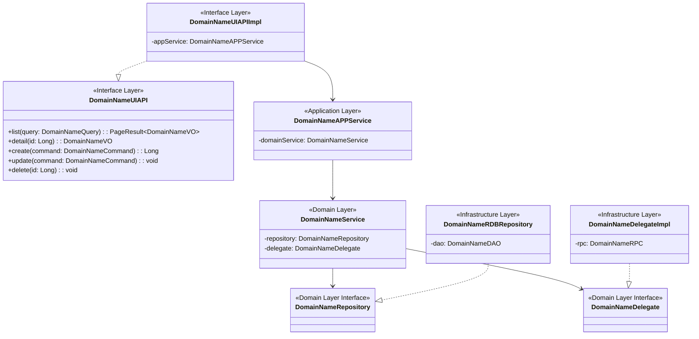
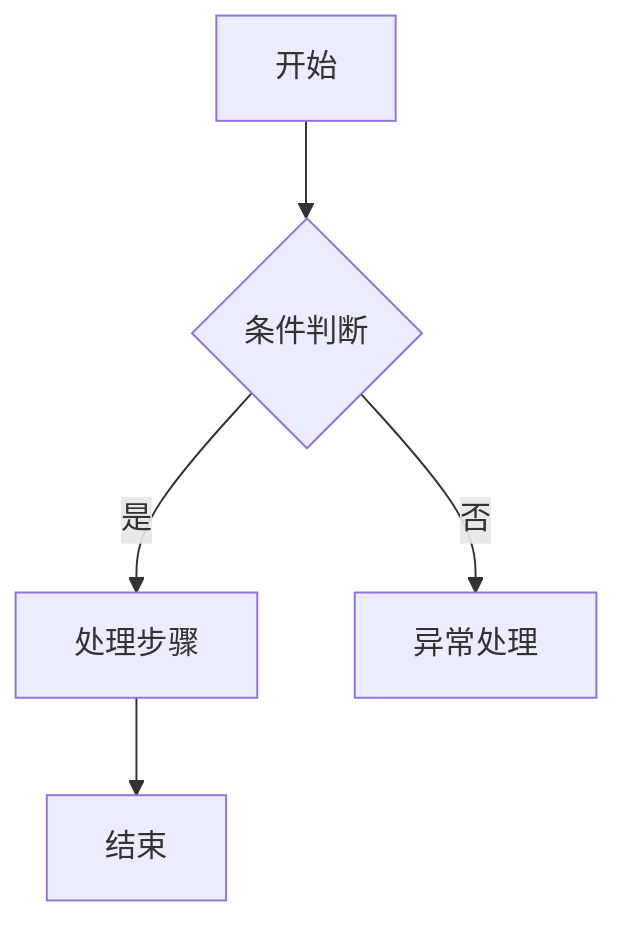
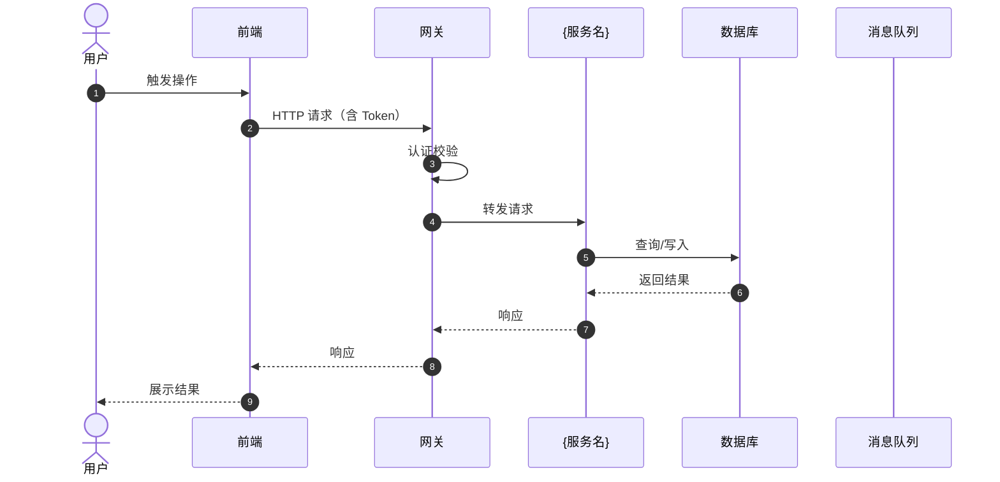
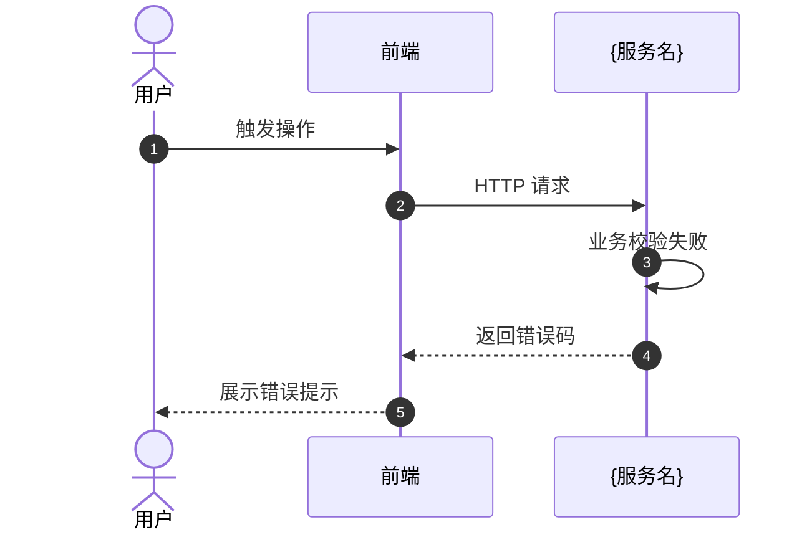
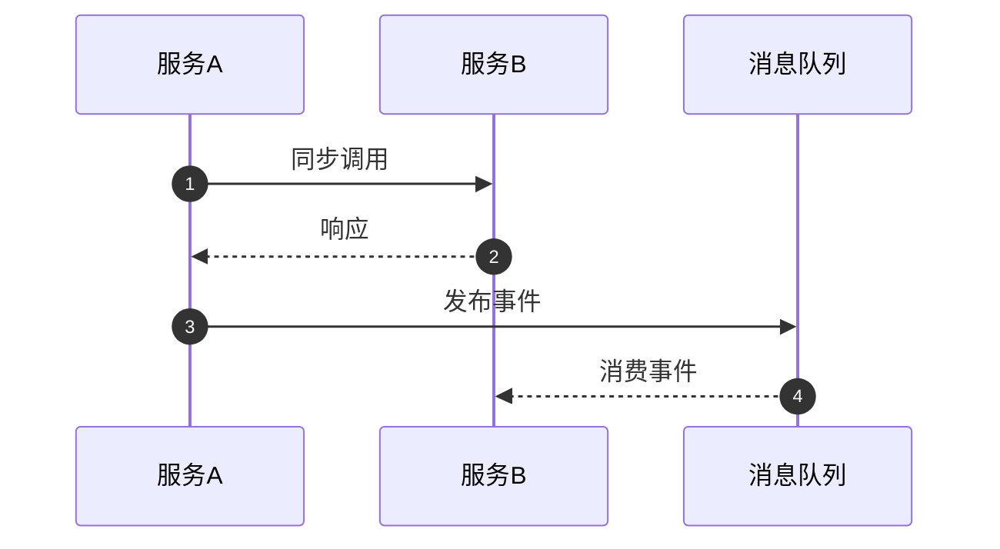

# design-backend

内建规范；域 **`backend`**；子分段：`be-class`, `be-sequence`, `be-transaction`, `be-export`, `be-schedule`, `be-workflow`。
每节含「规范条文」与「交付模板」（若该分段定义了模板章节）。

## 分段：`be-class`


**规范分段**：`be-class`

### 规范条文

# DDD 类设计规范

## DDD 四层架构职责

### Interface Layer（接口层）
**职责**: 接收HTTP请求、参数校验、VO/DTO转换、调用应用服务
**核心类**: UIAPI接口 + UIAPIImpl实现、DTO、Converter
**禁止事项**: 
- 禁止包含业务逻辑
- 禁止直接调用Domain层
- 禁止DTO进入Domain层

### Application Layer（应用层）
**职责**: 编排Domain服务、事务边界、跨领域协调
**核心类**: APPService
**禁止事项**:
- 禁止包含核心业务逻辑（业务逻辑在Domain层）
- 禁止直接访问数据库

### Domain Layer（领域层）
**职责**: 核心业务逻辑、领域模型、业务规则
**核心类**: Service、VO、Query、Command、Repository接口、Delegate接口、ImportConsumer、ExportConsumer、Enum
**禁止事项**:
- 禁止依赖任何外部技术框架（Spring、MyBatis等）
- 禁止直接操作数据库

### Infrastructure Layer（基础设施层）
**职责**: 实现Domain层接口、数据库访问、外部系统集成
**核心类**: PO、RDBRepository、DAO、DelegateImpl、RPC、Converter
**禁止事项**:
- 禁止包含业务逻辑
- 禁止被Domain层直接依赖

## 命名规范

### Interface Layer
```
- API接口: {DomainName}UIAPI
- API实现: {DomainName}UIAPIImpl
- DTO: {DomainName}DTO
- 转换器: {DomainName}VOToDTOConverter, {DomainName}DTOToQueryConverter
```

### Application Layer
```
- 应用服务: {DomainName}APPService
```

### Domain Layer
```
- 值对象: {DomainName}VO
- 领域服务: {DomainName}Service
- 仓储接口: {DomainName}Repository
- 查询对象: {DomainName}Query
- 命令对象: {DomainName}Command
- 委托接口: {DomainName}Delegate
- 导入Consumer: {业务对象}ImportConsumer
- 导出Consumer: {业务域}{维度}ExportConsumer
- 枚举: {业务含义}Enum / {业务含义}Mapping
```

#### 导入导出类

> Excel 导入/导出 Consumer 归属 **Domain Layer**，封装批量数据处理业务逻辑；通过 Jalor 框架 Bean 前缀（`IExcelDataConsumer` / `IExcelDataProvider`）注册，须使用 `@Component` / `@Service` 注解。

##### ExportConsumer 编写规范

| 要素 | 规则 | 示例 |
|------|------|------|
| 类名 | `{业务域}{维度}ExportConsumer`，语义化长命名 | `MatchResultProjectExportConsumer` |
| Bean 注册 | `@Service("IExcelDataProvider.{ClassName}")`，遵循 Jalor 框架前缀约定 | `@Service("IExcelDataProvider.MatchResultProjectExportConsumer")` |
| 实现接口 | `IExcelDataProvider`（同步导出）；需一站式推送/生命周期回调时继承 `BaseExportExcelProvider` | — |
| 核心方法 | 仅实现 `getBatchData()`，逻辑极简 | 反序列化 Query → 委托 Repository 查询 → 返回 VO 列表 |

```java
@Service("IExcelDataProvider.MatchResultProjectExportConsumer")
public class MatchResultProjectExportConsumer implements IExcelDataProvider {
    // 仅实现 getBatchData()：Query 反序列化 → Repository 查询 → 返回 VO 列表
}
```

##### ImportConsumer 编写规范

| 要素 | 规则 | 示例 |
|------|------|------|
| 类名 | `{业务对象}ImportConsumer` | `ProjectPlanImportConsumer` |
| Bean 注册 | `@Component("IExcelDataConsumer.{业务标识}Import")` | `@Component("IExcelDataConsumer.projectPlanImport")` |
| 基类 | 继承 `BaseImportExcelProvider` | — |

```java
@Slf4j
@Component("IExcelDataConsumer.projectPlanImport")
public class ProjectPlanImportConsumer extends BaseImportExcelProvider {
    // begin() / useBatchData() / end() / fail()
}
```

### Infrastructure Layer
```
- 持久化对象: {DomainName}PO
- 仓储实现: {DomainName}RDBRepository
- MyBatis映射: {DomainName}DAO
- 转换器: {DomainName}POToVOConverter, {DomainName}QueryToPOConverter, {DomainName}CommandToPOConverter
- 委托实现: {DomainName}DelegateImpl
- RPC调用: {DomainName}RPC
```

## 枚举类规范

枚举类归属 **Domain Layer**，用于表达领域内的固定取值与业务码映射。

| 要素 | 规则 |
|------|------|
| 常量命名 | 全大写下划线分隔（如 `AUDIT_EXPERT_EXPERIENCE`） |
| 关联业务码 | 枚举项通过构造函数绑定业务码 |
| 构造方法 | `private`（枚举默认），赋值给字段 |
| 访问器 | 提供 `getCode()` getter |

**示例**

```java
public enum TagNameMapping {
    AUDIT_PROJECT_TAG(1),
    AUDIT_EXPERT_EXPERIENCE(2);

    private Integer code;

    TagNameMapping(Integer code) {
        this.code = code;
    }

    public Integer getCode() {
        return code;
    }
}
```

## 依赖关系规范

### 严格分层依赖
```
Interface Layer → Application Layer → Domain Layer ← Infrastructure Layer
```

**关键原则**:
1. Infrastructure层**实现**Domain层接口，不是反向依赖
2. Domain层完全不依赖Infrastructure层技术实现
3. Application层依赖Domain层接口，不依赖Infrastructure实现
4. Interface层依赖Application层，通过DTO隔离外部协议

### Interface Layer 依赖
- `facade.impl` → Application Layer.{DomainName}APPService
- `converter` → Domain Layer.{DomainName}VO, Interface Layer.{DomainName}DTO

### Application Layer 依赖
- `{DomainName}APPService` → Domain Layer.{DomainName}Service

### Domain Layer 依赖
- `service` → Domain Layer.{DomainName}Repository
- `service` → Domain Layer.{DomainName}Delegate
- `import/export consumer` → Domain Layer.{DomainName}Repository、Domain Layer.{DomainName}Service
- `delegate` (接口定义) ← Infrastructure Layer.{DomainName}DelegateImpl

### Infrastructure Layer 依赖
- `repository` → Domain Layer.{DomainName}Repository (实现接口)
- `repository` → Infrastructure Layer.{DomainName}DAO
- `delegate.impl` → Domain Layer.{DomainName}Delegate (实现接口)
- `delegate.impl` → Infrastructure Layer.{DomainName}RPC

## 对象转换规范

### 转换器位置
- **Interface层**: VO ↔ DTO 转换
- **Infrastructure层**: PO ↔ VO, PO ↔ Query, PO ↔ Command 转换

### 转换规则
- 使用 MapStruct 或自定义转换器，禁止手动 get/set
- 转换器命名: `{Source}To{Target}Converter`
- Domain层的VO对象**不**使用MapStruct，保持纯净

## 设计模式指导

| 场景 | 推荐模式 | DDD层级应用 |
|------|---------|------------|
| 多种实现策略 | 策略模式 + Domain Delegate | Domain层定义接口，Infrastructure层多实现 |
| 复杂对象构建 | Builder 模式 | Domain层VO构建 |
| 跨领域事件 | Domain Event | Domain层发布，Application层编排 |
| 外部系统集成 | 适配器模式（Delegate接口） | Domain层定义契约，Infrastructure层适配 |
| 数据持久化 | Repository模式 | Domain层定义接口，Infrastructure层实现 |

## 类规模与复杂度控制

- 单个类不超过 500 行
- 单个方法不超过 80 行，超出则提取私有方法
- Domain Service 方法数不超过 20 个，超出则按子域拆分
- Application Service 方法数不超过 15 个，超出则重新审视领域划分

## 依赖注入规范

- **Domain层**: 禁止使用Spring注解，保持技术中立；**例外**：Excel 导入/导出 Consumer 须使用 `@Component` / `@Service` 注册 Jalor 框架 Bean
- **Infrastructure层**: 统一使用构造器注入（`@RequiredArgsConstructor`）
- **Application层**: 使用构造器注入
- **Interface层**: 使用构造器注入
- **全项目禁止**: 字段注入（`@Autowired` 在字段上）

## DDD 架构验收标准

### 必须满足
1. ✅ Domain层没有任何Spring、MyBatis等技术框架依赖
2. ✅ Infrastructure层实现Domain层接口
3. ✅ Application层不包含核心业务逻辑
4. ✅ Interface层DTO不进入Domain层
5. ✅ 依赖方向: Interface → Application → Domain ← Infrastructure

### 禁止出现
1. ❌ Domain层依赖Infrastructure层实现
2. ❌ Domain层包含Spring注解（`@Service`, `@Component`等）；**例外**：Excel 导入/导出 Consumer 的 Bean 注册注解
3. ❌ Application层直接访问数据库
4. ❌ Interface层包含业务逻辑
5. ❌ DTO对象进入Domain层

---

## 项目规范摘录（`规范/` 目录 · IT 设计文档 §2 / §4.1）

> 来源：`{WORKSPACE_ROOT}/规范/examples/it_design_doc.md`。

- **数据结构分析**（如适用）：对新模型或接口定义给出类关系，建议 **Mermaid `classDiagram`**（或等价类图）。
- **代码列表（必选）**：列出本需求涉及的**全部**代码文件路径，并标明 **新增 / 修改**，避免遗漏。
- **DDD分层标注**：每个文件必须标注所属DDD层（Interface/Application/Domain/Infrastructure）。

### 交付模板

# DDD 类设计

## DDD 四层包结构

```
{项目根}/
├── {项目}-interface/           # 接口层
│   └── src/main/java/com/{公司}/{系统}/{模块}/interfaces/{领域}/
│       ├── dto/                # 数据传输对象
│       │   └── {DomainName}DTO.java
│       ├── facade/             # API接口定义
│       │   ├── {DomainName}UIAPI.java
│       │   └── impl/           # API接口实现
│       │       └── {DomainName}UIAPIImpl.java
│       └── converter/          # VO/DTO转换器
│           ├── {DomainName}VOToDTOConverter.java
│           └── {DomainName}DTOToQueryConverter.java
├── {项目}-application/         # 应用层
│   └── src/main/java/com/{公司}/{系统}/{模块}/application/{领域}/
│       └── {DomainName}APPService.java
├── {项目}-domain/              # 领域层
│   └── src/main/java/com/{公司}/{系统}/{模块}/domain/{领域}/
│       ├── vo/                 # 值对象
│       │   └── {DomainName}VO.java
│       ├── service/            # 领域服务
│       │   └── {DomainName}Service.java
│       ├── repository/         # 仓储接口
│       │   └── {DomainName}Repository.java
│       ├── query/              # 查询对象
│       │   └── {DomainName}Query.java
│       ├── command/            # 命令对象
│       │   └── {DomainName}Command.java
│       └── delegate/           # 委托接口
│           └── {DomainName}Delegate.java
└── {项目}-infrastructure/      # 基础设施层
    └── src/main/java/com/{公司}/{系统}/{模块}/infrastructure/{领域}/
        ├── po/                 # 持久化对象
        │   └── {DomainName}PO.java
        ├── repository/         # 仓储实现
        │   └── {DomainName}RDBRepository.java
        ├── mapper/             # MyBatis映射
        │   └── {DomainName}DAO.java
        ├── converter/          # PO转换器
        │   ├── {DomainName}POToVOConverter.java
        │   ├── {DomainName}QueryToPOConverter.java
        │   └── {DomainName}CommandToPOConverter.java
        ├── delegate/           # 委托实现
        │   └── {DomainName}DelegateImpl.java
        ├── dto/                # RPC DTO
        │   └── {FunctionName}DTO.java
        └── rpc/                # RPC调用
            └── {DomainName}RPC.java
```

## 核心类清单

| 类名 | 所属层 | 职责说明 |
|------|--------|---------|
| {DomainName}UIAPI | Interface | API接口定义，声明REST端点 |
| {DomainName}UIAPIImpl | Interface | API实现，调用APPService，VO/DTO转换 |
| {DomainName}DTO | Interface | 前端数据传输对象 |
| {DomainName}APPService | Application | 应用服务，编排领域服务，事务边界 |
| {DomainName}Service | Domain | 领域服务，核心业务逻辑 |
| {DomainName}VO | Domain | 值对象，领域模型数据 |
| {DomainName}Query | Domain | 查询对象，查询条件封装 |
| {DomainName}Command | Domain | 命令对象，操作指令封装 |
| {DomainName}Repository | Domain | 仓储接口，数据访问契约 |
| {DomainName}Delegate | Domain | 委托接口，外部系统契约 |
| {DomainName}PO | Infrastructure | 持久化对象，数据库映射 |
| {DomainName}RDBRepository | Infrastructure | 仓储实现，实现Repository接口 |
| {DomainName}DAO | Infrastructure | MyBatis映射，SQL执行 |
| {DomainName}DelegateImpl | Infrastructure | 委托实现，实现Delegate接口 |
| {DomainName}RPC | Infrastructure | RPC调用，外部系统集成 |

---

## 代码文件清单（模板 · `规范/examples/it_design_doc.md` §4.1）

> **必选**：与「核心类清单」互补,按**文件路径**枚举,便于评审与测试范围核对。

| 序号 | 文件路径 | 类型（新增 / 修改） | 所属DDD层 |
|------|----------|---------------------|-----------|
| 1 | interface/{领域}/facade/{DomainName}UIAPI.java | 新增 | Interface |
| 2 | interface/{领域}/facade/impl/{DomainName}UIAPIImpl.java | 新增 | Interface |
| 3 | interface/{领域}/dto/{DomainName}DTO.java | 新增 | Interface |
| 4 | application/{领域}/{DomainName}APPService.java | 新增 | Application |
| 5 | domain/{领域}/service/{DomainName}Service.java | 新增 | Domain |
| 6 | domain/{领域}/vo/{DomainName}VO.java | 新增 | Domain |
| 7 | domain/{领域}/repository/{DomainName}Repository.java | 新增 | Domain |
| 8 | infrastructure/{领域}/po/{DomainName}PO.java | 新增 | Infrastructure |
| 9 | infrastructure/{领域}/repository/{DomainName}RDBRepository.java | 新增 | Infrastructure |

## 类图（DDD分层依赖）



## 关键对象设计

### {DomainName}DTO（Interface层）

| 字段名 | 类型 | 必填 | 校验规则 | 说明 |
|--------|------|------|---------|------|
| | | Y/N | @NotNull, @Size等 | 前端传输数据 |

### {DomainName}VO（Domain层）

| 字段名 | 类型 | 说明 |
|--------|------|------|
| | | 领域模型数据 |

### {DomainName}Command（Domain层）

| 字段名 | 类型 | 必填 | 说明 |
|--------|------|------|------|
| | | Y/N | 操作指令数据 |

### {DomainName}Query（Domain层）

| 字段名 | 类型 | 说明 |
|--------|------|------|
| | | 查询条件 |

## DDD依赖规则

```
Interface Layer → Application Layer → Domain Layer ← Infrastructure Layer
```

**关键规则**:
- Infrastructure层实现Domain层接口（Repository、Delegate）
- Domain层不依赖任何外部技术框架
- Application层编排Domain服务，不包含业务逻辑
- Interface层只负责HTTP协议适配

## 分段：`be-sequence`


**规范分段**：`be-sequence`

### 规范条文

# 处理逻辑时序规范（TDD 第3章 §3.3）

## 3.3 处理逻辑时序规范

本要素覆盖 TDD 第3章 §3.3 的全部内容：业务流转（流程图）、时序图、关键分支与异常处理策略。

---

## 业务流程图规范

- 针对复杂业务场景输出流程图（flowchart），覆盖判断分支
- 明确正常路径和各异常分支的处理方式
- 说明与现有流程的异同，以及复用的既有异常处理组件

## 时序图绘制规范

- 使用 Mermaid `sequenceDiagram` 语法
- 启用 `autonumber` 自动编号
- 参与者定义在图的顶部，使用短别名（FE、GW、SVC、DB）

### 参与者命名约定

| 别名 | 代表 |
|------|------|
| User / Actor | 操作用户（使用 `actor` 关键字） |
| FE | 前端 |
| GW | 网关 / BFF |
| SVC | 业务服务（具体命名如 OrderSVC） |
| DB | 数据库 |
| Cache | 缓存（Redis） |
| MQ | 消息队列 |
| EXT | 外部第三方系统 |

### 必须绘制的时序

1. 每个核心功能的主成功路径
2. 关键异常路径（业务校验失败、外部调用失败）
3. 异步流程（MQ 发布/消费）
4. 跨服务调用链路

### 箭头类型

| 类型 | 含义 |
|------|------|
| `->>` | 同步请求 |
| `-->>` | 同步响应 |
| `--)` | 异步消息（MQ） |
| `--)+` | 激活目标（创建新线程） |

## 业务规则设计规范

- 核心业务规则抽象为命名方法，方法名即规则描述，如 `validateOrderCanBeCancelled()`
- 规则校验集中在流程入口，不散落在各处
- 规则违反时抛出业务异常，携带错误码

## 异常处理规范

- 业务异常（可预期）继承 `BusinessException`，携带错误码
- 系统异常（不可预期）由全局异常处理器捕获，返回 500
- 不吞掉异常：catch 后必须记录日志或重新抛出
- 外部调用失败需要有降级处理（返回默认值 / 降级响应）

---

## 项目规范摘录（`规范/` 目录 · IT 设计文档 §2 / §4）

> 来源：`{WORKSPACE_ROOT}/规范/examples/it_design_doc.md`「业务流程时序分析」「核心流程图」。

- 针对「用户需求」核心路径输出**流程图（flowchart）**，覆盖判断分支；说明与现有流程的**异同**。
- 针对关键业务场景输出**交互时序**，明确消息传递与数据流向。
- 流程图侧重单端业务分支，时序图侧重参与者交互，两者互补。

### 交付模板

# 处理逻辑时序设计（TDD 第3章 §3.3）

---

## 核心业务流程

### {流程名称}

**触发条件**：{描述何种操作或事件触发该流程}



**处理步骤说明**：

| 步骤 | 说明 | 涉及实体/接口 | 异常处理 |
|------|------|-------------|---------|
| 1 | | | |

## 业务规则清单

| 规则ID | 规则描述 | 触发场景 | 违反时处理 |
|--------|---------|---------|----------|
| R001 | | | 抛出业务异常 / 忽略 / 记录日志 |

---

## 主流程时序

### {功能名称} — 主成功路径



## 异常流程时序

### {功能名称} — {异常场景名称}



## 跨服务调用时序

### {跨服务场景名称}



---

## 变更影响（模板 · `规范/examples/it_design_doc.md` §4.6）

### 受影响接口

| 受影响接口 | 影响类型 | 影响描述 | 测试重点 |
|------------|----------|----------|----------|
| | | | |

## 分段：`be-transaction`


**规范分段**：`be-transaction`

### 规范条文

# 分布式事务规范（TDD 第3章 §3.4）

## 3.4 分布式事务规范

仅当业务涉及跨微服务数据一致性时输出。

### 事务模式选型

| 模式 | 适用场景 | 实现 |
|------|---------|------|
| Saga（编排型）| 长事务，步骤多，回滚逻辑复杂 | Seata Saga / 自研状态机 |
| TCC（Try-Confirm-Cancel） | 强一致，响应快，业务侵入可接受 | Seata TCC |
| 本地消息表 | 最终一致，跨服务异步 | 本地表 + MQ |
| 最终一致性（仅 MQ）| 非核心操作异步联动 | RocketMQ 事务消息 |

### 边界与补偿规则

- 分布式事务的正向调用链必须明确（谁是主、谁是从）
- 每个参与方必须实现**回滚/补偿接口**（幂等）
- 正向操作失败后，逆向补偿按逆序执行
- 本地消息表：每步操作前写消息表，操作成功后更新状态，定时任务扫描未发送消息重试

### 本地事务规范

- 事务边界在 Service 层，使用 `@Transactional` 声明
- 事务粒度尽量小，只包含必须保证原子性的操作
- 禁止在事务内调用外部 HTTP 接口或发送 MQ 消息（应在事务提交后进行）
- 读操作使用 `@Transactional(readOnly = true)` 提升性能
- 嵌套事务明确指定传播行为（`REQUIRES_NEW` / `NESTED`）

### 交付模板

# 分布式事务设计（TDD 第3章 §3.4）

> ⏭️ **跳过说明**：{若无跨服务事务需求，填写原因，删除以下内容}

---

## 3.4 分布式事务设计

### 事务模式

| 属性 | 值 |
|------|---|
| 一致性要求 | 强一致 / 最终一致 |
| 选型模式 | Saga / TCC / 本地消息表 / 事务消息 |
| 框架 | Seata / 自研 |

### 正向调用链

| 步骤 | 服务 | 操作 | 说明 |
|------|------|------|------|
| 1 | | | |

### 逆向补偿链（回滚顺序）

| 步骤 | 服务 | 补偿操作 | 幂等保障 |
|------|------|---------|---------|
| 1 | | | |

## 分段：`be-export`


**规范分段**：`be-export`

### 规范条文

# 数据导出/报表规范（TDD 第3章 §3.5）

## 3.5 数据导出/报表规范

仅当 PRD 包含导出或报表功能时输出。

### 导出模式选型

| 场景 | 模式 | 说明 |
|------|------|------|
| 数据量 < 5000 条 | 同步导出 | 接口直接返回文件流 |
| 数据量 ≥ 5000 条 | 异步导出 | 提交任务 → 查询进度 → 下载链接 |

### 异步导出流程

1. 用户提交导出请求 → 创建导出任务记录（状态 PENDING）
2. 异步线程/定时任务处理：分页流式查询（EasyExcel StreamWriter）
3. 文件写入 OSS，更新任务状态为 DONE + 下载链接
4. 前端轮询任务状态，完成后展示下载按钮

### 内存与性能约束

- 禁止一次性把全量数据加载进内存
- 使用 Cursor/ScrollQuery 分页流式处理（每批 1000 条）
- 大文件（> 50MB）存 OSS，生成带时效的下载链接（有效期 24h）

### 文件格式规范

- Excel 文件使用 EasyExcel，禁止使用 POI 直接操作（内存占用大）
- CSV 文件需处理字段内含逗号、换行的转义问题
- 文件名格式：`{业务名称}_{导出时间}.{格式}`，如 `order_list_20240101120000.xlsx`

### 交付模板

# 数据导出/报表设计（TDD 第3章 §3.5）

> ⏭️ **跳过说明**：{若无导出需求，填写原因，删除以下内容}

---

## 3.5 数据导出设计

### 导出任务清单

| 导出功能 | 数据量预估 | 导出模式 | 文件格式 |
|---------|---------|---------|---------|
| | | 同步 / 异步 | Excel / CSV |

### 异步导出流程（数据量 ≥ 5000 时）

| 步骤 | 接口/方法 | 说明 |
|------|---------|------|
| 1. 提交任务 | `POST /export/tasks` | 创建任务记录，返回 taskId |
| 2. 执行任务 | `ExportTaskJob.execute()` | 分页流式查询（每批 1000 条）|
| 3. 上传 OSS | `OssService.upload()` | 文件写入 OSS，更新任务状态 DONE |
| 4. 下载文件 | `GET /export/tasks/{id}/download` | 返回 OSS 签名 URL（有效期 24h）|

## 分段：`be-schedule`


**规范分段**：`be-schedule`

### 规范条文

# 定时任务规范（TDD 第3章 §3.6）

## 3.6 定时任务规范

仅当 PRD 包含系统自动触发的功能时输出。

### 任务调度平台

- 推荐使用分布式任务调度平台（XXL-JOB / Elastic-Job）
- 禁止直接用 `@Scheduled`（单实例，无法动态调整，无执行记录）

### 关键设计约束

- 每个任务必须是**幂等**的（重复执行结果一致）
- 任务执行中若服务重启，下次执行时能正确处理未完成数据
- 大批量任务使用分片广播（多实例分片处理，每实例处理一部分数据）
- 任务执行有超时设置，超时自动中断并告警

### Cron 表达式规范

- 非高频任务使用 Cron 表达式，业务低峰期执行
- 高频任务（< 1 分钟间隔）改用 MQ 或 Delay Queue 实现
- Cron 表达式通过动态配置（Nacos）管理，不硬编码

### 补偿机制

- 任务失败必须有重试机制，重试次数与间隔须配置化
- 超过最大重试次数的任务记录到死信表，发送告警
- 定期对账任务检查数据一致性，修复遗漏数据

### 交付模板

# 定时任务设计（TDD 第3章 §3.6）

> ⏭️ **跳过说明**：{若无定时任务，填写原因，删除以下内容}

---

## 3.6 定时任务设计

### 定时任务清单

| 任务名称 | Cron 表达式 | 处理逻辑摘要 | 分片 | 幂等保障 |
|---------|-----------|-----------|------|---------|
| `OrderTimeoutJob` | `0 0 */1 * * ?` | 扫描超时订单自动驳回 | 是/否 | 状态机前置校验 |

### ✨/🔧 {任务名称}

| 属性 | 值 |
|------|---|
| Cron | `{表达式}`（配置 Key：`{nacos-key}`，支持热更新）|
| 每批处理量 | {N} 条 |
| 超时时间 | {N}s |
| 重试策略 | 失败后 {N}min 重试，最多 {N} 次 |
| 幂等保障 | {状态机前置检查 / 乐观锁 / 唯一索引} |
| 分片策略 | {按 ID 取模，实例数 = 分片总数} |

**处理步骤**：

| 步骤 | 说明 | 关键 SQL/方法 |
|------|------|-------------|
| 1 | | |

## 分段：`be-workflow`


**规范分段**：`be-workflow`

### 规范条文

# 审批流配置规范（TDD 第3章 §3.7）

## 3.7 审批流规范

仅当 PRD 包含需要人工审批的业务场景时输出。

### BPMN 流程引擎

- 推荐使用 Activiti 7 / Flowable 6.x
- 流程定义用 BPMN 2.0 XML 文件管理，随代码版本控制
- 流程变量（process variables）传递业务 ID，不传整个对象

### 审批节点设计约定

- 审批人获取策略：硬编码用户 ID / 按角色 / 动态获取（调用组织架构服务）
- 会签（AND）：所有审批人通过才继续；或签（OR）：任一审批人通过即继续
- 驳回行为：驳回到发起人 / 驳回到指定节点（需明确定义）
- 撤销：在特定状态下允许发起人撤销，通过流程监听器处理

### 超时处理

- 每个审批节点设置超时时间，超时后自动驳回或升级处理
- 超时提醒通过 MQ + 通知服务发送（见 integration/notification.md）

### 流程变量规范

- 流程变量命名采用驼峰命名法
- 只传递业务主键（ID），不传递完整对象（避免序列化问题）
- 审批结论（通过/驳回）和审批意见作为标准变量传递

### 交付模板

# 审批流设计（TDD 第3章 §3.7）

> ⏭️ **跳过说明**：{若无审批流需求，填写原因，删除以下内容}

---

## 3.7 审批流设计

### 审批流清单

| 流程名称 | 流程 Key | 涉及实体 | 引擎 |
|---------|---------|---------|------|
| | | | Activiti / Flowable |

### ✨/🔧 {流程名称}

**BPMN 流程节点**：

| 节点 | 节点类型 | 审批人策略 | 会签/或签 | 超时时间 |
|------|---------|---------|---------|---------|
| 直接上级审批 | UserTask | 调用 OrgService.getManager() | 无（单人）| 3 天 |

**驳回/撤销行为**：

| 操作 | 行为 | 说明 |
|------|------|------|
| 驳回 | 流程终止，状态 → REJECTED | 发送通知给申请人（见 integration/notification.md）|
| 撤销 | 流程终止，状态 → CANCELLED | 仅允许在 PENDING 状态 |

**流程变量**：

| 变量名 | 类型 | 说明 |
|--------|------|------|
| `businessId` | String | 业务主键 |
| `applicantId` | Long | 申请人 ID |
