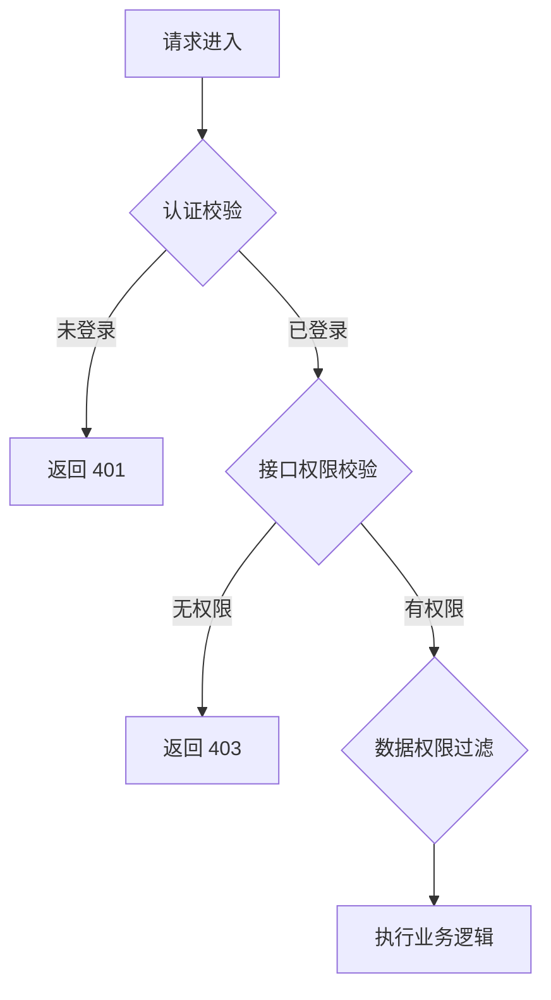

# design-config

内建规范；域 **`config`**；子分段：`config-app-config`, `config-dict`, `config-error-code`, `config-nfr-security`, `config-permission`。
每节含「规范条文」与「交付模板」（若该分段定义了模板章节）。

## 分段：`config-app-config`


**规范分段**：`config-app-config`

### 规范条文

# 配置项与非功能安全规范（TDD 第6章 §6.4 / §6.5）

> 本要素整合原 `be-config`（后端配置）、`be-dfx`（可观测性）与 `fe-nfr`（前端非功能规范）。

## 6.4 配置项清单规范

### 配置分层原则

| 层级 | 存储位置 | 变更方式 | 适用场景 |
|------|---------|---------|---------|
| 基础设施配置 | 环境变量 / K8s ConfigMap / Secret | 重启 Pod | DB 地址、密钥（敏感，不进代码仓库） |
| 应用行为配置 | `application.yml` | 重新部署 | 线程池大小、超时时间 |
| 运行时业务参数 | 配置中心（Nacos/Apollo） | 实时推送（热更新） | 功能开关、限流阈值、白名单 |

### 配置类型分类

根据配置项特性选择合适的配置类型：

#### 类型1：lookup（枚举值配置）

**适用场景**：
- 固定枚举值，数值相对固定
- 示例：
  - 状态（草稿/生效/失效）
  - 优先级（高/中/低）
  - 类型（类型A/类型B）
  - 级别（一级/二级/三级）

**配置方式**：
- 使用Jalor框架的lookup机制
- 手工或通过Excel导入配置

**维护方式**：
- 研发侧维护（需要研发团队配置）

**编码格式**：
- Classify Code使用uppercase格式（如 `ORDER_STATUS`）
- Item Code使用uppercase格式（如 `DRAFT`、`ACTIVE`）

**编码规范**：
- Classify Code: 使用uppercase格式（全大写），下划线分隔单词
- Item Code: 使用uppercase格式（全大写），与Classify Code对应

**Excel导入模板格式**：

**Sheet1: Lookup Classify（Lookup分类）**
| Code | Parent Classify | Name | Status | Lookup Type | Desc |
|------|-----------------|------|--------|-------------|------|
| ORDER_STATUS | null | 订单状态 | ACTIVE | STANDARD | 订单状态枚举 |

**Sheet2: Lookup Item（Lookup项）**
| Classify Code | Item Code | Item Name | Desc | Parent Item | Status | Lookup Type | Language | Sort |
|---------------|-----------|-----------|------|-------------|--------|-------------|----------|------|
| ORDER_STATUS | DRAFT | 草稿 | 草稿状态 | null | ACTIVE | STANDARD | zh_CN | 1 |

#### 类型2：配置项平台（业务侧维护的大数据量配置）

**适用场景**：
- 业务侧自行维护的数据量大、变化频繁的配置
- 示例：
  - 业务规则配置表（规则参数、计算系数）
  - 映射关系配置（编码映射、类型映射）

**配置方式**：
- IT建表存储，提供配置管理界面

**维护方式**：
- 业务侧自行维护（无需研发团队介入）

**技术实现**：
- 配置表 + 配置管理界面

**⚠️ 建表强制规范**：

必须遵循以下建表规范，否则配置项新增业务数据时会报错！

1. **表名必须以 `config_` 开头**
   - 选择配置表时仅展示授权了的以 `config_` 开头的表
   - 示例：`config_business_rule_t`、`config_threshold_t`

2. **配置表必须以 `ID` 为主键**
   ```sql
   id VARCHAR(64) NOT NULL,
   CONSTRAINT pk_config_xxx_t_id PRIMARY KEY (id)
   ```

3. **配置表必须包含 `_temp` 字段**
   - **字段类型**：`VARCHAR`
   - **字段长度**：大于除审计字段外其他字段总和
   - **用途**：用于展示新增业务配置数据时前端标识数据状态
   - **字段格式**：
     ```json
     {"dataMap":{业务数据},"type":"-1 or 1 or 0"}
     ```
     - 数字表示状态：
       - `1`：新增
       - `0`：编辑
       - `-1`：删除

4. **配置表必须存在 `published_flag` 字段**
   - **字段类型**：`CHAR(1)`
   - **用途**：标识配置值是否已发布
   - **枚举值**：
     - `Y`：已发布
     - `N`：未发布

5. **配置表必须给 `iaudit_common` 授权**
   ```sql
   GRANT USAGE ON SCHEMA iaudit_apr TO iaudit_common;
   GRANT SELECT,UPDATE,INSERT,DELETE,TRUNCATE ON config_xxx_t TO iaudit_common;
   ```

**完整建表示例**：

```sql
-- =============================================
-- 表名：config_business_rule_t  说明：业务规则配置表
-- 建表规范：符合配置项管理平台建表规范
-- =============================================
CREATE TABLE config_business_rule_t (
    id                VARCHAR(64)   NOT NULL,
    rule_code         VARCHAR(128)  NOT NULL,   -- 规则编码，唯一标识
    rule_name         VARCHAR(255)  NOT NULL,   -- 规则名称
    rule_type         VARCHAR(64)   NOT NULL,   -- 规则类型
    rule_params       TEXT          NULL,       -- 规则参数（JSON格式）
    _temp             VARCHAR(2000) NULL,       -- 配置项管理平台临时字段（必须，长度 > 其他字段总和）
    published_flag    CHAR(1)       NOT NULL DEFAULT 'N', -- 发布标识（必须）：Y-已发布 / N-未发布
    -- 审计字段
    created_by       INT8          NOT NULL,
    creation_date    TIMESTAMP(6)  NOT NULL,
    deleted_flag     CHAR(1)       NOT NULL DEFAULT 'N',
    last_updated_by  INT8          NOT NULL,
    last_update_date TIMESTAMP(6)  NOT NULL,
    renter_id        VARCHAR(64)   NULL DEFAULT NULL,
    CONSTRAINT pk_config_business_rule_t_id PRIMARY KEY (id)
);

CREATE UNIQUE INDEX uk_config_business_rule_t_rule_code ON config_business_rule_t(rule_code);

-- 必须给 iaudit_common 授权
GRANT USAGE ON SCHEMA iaudit_apr TO iaudit_common;
GRANT SELECT,UPDATE,INSERT,DELETE,TRUNCATE ON config_business_rule_t TO iaudit_common;
```

### 动态配置要求

- 每个动态配置必须有默认值（配置中心不可用时系统正常运行）
- 配置 Key 命名：`{模块}.{功能}.{参数}`，如 `order.approve.timeout-days=7`
- 配置变更要有变更记录和回滚机制
- 配置监听器需处理变更异常，不因格式错误导致服务崩溃

### 敏感配置

- 密码、密钥、Token 通过 K8s Secret / Vault 管理
- 禁止提交到代码仓库
- 日志输出时脱敏

---

## 6.5 非功能与安全规范

### 性能指标

- 核心接口响应时间 P99 基线，超出触发告警
- QPS 峰值预估及对应限流配置
- 数据库慢查询阈值（通常 1s）

### 安全规范

**后端**：
- 敏感字段脱敏展示（手机号/身份证/银行卡），`@Desensitize` 注解处理
- 通信加密验签（HTTPS + 请求签名）
- 禁止在响应中暴露 DB 错误或堆栈信息

**前端**：
- Token 存 `sessionStorage` 或 HttpOnly Cookie，禁止 `localStorage`（XSS 可窃取）
- 禁用 `v-html`，必须使用时用 DOMPurify sanitize
- 禁止在前端存储或展示未脱敏的敏感信息

### 可观测性规范

**日志**：
- SLF4J + Logback，格式：`时间 级别 [traceId] [userId] 类名 - 消息`
- MDC 维护 `traceId`、`userId`、`tenantId`，全链路透传
- 关键业务操作记录入参和结果（注意脱敏）

**监控指标**：
- Micrometer + Prometheus，命名：`{应用名}_{模块}_{指标名}_{单位}`
- 每个对外接口记录：请求量、成功率、P50/P95/P99 响应时间

**告警**：
| 级别 | 触发条件 | 通知方式 | 响应时效 |
|------|---------|---------|---------|
| P0 | 服务不可用、错误率 > 5% | 电话 + 即时消息 | 15 分钟 |
| P1 | P99 响应时间 > 2s | 即时消息 | 1 小时 |
| P2 | 队列积压 / 非核心异常 | 邮件 | 24 小时 |

### 前端非功能规范

- 路由级懒加载（禁止所有页面打包进主 bundle）
- 单个 chunk 体积 ≤ 500KB（gzip 后）
- 按需引入 UI 组件库（tree-shaking）
- 关键区域使用 `ErrorBoundary` 组件，子组件异常不影响整页
- 全局 `app.config.errorHandler` 捕获未处理异常并上报监控

---

## 项目规范摘录（`规范/` 目录 · IT 设计文档 §5 DFX）

> 来源：`{WORKSPACE_ROOT}/规范/examples/it_design_doc.md`「DFX 设计」；与上文 §6.5 互补时合并输出，避免重复矛盾。

- **安全（必选）**：结合需求给出可落地方案；日志/调试/错误信息中**禁止明文**打印认证凭据等敏感数据。
- **日志上报（必选）**：审计类日志满足 **4W1H**（Who / When / What / Where / How），并与安全要求一致。
- **性能（必选）**：关注帧率与过度绘制、异步与网络调用、大并发接口、大对象与内存/GC、**爆炸半径与过载控制**。
- **兼容性（必选）**：对外接口/常量/上报 key、内部持久化 key、数据库升级等变更须写清兼容策略。
- **全球化（可选）**：涉及则描述服务地/账号/登录/分级差异、界面文案与翻译要求。

### 交付模板

# 配置项与非功能安全设计（TDD 第6章 §6.4 / §6.5）

<!--
变更标注约定：
- ✨ 新增：本次新增的配置项或规范条目
- 🔧 修改：在现有基础上变更默认值、刷新策略等
-->

## 变更概要

| 要素 | 动作 | 对象 | 说明 |
|------|------|------|------|
| 6.4 配置项 | ✨/🔧 | | |
| 6.5 非功能/安全 | ✨/🔧 | | |

---

## 6.4 配置项清单

### 动态配置项（Nacos/Apollo，支持热更新）

| 配置 Key | 默认值 | 取值范围 | 动态刷新 | 影响面 | 动作 |
|---------|--------|---------|---------|--------|------|
| `order.approve.timeout-days` | `7` | `1~30` | ✅ 实时生效 | 超时自动驳回任务 | ✨ |

---

### ✨/🔧 {配置 Key}

> 🔧 **变更说明**：{仅修改时填写}

| 属性 | 值 |
|------|---|
| 配置层级 | 应用配置 / 动态配置 / 环境变量 |
| 默认值 | |
| 类型 | String / Integer / Boolean |
| 动态刷新 | ✅ 实时生效 / ❌ 需重启 |
| 变更影响面 | {影响的功能或模块} |
| 监听类 | `{XxxConfigListener}` |

---

### 应用配置项（application.yml，随部署生效）

| 配置键 | 默认值 | 说明 |
|--------|--------|------|
| `spring.datasource.hikari.maximum-pool-size` | `20` | 数据库连接池最大数 |

---

### 环境变量清单（K8s ConfigMap/Secret）

| 变量名 | 是否敏感 | 示例值 | 说明 |
|--------|---------|--------|------|
| `DB_URL` | N | `jdbc:mysql://host:3306/db` | 数据库连接串 |
| `DB_PASSWORD` | ✅ Secret | — | 数据库密码 |

---

## 6.5 非功能与安全规范

### 性能指标

| 接口/场景 | QPS 基线 | P99 目标 | 超限告警阈值 | 动作 |
|---------|---------|---------|------------|------|
| 订单查询接口 | 500 QPS | < 500ms | > 2s | ✨ |
| 审批提交接口 | 50 QPS | < 1s | > 3s | ✨ |

---

### 数据脱敏规则

| 字段 | 脱敏规则 | 展示样例 | 实现方式 | 动作 |
|------|---------|---------|---------|------|
| 手机号 | 中间四位替换为 `****` | `138****8888` | `@Desensitize(type=PHONE)` | ✨/🔧 |
| 身份证 | 保留前6后4 | `110101****1234` | `@Desensitize(type=ID_CARD)` | ✨/🔧 |

---

### 可观测性设计

#### 日志设计

| 日志类型 | 触发场景 | 级别 | 关键字段 |
|---------|---------|------|---------|
| 操作日志 | 用户关键操作（审批/创建等） | INFO | userId, action, resourceId, traceId |
| 异常日志 | 业务/系统异常 | ERROR | traceId, errorCode, message, stackTrace |
| 外部调用日志 | 调用三方服务 | INFO | serviceName, method, costMs, success |

#### 监控指标

| 指标名 | 类型 | 说明 | 告警阈值 |
|--------|------|------|---------|
| `{app}_{module}_request_total` | Counter | 接口请求总量 | — |
| `{app}_{module}_request_duration_seconds` | Histogram | 响应时间 | P99 > 见性能指标 |
| `{app}_{module}_error_total` | Counter | 错误请求数 | > 10/min |

#### 链路追踪

- TraceId：网关注入，通过 MDC 全链路透传
- 跨服务：HTTP Header `X-Trace-Id`
- 关键操作打 Span：{列举需追踪的关键方法}

---

### 前端非功能规范

| 规范项 | 要求 | 动作 |
|--------|------|------|
| 路由懒加载 | 所有页面路由使用 `() => import(...)` | 🔧 |
| Chunk 体积 | 单个 chunk ≤ 500KB（gzip 后） | 🔧 |
| Token 存储 | `sessionStorage` 或 HttpOnly Cookie，禁止 `localStorage` | 🔧 |
| 错误边界 | 关键模块用 `ErrorBoundary` 包裹 | ✨/🔧 |
| v-html 使用 | 禁用，例外时使用 DOMPurify sanitize | 🔧 |

---

## IT 设计文档 DFX 自检（模板 · `规范/examples/it_design_doc.md` §5）

| 类别 | 本需求落地说明（要点） |
|------|------------------------|
| 安全 | |
| 日志（4W1H） | |
| 性能 | |
| 兼容性 | |
| 全球化（可选） | |

## 分段：`config-dict`


**规范分段**：`config-dict`

### 规范条文

# 数据字典与错误码体系规范（TDD 第6章 §6.1 / §6.2）

## 6.1 数据字典规范

#### 配置项编码规范

**编码格式**：`App.SubApp.{模块名}.{控制名称}`

**编码组成**：
- `App` - 应用名称（固定前缀）
- `SubApp` - 子应用名称（固定前缀）
- `{模块名}` - 业务模块名称（如 OrderModule、ProductModule）
- `{控制名称}` - 控制项名称（如 EnableAutoApproval、MaxOrderAmount）

**命名规则**：
- 使用驼峰格式（CamelCase）
- 模块名使用 Module 后缀（如 OrderModule）
- 控制名称清晰表达配置含义（如 EnableAutoApproval）

**编码示例**：
```markdown
✅ 正确示例：
- App.SubApp.OrderModule.EnableAutoApproval - 启用自动审批
- App.SubApp.OrderModule.MaxOrderAmount - 最大订单金额
- App.SubApp.OrderModule.OrderTimeoutMinutes - 订单超时时间

❌ 错误示例：
- EnableAutoApproval（缺少统一前缀）
- App.SubApp.orderModule.enableAutoApproval（未使用驼峰格式）
- App.SubApp.OrderModule.Enable_Auto_Approval（使用下划线）
```

---

## 6.2 错误码体系规范

### 错误码格式

格式：`{应用模块简称}.{领域模块}.{6位序号}`

示例：
- `ARS.LABEL.000001` — 标签错误码
- `ARS.RESOURCE.000001` — 系统错误：用户服务内部异常

**类型说明**：
- `LABEL`：标签域
- `RESOURCE`：资源域

### 错误码分配原则

- 同一系统内错误码唯一，禁止复用
- 序号从 `000001` 开始，全局自增唯一即可
- 新增错误码追加，禁止修改已存在错误码含义（向后兼容）

### HTTP响应码规范
常用客户端错误响应码：
[400 Bad Request] 参数有误，相关业务逻辑校验失败等等
[401 Unauthorized] 权限相关错误
[404 Forbidden] 资源不存在

常用系统错误响应码：
[500 INTERNAL_SERVER_ERROR] 系统异常

### 前端文案规范

- 业务错误：给用户友好提示（中文），引导用户操作
- 系统错误：通用提示（如"系统繁忙，请稍后重试"），不暴露内部细节
- 多语言：`i18n/zh-CN.json` 中 key = 错误码，value = 文案

### API 响应中的错误码使用

- 错误码响应示例
```json
{
    "code": "arms.probe.000001",        // 错误编码
	"httpCode": 406,                             // HTTP状态码
	"entity": null,
	"message": "评价规则查询失败！参数:规则ID:13891135755197391488",       // 错误信息
	"faultUid": null,
	"stackTrace": "",
	"friendly": false
}
```
- 禁止在 API 响应中直接返回数据库错误或堆栈信息

### 交付模板

# 数据字典与错误码体系设计（TDD 第6章 §6.1 / §6.2）

<!--
变更标注约定：
- ✨ 新增：本次新增的字典分类或错误码
- 🔧 修改：在现有基础上新增键值或修改文案
-->

## 变更概要

| 要素 | 动作 | 对象 | 说明 |
|------|------|------|------|
| 6.1 数据字典 | ✨/🔧 | | |
| 6.2 错误码 | ✨/🔧 | | |

---

## 6.1 数据字典

#### 配置表格格式

| 配置项编码 | 配置项名称 | 数据类型 | 默认值 | 影响范围 | 维护方式 | 需求来源 |
|------------|------------|----------|--------|----------|----------|----------|
| App.SubApp.OrderModule.EnableAutoApproval | 启用自动审批 | Boolean | false | 订单模块 | 运维侧 | PRD第X.X节 |
| App.SubApp.OrderModule.MaxOrderAmount | 最大订单金额 | Decimal | 100000.00 | 订单模块 | 运维侧 | PRD第X.X节 |
| App.SubApp.OrderModule.OrderTimeoutMinutes | 订单超时时间（分钟） | Integer | 30 | 订单模块 | 运维侧 | PRD第X.X节 |

**表格字段说明**：
- **配置项编码**：配置项唯一标识，使用统一前缀格式
- **配置项名称**：配置项显示名称
- **数据类型**：Boolean/Integer/Decimal/String/Date
- **默认值**：配置项默认值
- **影响范围**：配置项影响的业务模块或功能

**使用位置**：
- 数据库字段：`{table_name}.{field_name}`（见 data/data-table.md）
- 后端获取：`registryQueryService.findRegistryListByParentPath("App.SubApp.excel.importPageVal", true)`

---

## 6.2 错误码体系

### 错误码清单

| 错误码 | 类型 | HTTP 状态 | 前端用户文案 | 开发者说明 | 动作 |
|--------|------|----------|-----------|---------|------|
| `APP-{模块}-BIZ-001` | BIZ | 400 | | | ✨ |

---

### ✨/🔧 {模块名} 模块错误码

> 🔧 **变更说明**：{仅修改时填写}

**错误码区段**：`APP-{MODULE}-*-{001~099}`（{模块}专属区段）

| 错误码 | 类型 | HTTP 状态 | 前端用户文案 | 开发者说明 | 触发场景 |
|--------|------|----------|-----------|---------|---------|
| `APP-ORDER-BIZ-001` | BIZ | 400 | 当前状态不允许该操作 | Status transition invalid | 状态机前置校验失败 |
| `APP-ORDER-BIZ-002` | BIZ | 403 | 无权操作该订单 | Data permission denied | 数据权限校验失败 |
| `APP-ORDER-SYS-001` | SYS | 500 | 系统繁忙，请稍后重试 | External service timeout | 审批服务调用超时 |

**国际化文件路径**：`src/i18n/zh-CN.json`

```json
{
  "APP-ORDER-BIZ-001": "当前状态不允许该操作",
  "APP-ORDER-BIZ-002": "无权操作该订单"
}
```

**Java 枚举定义**：

```java
public enum OrderErrorCode {
    STATUS_INVALID("APP-ORDER-BIZ-001", "Status transition invalid"),
    DATA_PERMISSION_DENIED("APP-ORDER-BIZ-002", "Data permission denied");
}
```

## 分段：`config-error-code`


**规范分段**：`config-error-code`

### 规范条文

# 错误码体系规范（TDD 第6章 §6.2）

## 6.2 错误码体系规范

### 错误码格式

格式：`{系统}-{模块}-{类型}-{序号}`

示例：
- `APP-ORDER-BIZ-001` — 业务错误：订单状态不允许该操作
- `APP-USER-SYS-001` — 系统错误：用户服务内部异常
- `APP-AUTH-SEC-001` — 安全错误：签名验证失败

**类型说明**：
- `BIZ`：业务逻辑错误（HTTP 4xx，用户侧原因）
- `SYS`：系统/服务错误（HTTP 5xx，服务侧原因）
- `SEC`：安全/权限错误（HTTP 401/403）
- `VAL`：参数校验错误（HTTP 400）

### 错误码分配原则

- 同一系统内错误码唯一，禁止复用
- 序号从 `001` 开始，按功能模块区段分配（ORDER 模块 001~099，USER 模块 100~199）
- 新增错误码追加，禁止修改已存在错误码含义（向后兼容）

### 前端文案规范

- 业务错误（BIZ/VAL）：给用户友好提示（中文），引导用户操作
- 系统错误（SYS/SEC）：通用提示（如"系统繁忙，请稍后重试"），不暴露内部细节
- 多语言：`i18n/zh-CN.json` 中 key = 错误码，value = 文案

### API 响应中的错误码使用

- 错误码在统一响应体 `code` 字段返回
- `message` 面向开发者（英文/技术描述），`localMessage`（可选）面向用户（中文）
- 禁止在 API 响应中直接返回数据库错误或堆栈信息

### 交付模板

# 错误码体系设计（TDD 第6章 §6.2）

<!--
变更标注约定：
- ✨ 新增：本次新增的错误码
- 🔧 修改：修改了已有错误码文案（不修改错误码本身）
-->

## 变更概要

| 动作 | 对象 | 说明 |
|------|------|------|
| ✨/🔧 | | |

---

## 6.2 错误码体系

### 错误码清单

| 错误码 | 类型 | HTTP 状态 | 前端用户文案 | 开发者说明 | 动作 |
|--------|------|----------|-----------|---------|------|
| `APP-{模块}-BIZ-001` | BIZ | 400 | | | ✨ |

---

### ✨/🔧 {模块名} 模块错误码

> 🔧 **变更说明**：{仅修改时填写}

**错误码区段**：`APP-{MODULE}-*-{001~099}`（{模块}专属区段）

| 错误码 | 类型 | HTTP 状态 | 前端用户文案 | 开发者说明 | 触发场景 |
|--------|------|----------|-----------|---------|---------|
| `APP-ORDER-BIZ-001` | BIZ | 400 | 当前状态不允许该操作 | Status transition invalid | 状态机前置校验失败 |
| `APP-ORDER-BIZ-002` | BIZ | 403 | 无权操作该订单 | Data permission denied | 数据权限校验失败 |
| `APP-ORDER-SYS-001` | SYS | 500 | 系统繁忙，请稍后重试 | External service timeout | 审批服务调用超时 |

**国际化文件路径**：`src/i18n/zh-CN.json`

```json
{
  "APP-ORDER-BIZ-001": "当前状态不允许该操作",
  "APP-ORDER-BIZ-002": "无权操作该订单"
}
```

**Java 枚举定义**：

```java
public enum OrderErrorCode {
    STATUS_INVALID("APP-ORDER-BIZ-001", "Status transition invalid"),
    DATA_PERMISSION_DENIED("APP-ORDER-BIZ-002", "Data permission denied");
}
```

## 分段：`config-nfr-security`


**规范分段**：`config-nfr-security`

### 规范条文

# 非功能与安全规范（TDD 第6章 §6.5）

## 6.5 非功能与安全规范

### 性能指标

- 核心接口响应时间 P99 基线，超出触发告警
- QPS 峰值预估及对应限流配置
- 数据库慢查询阈值（通常 1s）

### 安全规范

**后端**：
- 敏感字段脱敏展示（手机号/身份证/银行卡），`@Desensitize` 注解处理
- 通信加密验签（HTTPS + 请求签名）
- 禁止在响应中暴露 DB 错误或堆栈信息

**前端**：
- Token 存 `sessionStorage` 或 HttpOnly Cookie，禁止 `localStorage`（XSS 可窃取）
- 禁用 `v-html`，必须使用时用 DOMPurify sanitize
- 禁止在前端存储或展示未脱敏的敏感信息

### 可观测性规范

**日志**：
- SLF4J + Logback，格式：`时间 级别 [traceId] [userId] 类名 - 消息`
- MDC 维护 `traceId`、`userId`、`tenantId`，全链路透传
- 关键业务操作记录入参和结果（注意脱敏）

**监控指标**：
- Micrometer + Prometheus，命名：`{应用名}_{模块}_{指标名}_{单位}`
- 每个对外接口记录：请求量、成功率、P50/P95/P99 响应时间

**告警**：
| 级别 | 触发条件 | 通知方式 | 响应时效 |
|------|---------|---------|---------|
| P0 | 服务不可用、错误率 > 5% | 电话 + 即时消息 | 15 分钟 |
| P1 | P99 响应时间 > 2s | 即时消息 | 1 小时 |
| P2 | 队列积压 / 非核心异常 | 邮件 | 24 小时 |

### 前端非功能规范

- 路由级懒加载（禁止所有页面打包进主 bundle）
- 单个 chunk 体积 ≤ 500KB（gzip 后）
- 按需引入 UI 组件库（tree-shaking）
- 关键区域使用 `ErrorBoundary` 组件，子组件异常不影响整页
- 全局 `app.config.errorHandler` 捕获未处理异常并上报监控

---

## 项目规范摘录（`规范/` 目录 · IT 设计文档 §5 DFX）

> 来源：`{WORKSPACE_ROOT}/规范/examples/it_design_doc.md`「DFX 设计」。

- **安全（必选）**：结合需求给出可落地方案；日志/调试/错误信息中**禁止明文**打印认证凭据等敏感数据。
- **日志上报（必选）**：审计类日志满足 **4W1H**（Who / When / What / Where / How）。
- **性能（必选）**：关注帧率与过度绘制、大并发接口、**爆炸半径与过载控制**。
- **兼容性（必选）**：对外接口/常量变更须写清兼容策略。

### 交付模板

# 非功能与安全设计（TDD 第6章 §6.5）

<!--
变更标注约定：
- ✨ 新增：本次新增的规范条目或指标
- 🔧 修改：在现有基础上变更阈值或规则
-->

## 变更概要

| 动作 | 对象 | 说明 |
|------|------|------|
| ✨/🔧 | | |

---

## 6.5 非功能与安全规范

### 性能指标

| 接口/场景 | QPS 基线 | P99 目标 | 超限告警阈值 | 动作 |
|---------|---------|---------|------------|------|
| 订单查询接口 | 500 QPS | < 500ms | > 2s | ✨ |
| 审批提交接口 | 50 QPS | < 1s | > 3s | ✨ |

---

### 数据脱敏规则

| 字段 | 脱敏规则 | 展示样例 | 实现方式 | 动作 |
|------|---------|---------|---------|------|
| 手机号 | 中间四位替换为 `****` | `138****8888` | `@Desensitize(type=PHONE)` | ✨/🔧 |
| 身份证 | 保留前6后4 | `110101****1234` | `@Desensitize(type=ID_CARD)` | ✨/🔧 |

---

### 可观测性设计

#### 日志设计

| 日志类型 | 触发场景 | 级别 | 关键字段 |
|---------|---------|------|---------|
| 操作日志 | 用户关键操作（审批/创建等） | INFO | userId, action, resourceId, traceId |
| 异常日志 | 业务/系统异常 | ERROR | traceId, errorCode, message, stackTrace |
| 外部调用日志 | 调用三方服务 | INFO | serviceName, method, costMs, success |

#### 监控指标

| 指标名 | 类型 | 说明 | 告警阈值 |
|--------|------|------|---------|
| `{app}_{module}_request_total` | Counter | 接口请求总量 | — |
| `{app}_{module}_request_duration_seconds` | Histogram | 响应时间 | P99 > 见性能指标 |
| `{app}_{module}_error_total` | Counter | 错误请求数 | > 10/min |

---

### 前端非功能规范

| 规范项 | 要求 | 动作 |
|--------|------|------|
| 路由懒加载 | 所有页面路由使用 `() => import(...)` | 🔧 |
| Chunk 体积 | 单个 chunk ≤ 500KB（gzip 后） | 🔧 |
| Token 存储 | `sessionStorage` 或 HttpOnly Cookie，禁止 `localStorage` | 🔧 |
| 错误边界 | 关键模块用 `ErrorBoundary` 包裹 | ✨/🔧 |

---

## IT 设计文档 DFX 自检（模板 · `规范/examples/it_design_doc.md` §5）

| 类别 | 本需求落地说明（要点） |
|------|------------------------|
| 安全 | |
| 日志（4W1H） | |
| 性能 | |
| 兼容性 | |
| 全球化（可选） | |

## 分段：`config-permission`


**规范分段**：`config-permission`

### 规范条文

# 权限矩阵设计规范（TDD 第6章 §6.3）

> 本要素整合原 `be-permission`（后端权限校验）与 `fe-permission`（前端权限控制）。
> 权限矩阵是前后端共享的跨层规范，单一源头在此文件，前后端实现均引用此处定义。

## 权限模型

采用 RBAC（基于角色的访问控制）：
- **用户** → 分配 **角色** → 角色拥有 **权限码**
- 权限码同时用于：后端接口鉴权、前端菜单过滤、按钮级 UI 控制

## Jalor权限框架规范

### 注解使用
- **@JalorResource**：用于类级别，标识资源类型
- **@JalorOperation**：用于方法级别，标识操作类型

### 权限编码规范
1. 方法级别优先使用 RequestConstants 接口定义的标准权限编码：
   - `read` - 查看权限
   - `create` - 创建权限
   - `update` - 更新权限
   - `approve` - 审批权限
   - `import` - 导入权限
   - `export` - 导出权限

2. 当一个类下出现多个相同的操作时，使用方法名作为方法的权限编码，用来区分细粒度接口权限：
   - `queryTags` - 查询标签列表
   - `queryTagDetail` - 查询标签详情

## 权限层级定义

| 层级 | 含义 | 适用场景 |
|------|------|---------|
| ALL | 可见全部数据 | 系统管理员 |
| DEPT | 可见本部门及下级部门数据 | 部门主管 |
| SELF | 仅可见本人创建的数据 | 普通用户 |
| CUSTOM | 自定义数据范围 | 特殊授权角色 |

**注意**：ALL 对应"全局数据"，DEPT 对应"部门数据"，SELF 对应"个人数据"

## 数据权限控制规范

### 数据权限范围类型

#### 全局数据（ALL）
- **说明**：所有数据可见
- **适用角色**：系统管理员、高级管理员
- **实现原则**：无需数据过滤

#### 部门数据（DEPT）
- **说明**：本部门及下级部门数据可见
- **适用角色**：部门管理员、部门经理
- **实现原则**：通过部门ID列表过滤

#### 个人数据（SELF）
- **说明**：仅本人数据可见
- **适用角色**：普通用户
- **实现原则**：通过用户ID过滤

#### 自定义范围（CUSTOM）
- **说明**：特定条件过滤
- **适用场景**：特殊业务场景
- **实现原则**：根据业务规则自定义

### 数据权限实现原则

- 数据权限过滤在业务逻辑执行前完成
- 通过 MyBatis 拦截器或业务层条件注入
- 禁止在业务代码中硬编码数据权限过滤条件
- 数据范围参数从用户上下文中获取

## 权限校验流程

### 标准流程
1. **Token解析**：从JWT Token解析用户ID、角色、数据权限范围
2. **操作权限校验**：检查用户是否拥有接口所需操作权限
3. **数据权限校验**：检查数据权限范围，应用数据过滤条件
4. **执行业务逻辑**：权限校验通过后执行业务逻辑

### 权限校验流程图



## 后端实现规范

### Jalor框架注解实现

- 接口层用 Jalor 注解声明权限：
  - 类级别：`@JalorResource(code = "{类名}", desc = "{类中文描述}")`
  - 方法级别：`@JalorOperation(code = RequestConstants.CREATE, desc = RequestConstants.CREATE_DESC)`
- 未认证返回 401，无权限返回 403（错误码见 config/dict-error.md）
- 数据权限通过在业务逻辑层获取数据范围参数，带入到SQL条件过滤

## 前端实现规范

- 登录后将权限码列表存入 Pinia Store（持久化到 sessionStorage）
- 路由 meta 中声明权限码，路由守卫（`router.beforeEach`）统一校验
- **无权限的元素用 `v-if` 不渲染**，不仅 `disabled`（禁用仍暴露功能存在）
- 前端权限控制只用于 UI 展示，不是安全边界，后端必须独立校验

## 前后端联动约定

- 权限码定义在权限矩阵文件（单一源头），前后端各自实现
- 前端隐藏不代表后端放行
- 权限变更后在线用户下次请求时重新加载（Token 续签或缓存失效）
- 权限变更记录审计日志

## 特殊权限场景

- **超级管理员**：可配置绕过权限校验（需在配置中明确）
- **多租户场景**：租户ID作为数据隔离条件之一
- **动态权限**：权限变更需实时生效时使用缓存失效机制

### 交付模板

# 权限矩阵设计（TDD 第6章 §6.3）

<!--
变更标注约定：
- ✨ 新增：本次新增的角色或权限码
- 🔧 修改：变更角色权限范围或数据权限
-->

## 变更概要

| 动作 | 对象（角色/权限码） | 说明 |
|------|-----------------|------|
| ✨ 新增 | | |
| 🔧 修改 | | |

---

## 角色定义

| 角色编码 | 角色名称 | 角色说明 | 数据权限范围 | 动作 |
|----------|----------|----------|----------|------|
| | | | ALL/DEPT/SELF/CUSTOM | ✨/🔧 |

**表格字段说明**：
- **角色编码**：角色唯一标识，使用uppercase格式
- **角色名称**：角色显示名称
- **角色说明**：角色职责说明
- **数据权限范围**：全局数据/部门数据/个人数据/自定义范围

---

## 权限码清单

| 权限编码 | 权限名称 | 权限类型 | 归属模块 | 关联接口 | 拥有角色 | 动作 |
|----------|----------|----------|----------|----------|----------|------|
| | | 操作权限/数据权限 | | | | ✨/🔧 |

**表格字段说明**：
- **权限编码**：使用RequestConstants标准编码（read/create/update/approve/import/export）或自定义方法名
- **权限名称**：权限显示名称
- **权限类型**：操作权限/数据权限
- **归属模块**：权限所属业务模块
- **关联接口**：权限对应的接口路径
- **拥有角色**：拥有该权限的角色列表（逗号分隔）

---

## 角色-权限矩阵

| 权限编码 \ 角色 | {角色1} | {角色2} | {角色3} |
|-------------|---------|---------|---------|
| `{权限码1}` | ✅ | ❌ | ✅ |
| `{权限码2}` | ❌ | ✅ | ✅ |
| `{权限码3}` | ✅ | ✅ | ❌ |

---

## 数据权限设计

| 角色 | 数据范围 | SQL 过滤条件 | 说明 |
|------|---------|------------|------|
| 系统管理员 | ALL（全局数据） | 无需过滤 | 可查看和操作所有数据 |
| 部门管理员 | DEPT（部门数据） | `dept_id IN (:userDeptIds)` | 可查看和操作本部门及下级部门数据 |
| 普通用户 | SELF（个人数据） | `created_by = :userId` | 仅可查看和操作本人创建的数据 |
| {特殊角色} | CUSTOM（自定义） | {自定义SQL条件} | {特殊业务场景说明} |

---

## 权限校验流程


---

## 前端路由鉴权配置

| 路由路径 | 路由名称 | 所需权限码 | keepAlive | 说明 |
|---------|---------|-----------|---------|------|
| `/path` | `RouteName` | `{模块}:{资源}:view` | Y/N | |

**路由 meta 示例**：

```typescript
{
  path: '/orders',
  meta: {
    requiresAuth: true,
    permission: ['order:list:view'],
    keepAlive: true,
    title: '订单列表'
  }
}
```

---

## 菜单与按钮权限映射

| 菜单/页面 | 按钮/操作 | 权限码 | v-if 条件 | 说明 |
|---------|---------|--------|---------|------|
| | | | `hasPermission('xxx:xxx:xxx')` | |

---

## 数据权限SQL过滤示例

> 根据实际业务场景调整SQL条件，以下为通用示例

### 部门数据权限示例

```sql
SELECT * FROM orders
WHERE (
    -- 全局权限
    :dataPermission = 'ALL'
    OR
    -- 部门权限
    (:dataPermission = 'DEPT' AND dept_id IN (:userDeptIds))
)
AND deleted_flag = 'N'
```

### 个人数据权限示例

```sql
SELECT * FROM orders
WHERE (
    -- 全局权限
    :dataPermission = 'ALL'
    OR
    -- 部门权限
    (:dataPermission = 'DEPT' AND dept_id IN (:userDeptIds))
    OR
    -- 个人权限
    (:dataPermission = 'SELF' AND created_by = :userId)
)
AND deleted_flag = 'N'
```

**参数说明**：
- `:dataPermission` - 数据权限范围（ALL/DEPT/SELF/CUSTOM）
- `:userDeptIds` - 用户所在部门及下级部门ID列表
- `:userId` - 用户ID

---

## 后端权限注解示例

### 类级别注解

```java
@JalorResource(code = "OrderController", desc = "订单管理")
public class OrderController {
    // ...
}
```

### 方法级别注解

```java
@JalorOperation(code = RequestConstants.READ, desc = RequestConstants.READ_DESC)
public ApiResponse<OrderListVO> queryOrders(QueryRequest request) {
    // 查看订单列表权限
}

@JalorOperation(code = RequestConstants.CREATE, desc = RequestConstants.CREATE_DESC)
public ApiResponse<OrderVO> createOrder(CreateRequest request) {
    // 创建订单权限
}

@JalorOperation(code = RequestConstants.EXPORT, desc = RequestConstants.EXPORT_DESC)
public ApiResponse<ExportTaskVO> exportOrders(ExportRequest request) {
    // 导出订单权限
}
```

### 自定义权限编码（细粒度权限）

```java
@JalorOperation(code = "queryTags", desc = "查询标签列表")
public ApiResponse<TagListVO> queryTags(QueryRequest request) {
    // 查询标签列表（细粒度权限）
}

@JalorOperation(code = "queryTagDetail", desc = "查询标签详情")
public ApiResponse<TagVO> queryTagDetail(@PathVariable String id) {
    // 查询标签详情（细粒度权限）
}
```

---

## 特殊权限说明

{描述超级管理员绕过、多租户数据隔离、动态路由等特殊场景}

**示例内容**：

### 超级管理员权限
- 超级管理员角色编码：`SUPER_ADMIN`
- 可配置绕过所有权限校验（通过配置项控制）
- 数据权限范围：全局数据（ALL）

### 多租户数据隔离
- 租户ID字段：`renter_id`（审计标准字段）
- 数据隔离条件：`renter_id = :tenantId`（全局附加）
- 与业务数据权限条件组合使用

### 动态权限变更
- 权限变更触发：角色权限调整、用户角色变更
- 实时生效策略：Token续签或Redis缓存失效
- 变更记录：记录审计操作日志
