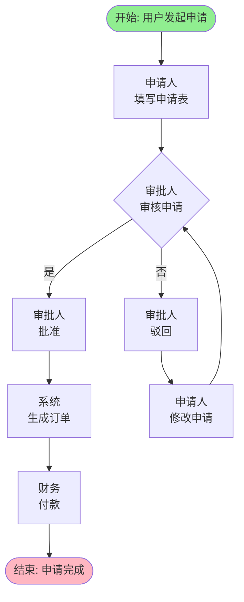

# m-fe-business-process — 业务流程分析(TP专用)

> 通过多轮对话发现端到端业务流程,逐活动深挖四维度追问(角色/输入/输出/规则/异常),生成Mermaid流程图、活动明细、角色清单、输入输出表格、业务规则列表、外部依赖记录。回溯原始需求矩阵查找流程步骤线索。

## 目标

**目标说明**

挖掘完整端到端业务流程,逐活动深挖四维度(角色、输入信息、输出结果、业务规则)和异常处理,识别外部系统依赖,生成Mermaid流程图和结构化活动明细。

**输出物**

- Mermaid流程图(flowchart TD格式,包含开始/结束标记、决策节点、角色标注、样式标记)
- 活动总览表格(序号、活动名称、所属阶段、执行角色、触发条件、操作方式)
- 活动明细(每个活动含:所属阶段、执行角色、触发条件、输入信息、操作内容、业务规则、输出结果、异常处理、时限要求)
- 角色清单表格(角色名称+职责说明)
- 输入信息表格(输入编号、输入名称、输入来源、数据内容、来源类型内部/外部、更新频率)
- 输出结果表格(输出编号、输出名称、输出类型、目标系统、数据内容、触发后续动作)
- 业务规则列表(规则编号、规则类型、规则名称、规则描述、适用场景)
- 外部依赖记录(活动步骤、外部系统名称、接口用途、依赖类型数据依赖/服务依赖、同步方式、不可用影响)

**成功标准**

- 流程图完整覆盖端到端流程(从发起到完成)
- Mermaid语法正确(开始/结束标记、决策节点、角色标注)
- 每个活动已逐维度追问(角色/输入/输出/规则/异常)
- 外部依赖已记录(数据依赖和服务依赖)
- 每2-3个活动做完小结,用户确认后才继续

---

## 前置条件

**依赖要素**

| 依赖要素 element_id | 原因 |
|----------------------|------|
| requirement-type | 需求类型已判定为TP,才执行本要素 |
| original-requirement | 原始需求矩阵可能包含流程步骤线索 |

**必要输入**

- 原始需求关键信息提取矩阵(可能包含流程步骤线索)
- 用户描述端到端流程阶段

---

## 约束

### 格式规范

| standard_id | 规范说明 |
|-------------|---------|
| mermaid-flowchart | 业务流程 Mermaid flowchart TD 格式规范 |

### 设计约束

| 约束编号 | 级别 | 规则 | 验证方法 |
|----------|------|------|---------|
| `DC-PROC-001` | MUST | 必须生成Mermaid流程图,格式为flowchart TD | 检查输出骨架是否包含flowchart TD语法 |
| `DC-PROC-002` | MUST | 流程图必须包含开始标记([节点名])、结束标记([节点名])、决策节点({决策描述})、角色标注([角色\n操作]) | 检查Mermaid语法正确性 |
| `DC-PROC-003` | MUST | 必须逐活动追问四维度(角色/输入/输出/规则/异常),禁止跳过任何维度 | 检查活动明细是否包含6个维度的完整内容 |
| `DC-PROC-004` | MUST | 每2-3个活动做完必须做小结,用户确认后才继续 | 检查对话记录是否包含小结和确认环节 |
| `DC-PROC-005` | MUST | 必须记录外部依赖(数据依赖和服务依赖),包含活动步骤、系统名称、依赖类型、不可用影响 | 检查输出骨架是否包含外部依赖记录表格 |
| `DC-PROC-006` | MUST | 必须回溯原始需求矩阵查找流程步骤线索 | 检查执行步骤是否先读取矩阵 |

---

## 执行步骤

**Step 1: 回溯原始需求矩阵查找流程线索** `[自动]`

读取 `original-requirement` 要素生成的关键信息提取矩阵:
- 查找"业务流程"行的"流程步骤线索"、"角色线索"
- 若矩阵中已包含相关线索,跳过部分追问,直接进入针对性询问

**Step 2: 引导开场(端到端流程)** `[交互]`

> "我们先把这个业务完整过程走一遍——从最开始谁来发起,到最后这件事算完成,中间经过哪些步骤?
>
> 你可以用'先...然后...最后...'的方式描述,不用急着说细节,先把大框架说清楚。"

让用户先描述宏观流程阶段,不打断叙述流。

**Step 3: 整理流程阶段列表** `[自动]`

将用户描述的流程整理成阶段列表:

> "我理解的流程是这样的:
> 1. 阶段一: {阶段名称}
> 2. 阶段二: {阶段名称}
> 3. 阶段三: {阶段名称}
> ...
>
> 这个顺序对吗?"

用户确认后,进入逐活动追问。

**Step 4: 主动探测常见遗漏点** `[交互]`

追问常见遗漏环节:

- 流程发起前:"发起前有没有申请/预处理/准入环节?"
- 流程完成后:"完成后有没有通知/归档/对账/评价环节?"
- 人工介入节点:"哪些环节必须人工介入?"
- 并行分支:"有没有同时进行的步骤?"

若用户提到遗漏点,补充到阶段列表。

**Step 5: 生成Mermaid流程图框架** `[自动]`

生成初步流程图框架:

```mermaid
flowchart TD
    Start([开始: {流程发起}])
    --> Phase1[{阶段一}]
    --> Phase2[{阶段二}]
    --> End([结束: {流程完成}])

    style Start fill:#90EE90
    style End fill:#FFB6C1
```

展示给用户确认整体框架。

**Step 6: 逐活动深挖四维度追问** `[交互]` ⚠️ **核心环节**

对流程中每个活动逐一追问四个维度。

---

### **维度1: 角色维度追问**

> "**[{活动名称}]** 这一步是谁做的?"

追问细节:
- "是系统自动触发还是人工操作?"
- "同一步骤是否有多个角色参与?(如经办+复核)"
- "角色是固定的还是根据条件动态分配?(如金额超过某额度自动指派更高级别处理人)"
- "是否存在代理/委托场景?(A不在时B可代为处理)"

记录角色清单:
- 角色类型: 用户角色 / 系统角色 / 外部系统角色
- 若为动态分配: 记录分配规则(如"金额>10万自动流转到部门经理")

---

### **维度2: 输入维度追问**

> "做这一步之前需要哪些信息?"

追问细节:
- "信息来源是什么?"
  - 人工填写: 用户手动填写
  - 系统自动带出: 本系统已有数据(用户之前填写/系统计算生成)
  - 上一步传递: 前序活动输出
  - 外部系统获取: 从哪个外部系统获取?

- "哪些字段必填哪些选填?"

- "**若涉及外部系统追问**:"
  - "这个数据是实时查询还是批量同步?"
  - "数据新鲜度有要求吗(最新的/T+1可接受)?"
  - "外部系统不可用时这个活动还能继续吗?"

**记录外部依赖(数据依赖)**:

若涉及外部系统获取数据,记录:

| 活动步骤 | 外部系统名称 | 数据内容 | 依赖类型 | 同步方式 | 不可用影响 |
|----------|-------------|---------|---------|---------|---------|
| {活动名称} | {系统名称} | {数据字段} | 数据依赖 | {实时查询/批量同步} | {阻断流程/记录日志/降级处理} |

---

### **维度3: 输出维度追问**

> "这一步完成后产生什么结果?"

追问细节:
- "输出类型是什么?"
  - 内部输出: 记录创建 / 状态变更 / 通知相关人员(短信/邮件/系统消息) / 成为后续步骤输入
  - 外部输出: 触发外部系统

- "**若触发外部系统追问**:"
  - "需要调用哪个外部系统的接口?"
  - "调用失败怎么处理?(阻断流程/重试/记录日志)"

**记录外部依赖(服务依赖)**:

若涉及调用外部系统接口,记录:

| 活动步骤 | 外部系统名称 | 接口用途 | 依赖类型 | 失败处理方式 |
|----------|-------------|---------|---------|-------------|
| {活动名称} | {系统名称} | {接口用途} | 服务依赖 | {阻断流程/重试/记录日志} |

---

### **维度4: 业务规则维度追问**

> "这一步有什么限制条件或计算逻辑?"

逐一探测规则类型:

| 规则类型 | 追问示例 |
|---------|---------|
| **准入规则** | "什么情况下不能发起或会被拦截?" |
| **路由规则** | "根据什么条件决定走哪条路径?(如金额大小决定审批层级)" |
| **计算规则** | "金额/数量/日期怎么算?" |
| **校验规则** | "提交前做哪些检查?(如金额不能为负、日期不能早于今天)" |
| **时限规则** | "这一步有时间要求吗?超时会怎样?" |
| **权限规则** | "谁可以看/改/撤销这一步?" |
| **额度限制** | "是否有单次上限/下限/累计额度?" |

每探测到一个规则,立即记录:

| 规则编号 | 规则类型 | 规则名称 | 规则描述 | 适用场景 |
|----------|---------|---------|---------|---------|
| BR-001 | 准入规则 | {规则名称} | {规则描述} | {适用活动} |

---

### **维度5: 异常处理追问**

> "出错了怎么办?"

追问具体场景:

| 异常场景 | 追问示例 |
|---------|---------|
| **撤销/回退** | "已提交的内容能撤销吗?谁能撤?撤到哪一步?" |
| **驳回/退回** | "审批不通过是直接拒绝还是退回修改?" |
| **超时处理** | "长时间无人处理,系统自动做还是人工介入?" |
| **信息缺失/有误** | "找不到数据或有误的业务怎么处理?" |
| **重复提交** | "同一件事重复发起系统如何识别处理?" |
| **并发冲突** | "两人同时处理同一环节怎么处理?" |
| **补录/追单** | "线下先完成再补录系统怎么处理?" |

每探测到一个异常场景,立即记录到活动明细的"异常处理"字段。

---

**Step 7: 每2-3个活动做小结** `[交互]` ⚠️ **强制环节**

每完成2-3个活动挖掘后,暂停并做小结:

> "我来整理一下刚才聊的几个活动:
>
> **[{活动名称1}]**:
> - 执行角色: {角色}
> - 输入信息: {输入项}
> - 业务规则: {规则描述}
> - 输出结果: {输出项},状态变更[{旧状态}→{新状态}]
> - 界面呈现: {对应页面},按钮[{主要操作}]
> - 异常情况: {异常处理}
>
> **[{活动名称2}]**:
> - ...
>
> 这个整理是否准确?"

用户确认后,继续下一个活动追问。

**若用户提出修正**:
- 更新活动明细
- 再次小结并确认

---

**Step 8: 生成Mermaid详细流程图** `[自动]`

基于活动明细,生成完整Mermaid流程图:



**关键要求**:
- 开始节点格式: `Start([开始: {发起描述}])`
- 结束节点格式: `End([结束: {完成描述}])`
- 决策节点格式: `Decision1{决策描述}`
- 角色标注: `Act1[角色\n操作]`
- 分支条件: `Decision1 -- 是 -->` / `Decision1 -- 否 -->`
- 样式标记: `style Start fill:#90EE90` / `style End fill:#FFB6C1`

---

**Step 9: 生成活动总览表格** `[自动]`

汇总所有活动:

| 序号 | 活动名称 | 所属阶段 | 执行角色 | 触发条件 | 操作方式 |
|------|---------|---------|---------|---------|---------|
| ACT-001 | {活动名称} | {阶段} | {角色} | {触发条件} | {人工操作/系统自动} |

---

**Step 10: 生成角色清单表格** `[自动]`

从活动明细提取执行角色:

| 角色名称 | 角色类型 | 职责说明 |
|---------|---------|---------|
| {角色名称} | 用户角色/系统角色/外部系统角色 | {职责描述} |

---

**Step 11: 生成输入信息表格** `[自动]`

从活动明细的输入信息字段提取:

| 输入编号 | 输入名称 | 输入来源 | 数据内容 | 来源类型 | 更新频率 |
|---------|---------|---------|---------|---------|---------|
| IN-001 | {输入名称} | {来源系统} | {数据字段} | 内部/外部 | {实时/T+1} |

---

**Step 12: 生成输出结果表格** `[自动]`

从活动明细的输出结果字段提取:

| 输出编号 | 输出名称 | 输出类型 | 目标系统 | 数据内容 | 触发后续动作 |
|---------|---------|---------|---------|---------|-------------|
| OUT-001 | {输出名称} | 内部输出/外部输出 | {目标系统} | {数据内容} | {触发动作} |

---

**Step 13: 生成业务规则列表** `[自动]`

从活动明细的业务规则字段提取:

| 规则编号 | 规则类型 | 规则名称 | 规则描述 | 适用场景 |
|----------|---------|---------|---------|---------|
| BR-001 | 准入规则 | {规则名称} | {规则描述} | {适用活动} |

---

**Step 14: 生成外部依赖记录** `[自动]`

汇总所有外部依赖:

| 活动步骤 | 外部系统名称 | 数据内容/接口用途 | 依赖类型 | 同步方式/失败处理 | 不可用影响 |
|----------|-------------|------------------|---------|------------------|-----------|
| {活动名称} | {系统名称} | {数据内容} | 数据依赖 | {实时查询} | {阻断流程} |
| {活动名称} | {系统名称} | {接口用途} | 服务依赖 | {重试机制} | {记录日志} |

---

**Step 15: 用户最终确认** `[交互]`

整理完整业务流程内容并展示:

> "我已经整理好了完整的业务流程分析,包含:
> - 流程图(端到端流程)
> - 活动明细(每个活动的角色/输入/输出/规则/异常)
> - 角色清单、输入输出表格、业务规则列表
> - 外部依赖记录(数据依赖和服务依赖)
>
> 这个信息是否准确?"

强制获得明确确认。

---

**Step 16: 写入文档** `[自动]`

---

## 引导开场(对话模式)

我们先把这个业务完整过程走一遍——从最开始谁来发起,到最后这件事算完成,中间经过哪些步骤?

你可以用"先...然后...最后..."的方式描述,不用急着说细节,先把大框架说清楚。

---

## 追问维度

### 端到端流程框架

- 流程阶段:"先...然后...最后..."框架
- 常见遗漏点:发起前环节、完成后环节、人工介入节点、并行分支

### 逐活动深挖(四维度)

- **角色维度**: 谁做的?系统自动/人工操作?多角色参与?动态分配?代理/委托?
- **输入维度**: 需要哪些信息?来源(人工填写/系统带出/上一步传递/外部系统)?必填/选填?外部系统数据实时性?
- **输出维度**: 产生什么结果?内部输出(记录创建/状态变更/通知)/外部输出(触发外部系统)?调用失败处理?
- **业务规则维度**: 准入规则/路由规则/计算规则/校验规则/时限规则/权限规则/额度限制
- **异常处理维度**: 撤销/回退/驳回/超时/信息缺失/重复提交/并发冲突/补录追单

---

## 完整性检查

检查必要信息是否完整:
- [ ] 流程图已生成(包含开始/结束标记、决策节点、角色标注)
- [ ] 每个活动已逐一追问四个维度
- [ ] 每2-3个活动已做小结并获得用户确认
- [ ] 角色清单已生成
- [ ] 输入输出表格已生成
- [ ] 业务规则列表已生成(至少包含规则的编号、类型、描述)
- [ ] 外部依赖已记录(数据依赖和服务依赖)
- [ ] Mermaid语法正确(节点格式、分支条件、样式标记)

---

## 用户确认

整理业务流程内容并展示,询问:"这个信息是否准确?"

强制获得明确确认。

**特别要求**:
- 每2-3个活动做完必须做小结并获得用户确认后才继续
- 流程图必须符合Mermaid语法规范

---

## 强制质量检查

- ✅ 流程图已生成且语法正确
- ✅ 每个活动已逐维度追问(角色/输入/输出/规则/异常)
- ✅ 外部依赖已记录(包含数据依赖和服务依赖)
- ✅ 业务规则列表已生成(规则编号、类型、描述完整)
- ✅ 无占位符

---

## 输出骨架

```markdown
## 业务流程分析(TP专用)

### 业务流程图

```mermaid
flowchart TD
    Start([开始: {流程发起}])
    --> Act1[角色1\n操作1]
    --> Decision1{决策节点1}
    Decision1 -- 是 --> Act2[角色2\n操作2]
    Decision1 -- 否 --> Act3[角色3\n操作3]
    Act2 --> End([结束: {流程完成}])
    Act3 --> Act4[角色4\n操作4]
    Act4 --> Decision1

    style Start fill:#90EE90
    style End fill:#FFB6C1
```

### 活动总览

| 序号 | 活动名称 | 所属阶段 | 执行角色 | 触发条件 | 操作方式 |
|------|---------|---------|---------|---------|---------|
| ACT-001 | {活动名称} | {阶段} | {角色} | {触发条件} | {人工操作/系统自动} |

### 活动明细

**ACT-001: {活动名称}**

- 所属阶段: {阶段}
- 执行角色: {角色}
- 触发条件: {触发条件}
- 输入信息: {输入项列表}
- 操作内容: {操作描述}
- 业务规则: {规则编号列表}
- 输出结果: {输出项},状态变更[{旧状态}→{新状态}]
- 异常处理: {异常场景处理措施}
- 时限要求: {时限描述}

(重复每个活动)

### 角色清单

| 角色名称 | 角色类型 | 职责说明 |
|---------|---------|---------|
| {角色名称} | 用户角色/系统角色/外部系统角色 | {职责描述} |

### 输入信息

| 输入编号 | 输入名称 | 输入来源 | 数据内容 | 来源类型 | 更新频率 |
|---------|---------|---------|---------|---------|---------|
| IN-001 | {输入名称} | {来源系统} | {数据字段} | 内部/外部 | {实时/T+1} |

### 输出结果

| 输出编号 | 输出名称 | 输出类型 | 目标系统 | 数据内容 | 触发后续动作 |
|---------|---------|---------|---------|---------|-------------|
| OUT-001 | {输出名称} | 内部输出/外部输出 | {目标系统} | {数据内容} | {触发动作} |

### 业务规则

| 规则编号 | 规则类型 | 规则名称 | 规则描述 | 适用场景 |
|----------|---------|---------|---------|---------|
| BR-001 | 准入规则 | {规则名称} | {规则描述} | {适用活动} |

### 外部依赖记录

| 活动步骤 | 外部系统名称 | 数据内容/接口用途 | 依赖类型 | 同步方式/失败处理 | 不可用影响 |
|----------|-------------|------------------|---------|------------------|-----------|
| {活动名称} | {系统名称} | {数据内容} | 数据依赖 | {实时查询} | {阻断流程} |
| {活动名称} | {系统名称} | {接口用途} | 服务依赖 | {重试机制} | {记录日志} |

> 注:本要素采用逐活动深挖四维度追问方法,每2-3个活动做完小结,确保用户理解并确认每个活动细节。外部依赖记录包含数据依赖和服务依赖,用于后续架构设计参考。
```