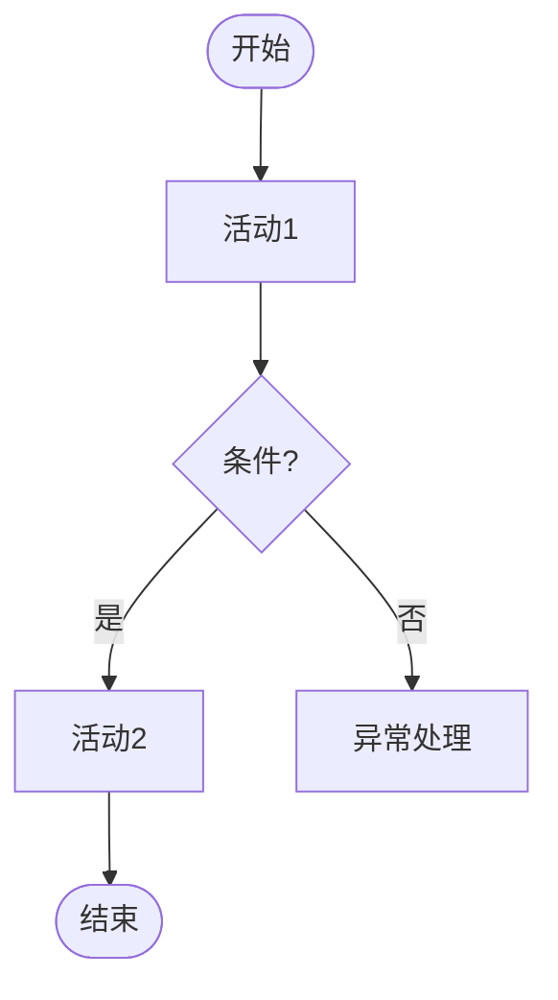

# business-process — 业务流程图规范（mermaid-flowchart）

## 适用范围
BusinessProcess 要素的 flow_diagram_mermaid 字段。

## 规则定义
### 图类型
- 必须使用 `flowchart TD`（自上而下）。
### 节点
- 每个 activities[] 活动对应一个流程节点，节点文案 = 活动 name。
- 起点用 `([开始])`，终点用 `([结束])`，判断用菱形 `{条件}`。
### 连线
- 顺序活动用 `-->`；条件分支在连线上标注 `-->|条件|`。
- 异常分支（activities[].exceptions）必须在图中体现为分支或旁路。
### 角色泳道（可选）
- 如需体现角色，可用 `subgraph 角色名 ... end` 分组。

## 禁止事项
- 禁止出现无节点/无连线的空图。
- 禁止图中活动与 activities[] 不一致（多、漏、改名）。
- 禁止使用未在 activities 中定义的节点。

## 验证检查点
- [ ] 图类型为 flowchart TD
- [ ] 节点集合 == activities 活动集合（无多无漏）
- [ ] 每个条件分支有标注
- [ ] exceptions 已在图中体现
- [ ] 无空节点/空连线

## 输出骨架

