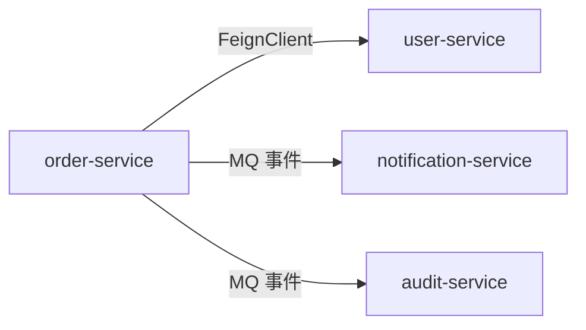
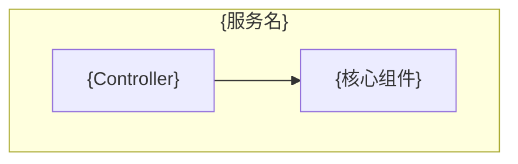

# arch-microservice

**规范分段**：`arch-microservice`

### 规范条文

# 微服务架构规范（TDD 第1章 §1.3）

> **仅在 build 模式下输出。**

## 1.3 微服务架构规范

### 服务划分原则

- 按业务域划分（Domain-Driven Design），不按技术职责划分
- 单一职责：每个服务只负责一个业务域的核心能力
- 避免循环依赖：服务 A 调用 B，B 不可再调用 A（通过事件解耦）
- 合适的服务粒度：避免过度拆分（纳米服务）和欠拆分（单体）

### 接口协议

| 场景 | 协议 | 实现 |
|------|------|------|
| 服务内部调用 | REST over HTTP | Spring Cloud Feign |
| 对外暴露接口 | REST over HTTP | Spring MVC + API Gateway |
| 异步事件驱动 | Message Queue | RocketMQ |

### 服务治理

| 治理能力 | 实现方案 | 关键配置 |
|---------|---------|---------|
| 服务注册与发现 | Nacos | 心跳间隔 5s，健康检查 15s |
| 配置中心 | Nacos Config | 命名空间隔离（dev/test/prod）|
| 限流 | Sentinel / 网关层限流 | QPS 阈值在 config/app-config.md 定义 |
| 熔断 | Resilience4j | 失败率 50% 触发，熔断 30s |
| 链路追踪 | SkyWalking / OpenTelemetry | TraceId 全链路透传 |

---

## 项目规范摘录（`规范/` 目录 · IT 设计文档 §2）

> 来源：`{WORKSPACE_ROOT}/规范/examples/it_design_doc.md`「需求上下文 — 架构组件分析」。

- 须识别**内部模块、外部服务、第三方 SDK** 及组件间**依赖与接口**。
- 建议输出 **Mermaid `graph`** 展示服务边界与调用关系（同步 FeignClient 与异步 MQ 分别标注）。
- 服务治理关键配置（限流 QPS 阈值、熔断策略）须在本要素中声明，具体值引用 `config/app-config.md`。

## 输出骨架
# 微服务架构设计（TDD 第1章 §1.3）

> **仅 build 模式输出。** 本文件确定后，后续版本迭代不重新生成，变更需走架构评审。

---

## 1.3 微服务架构

### 服务边界划分

| 业务域 | 服务名 | 核心职责 | 数据库 |
|--------|--------|---------|--------|
| 订单域 | `order-service` | 订单生命周期管理 | `db_order` |
| 用户域 | `user-service` | 用户身份与组织架构 | `db_user` |

### 服务依赖关系

### 接口协议约定

| 场景 | 协议 | 示例 |
|------|------|------|
| 同步服务调用 | REST / FeignClient | `OrderClient.getOrder()` |
| 异步事件驱动 | RocketMQ | `order-event / ORDER_APPROVED` |

### 服务治理配置

| 治理能力 | 配置值 |
|---------|--------|
| 服务注册 Nacos 心跳 | 5s |
| 限流阈值（网关层）| {N} QPS（具体见 config/app-config.md）|
| 熔断失败率 | 50% |
| 熔断持续时间 | 30s |
| 链路追踪 | SkyWalking，TraceId via MDC 全链路透传 |

---

## 架构组件分析图（模板 · `规范/examples/it_design_doc.md` §2）

> 与「服务依赖关系」图互补：侧重**子模块/控制器/仓储/外部 SDK** 粒度，可用 `flowchart TD` 表达。

