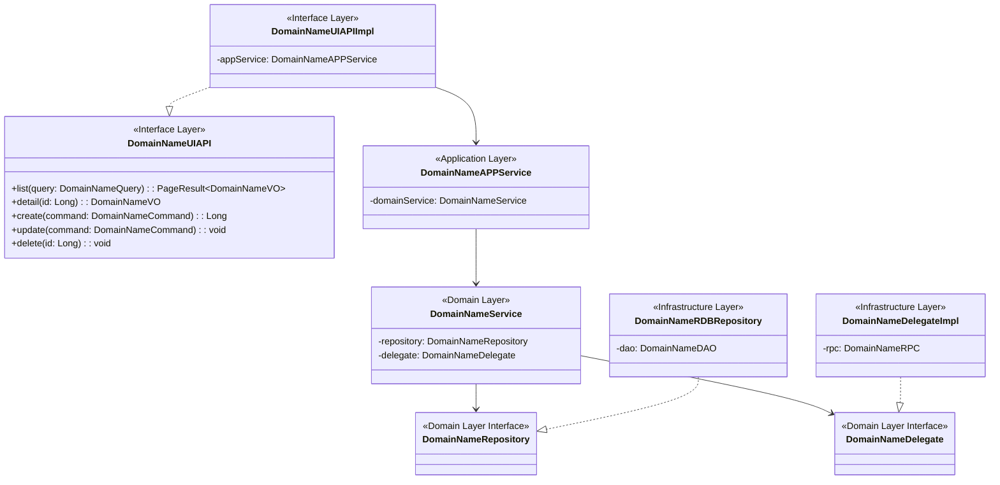

# be-class

**规范分段**：`be-class`

### 规范条文

# DDD 类设计规范

## DDD 四层架构职责

### Interface Layer（接口层）
**职责**: 接收HTTP请求、参数校验、VO/DTO转换、调用应用服务
**核心类**: UIAPI接口 + UIAPIImpl实现、DTO、Converter
**禁止事项**: 
- 禁止包含业务逻辑
- 禁止直接调用Domain层
- 禁止DTO进入Domain层

### Application Layer（应用层）
**职责**: 编排Domain服务、事务边界、跨领域协调
**核心类**: APPService
**禁止事项**:
- 禁止包含核心业务逻辑（业务逻辑在Domain层）
- 禁止直接访问数据库

### Domain Layer（领域层）
**职责**: 核心业务逻辑、领域模型、业务规则
**核心类**: Service、VO、Query、Command、Repository接口、Delegate接口、ImportConsumer、ExportConsumer、Enum
**禁止事项**:
- 禁止依赖任何外部技术框架（Spring、MyBatis等）
- 禁止直接操作数据库

### Infrastructure Layer（基础设施层）
**职责**: 实现Domain层接口、数据库访问、外部系统集成
**核心类**: PO、RDBRepository、DAO、DelegateImpl、RPC、Converter
**禁止事项**:
- 禁止包含业务逻辑
- 禁止被Domain层直接依赖

## 命名规范

### Interface Layer
```
- API接口: {DomainName}UIAPI
- API实现: {DomainName}UIAPIImpl
- DTO: {DomainName}DTO
- 转换器: {DomainName}VOToDTOConverter, {DomainName}DTOToQueryConverter
```

### Application Layer
```
- 应用服务: {DomainName}APPService
```

### Domain Layer
```
- 值对象: {DomainName}VO
- 领域服务: {DomainName}Service
- 仓储接口: {DomainName}Repository
- 查询对象: {DomainName}Query
- 命令对象: {DomainName}Command
- 委托接口: {DomainName}Delegate
- 导入Consumer: {业务对象}ImportConsumer
- 导出Consumer: {业务域}{维度}ExportConsumer
- 枚举: {业务含义}Enum / {业务含义}Mapping
```

#### 导入导出类

> Excel 导入/导出 Consumer 归属 **Domain Layer**，封装批量数据处理业务逻辑；通过 Jalor 框架 Bean 前缀（`IExcelDataConsumer` / `IExcelDataProvider`）注册，须使用 `@Component` / `@Service` 注解。

##### ExportConsumer 编写规范

| 要素 | 规则 | 示例 |
|------|------|------|
| 类名 | `{业务域}{维度}ExportConsumer`，语义化长命名 | `MatchResultProjectExportConsumer` |
| Bean 注册 | `@Service("IExcelDataProvider.{ClassName}")`，遵循 Jalor 框架前缀约定 | `@Service("IExcelDataProvider.MatchResultProjectExportConsumer")` |
| 实现接口 | `IExcelDataProvider`（同步导出）；需一站式推送/生命周期回调时继承 `BaseExportExcelProvider` | — |
| 核心方法 | 仅实现 `getBatchData()`，逻辑极简 | 反序列化 Query → 委托 Repository 查询 → 返回 VO 列表 |

```java
@Service("IExcelDataProvider.MatchResultProjectExportConsumer")
public class MatchResultProjectExportConsumer implements IExcelDataProvider {
    // 仅实现 getBatchData()：Query 反序列化 → Repository 查询 → 返回 VO 列表
}
```

##### ImportConsumer 编写规范

| 要素 | 规则 | 示例 |
|------|------|------|
| 类名 | `{业务对象}ImportConsumer` | `ProjectPlanImportConsumer` |
| Bean 注册 | `@Component("IExcelDataConsumer.{业务标识}Import")` | `@Component("IExcelDataConsumer.projectPlanImport")` |
| 基类 | 继承 `BaseImportExcelProvider` | — |

```java
@Slf4j
@Component("IExcelDataConsumer.projectPlanImport")
public class ProjectPlanImportConsumer extends BaseImportExcelProvider {
    // begin() / useBatchData() / end() / fail()
}
```

### Infrastructure Layer
```
- 持久化对象: {DomainName}PO
- 仓储实现: {DomainName}RDBRepository
- MyBatis映射: {DomainName}DAO
- 转换器: {DomainName}POToVOConverter, {DomainName}QueryToPOConverter, {DomainName}CommandToPOConverter
- 委托实现: {DomainName}DelegateImpl
- RPC调用: {DomainName}RPC
```

## 枚举类规范

枚举类归属 **Domain Layer**，用于表达领域内的固定取值与业务码映射。

| 要素 | 规则 |
|------|------|
| 常量命名 | 全大写下划线分隔（如 `AUDIT_EXPERT_EXPERIENCE`） |
| 关联业务码 | 枚举项通过构造函数绑定业务码 |
| 构造方法 | `private`（枚举默认），赋值给字段 |
| 访问器 | 提供 `getCode()` getter |

**示例**

```java
public enum TagNameMapping {
    AUDIT_PROJECT_TAG(1),
    AUDIT_EXPERT_EXPERIENCE(2);

    private Integer code;

    TagNameMapping(Integer code) {
        this.code = code;
    }

    public Integer getCode() {
        return code;
    }
}
```

## 依赖关系规范

### 严格分层依赖
```
Interface Layer → Application Layer → Domain Layer ← Infrastructure Layer
```

**关键原则**:
1. Infrastructure层**实现**Domain层接口，不是反向依赖
2. Domain层完全不依赖Infrastructure层技术实现
3. Application层依赖Domain层接口，不依赖Infrastructure实现
4. Interface层依赖Application层，通过DTO隔离外部协议

### Interface Layer 依赖
- `facade.impl` → Application Layer.{DomainName}APPService
- `converter` → Domain Layer.{DomainName}VO, Interface Layer.{DomainName}DTO

### Application Layer 依赖
- `{DomainName}APPService` → Domain Layer.{DomainName}Service

### Domain Layer 依赖
- `service` → Domain Layer.{DomainName}Repository
- `service` → Domain Layer.{DomainName}Delegate
- `import/export consumer` → Domain Layer.{DomainName}Repository、Domain Layer.{DomainName}Service
- `delegate` (接口定义) ← Infrastructure Layer.{DomainName}DelegateImpl

### Infrastructure Layer 依赖
- `repository` → Domain Layer.{DomainName}Repository (实现接口)
- `repository` → Infrastructure Layer.{DomainName}DAO
- `delegate.impl` → Domain Layer.{DomainName}Delegate (实现接口)
- `delegate.impl` → Infrastructure Layer.{DomainName}RPC

## 对象转换规范

### 转换器位置
- **Interface层**: VO ↔ DTO 转换
- **Infrastructure层**: PO ↔ VO, PO ↔ Query, PO ↔ Command 转换

### 转换规则
- 使用 MapStruct 或自定义转换器，禁止手动 get/set
- 转换器命名: `{Source}To{Target}Converter`
- Domain层的VO对象**不**使用MapStruct，保持纯净

## 设计模式指导

| 场景 | 推荐模式 | DDD层级应用 |
|------|---------|------------|
| 多种实现策略 | 策略模式 + Domain Delegate | Domain层定义接口，Infrastructure层多实现 |
| 复杂对象构建 | Builder 模式 | Domain层VO构建 |
| 跨领域事件 | Domain Event | Domain层发布，Application层编排 |
| 外部系统集成 | 适配器模式（Delegate接口） | Domain层定义契约，Infrastructure层适配 |
| 数据持久化 | Repository模式 | Domain层定义接口，Infrastructure层实现 |

## 类规模与复杂度控制

- 单个类不超过 500 行
- 单个方法不超过 80 行，超出则提取私有方法
- Domain Service 方法数不超过 20 个，超出则按子域拆分
- Application Service 方法数不超过 15 个，超出则重新审视领域划分

## 依赖注入规范

- **Domain层**: 禁止使用Spring注解，保持技术中立；**例外**：Excel 导入/导出 Consumer 须使用 `@Component` / `@Service` 注册 Jalor 框架 Bean
- **Infrastructure层**: 统一使用构造器注入（`@RequiredArgsConstructor`）
- **Application层**: 使用构造器注入
- **Interface层**: 使用构造器注入
- **全项目禁止**: 字段注入（`@Autowired` 在字段上）

## DDD 架构验收标准

### 必须满足
1. ✅ Domain层没有任何Spring、MyBatis等技术框架依赖
2. ✅ Infrastructure层实现Domain层接口
3. ✅ Application层不包含核心业务逻辑
4. ✅ Interface层DTO不进入Domain层
5. ✅ 依赖方向: Interface → Application → Domain ← Infrastructure

### 禁止出现
1. ❌ Domain层依赖Infrastructure层实现
2. ❌ Domain层包含Spring注解（`@Service`, `@Component`等）；**例外**：Excel 导入/导出 Consumer 的 Bean 注册注解
3. ❌ Application层直接访问数据库
4. ❌ Interface层包含业务逻辑
5. ❌ DTO对象进入Domain层

---

## 项目规范摘录（`规范/` 目录 · IT 设计文档 §2 / §4.1）

> 来源：`{WORKSPACE_ROOT}/规范/examples/it_design_doc.md`。

- **数据结构分析**（如适用）：对新模型或接口定义给出类关系，建议 **Mermaid `classDiagram`**（或等价类图）。
- **代码列表（必选）**：列出本需求涉及的**全部**代码文件路径，并标明 **新增 / 修改**，避免遗漏。
- **DDD分层标注**：每个文件必须标注所属DDD层（Interface/Application/Domain/Infrastructure）。

## 输出骨架
# DDD 类设计

## DDD 四层包结构

```
{项目根}/
├── {项目}-interface/           # 接口层
│   └── src/main/java/com/{公司}/{系统}/{模块}/interfaces/{领域}/
│       ├── dto/                # 数据传输对象
│       │   └── {DomainName}DTO.java
│       ├── facade/             # API接口定义
│       │   ├── {DomainName}UIAPI.java
│       │   └── impl/           # API接口实现
│       │       └── {DomainName}UIAPIImpl.java
│       └── converter/          # VO/DTO转换器
│           ├── {DomainName}VOToDTOConverter.java
│           └── {DomainName}DTOToQueryConverter.java
├── {项目}-application/         # 应用层
│   └── src/main/java/com/{公司}/{系统}/{模块}/application/{领域}/
│       └── {DomainName}APPService.java
├── {项目}-domain/              # 领域层
│   └── src/main/java/com/{公司}/{系统}/{模块}/domain/{领域}/
│       ├── vo/                 # 值对象
│       │   └── {DomainName}VO.java
│       ├── service/            # 领域服务
│       │   └── {DomainName}Service.java
│       ├── repository/         # 仓储接口
│       │   └── {DomainName}Repository.java
│       ├── query/              # 查询对象
│       │   └── {DomainName}Query.java
│       ├── command/            # 命令对象
│       │   └── {DomainName}Command.java
│       └── delegate/           # 委托接口
│           └── {DomainName}Delegate.java
└── {项目}-infrastructure/      # 基础设施层
    └── src/main/java/com/{公司}/{系统}/{模块}/infrastructure/{领域}/
        ├── po/                 # 持久化对象
        │   └── {DomainName}PO.java
        ├── repository/         # 仓储实现
        │   └── {DomainName}RDBRepository.java
        ├── mapper/             # MyBatis映射
        │   └── {DomainName}DAO.java
        ├── converter/          # PO转换器
        │   ├── {DomainName}POToVOConverter.java
        │   ├── {DomainName}QueryToPOConverter.java
        │   └── {DomainName}CommandToPOConverter.java
        ├── delegate/           # 委托实现
        │   └── {DomainName}DelegateImpl.java
        ├── dto/                # RPC DTO
        │   └── {FunctionName}DTO.java
        └── rpc/                # RPC调用
            └── {DomainName}RPC.java
```

## 核心类清单

| 类名 | 所属层 | 职责说明 |
|------|--------|---------|
| {DomainName}UIAPI | Interface | API接口定义，声明REST端点 |
| {DomainName}UIAPIImpl | Interface | API实现，调用APPService，VO/DTO转换 |
| {DomainName}DTO | Interface | 前端数据传输对象 |
| {DomainName}APPService | Application | 应用服务，编排领域服务，事务边界 |
| {DomainName}Service | Domain | 领域服务，核心业务逻辑 |
| {DomainName}VO | Domain | 值对象，领域模型数据 |
| {DomainName}Query | Domain | 查询对象，查询条件封装 |
| {DomainName}Command | Domain | 命令对象，操作指令封装 |
| {DomainName}Repository | Domain | 仓储接口，数据访问契约 |
| {DomainName}Delegate | Domain | 委托接口，外部系统契约 |
| {DomainName}PO | Infrastructure | 持久化对象，数据库映射 |
| {DomainName}RDBRepository | Infrastructure | 仓储实现，实现Repository接口 |
| {DomainName}DAO | Infrastructure | MyBatis映射，SQL执行 |
| {DomainName}DelegateImpl | Infrastructure | 委托实现，实现Delegate接口 |
| {DomainName}RPC | Infrastructure | RPC调用，外部系统集成 |

---

## 代码文件清单（模板 · `规范/examples/it_design_doc.md` §4.1）

> **必选**：与「核心类清单」互补,按**文件路径**枚举,便于评审与测试范围核对。

| 序号 | 文件路径 | 类型（新增 / 修改） | 所属DDD层 |
|------|----------|---------------------|-----------|
| 1 | interface/{领域}/facade/{DomainName}UIAPI.java | 新增 | Interface |
| 2 | interface/{领域}/facade/impl/{DomainName}UIAPIImpl.java | 新增 | Interface |
| 3 | interface/{领域}/dto/{DomainName}DTO.java | 新增 | Interface |
| 4 | application/{领域}/{DomainName}APPService.java | 新增 | Application |
| 5 | domain/{领域}/service/{DomainName}Service.java | 新增 | Domain |
| 6 | domain/{领域}/vo/{DomainName}VO.java | 新增 | Domain |
| 7 | domain/{领域}/repository/{DomainName}Repository.java | 新增 | Domain |
| 8 | infrastructure/{领域}/po/{DomainName}PO.java | 新增 | Infrastructure |
| 9 | infrastructure/{领域}/repository/{DomainName}RDBRepository.java | 新增 | Infrastructure |

## 类图（DDD分层依赖）



## 关键对象设计

### {DomainName}DTO（Interface层）

| 字段名 | 类型 | 必填 | 校验规则 | 说明 |
|--------|------|------|---------|------|
| | | Y/N | @NotNull, @Size等 | 前端传输数据 |

### {DomainName}VO（Domain层）

| 字段名 | 类型 | 说明 |
|--------|------|------|
| | | 领域模型数据 |

### {DomainName}Command（Domain层）

| 字段名 | 类型 | 必填 | 说明 |
|--------|------|------|------|
| | | Y/N | 操作指令数据 |

### {DomainName}Query（Domain层）

| 字段名 | 类型 | 说明 |
|--------|------|------|
| | | 查询条件 |

## DDD依赖规则

```
Interface Layer → Application Layer → Domain Layer ← Infrastructure Layer
```

**关键规则**:
- Infrastructure层实现Domain层接口（Repository、Delegate）
- Domain层不依赖任何外部技术框架
- Application层编排Domain服务，不包含业务逻辑
- Interface层只负责HTTP协议适配