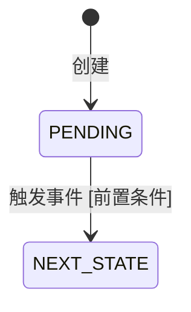

# data-cache

**规范分段**：`data-cache`

### 规范条文

# 缓存与实体流转设计规范（TDD 第2章 §2.2 / §2.3）

## 2.2 缓存设计规范

### Key 命名规范

- 结构 (Structure)
- Redis Key 由以下 5 个部分按顺序组成：

		租户序号后9位：用于标识具体的租户（Tenant）。
		模块缩写：标识业务所属的模块。
		缓存对象缩写：标识具体的业务数据对象。
		缓存子对象缩写（可选）：标识更细分的数据对象。
		开发环境：标识当前运行的环境（如开发、测试、生产）。

- 示例 (Example)
  888888888 + :iaone + :com + :kri + :alpha

		888888888：租户 ID 的后 9 位。
		:iaone：模块缩写（例如：IAONE 模块）。
		:com：缓存对象缩写（例如：Company 公司对象）。
		:kri：缓存子对象缩写（例如：KRI 指标对象）。
		:alpha：开发环境标识（例如：Alpha 测试环境）。

### 数据结构选型

| 场景 | 数据结构 | 说明 |
|------|---------|------|
| 单对象缓存 | String（JSON 序列化） | 简单，但无法部分更新 |
| 对象字段独立读写 | Hash | 可 HGET 单字段，减少序列化开销 |
| 有序集合 | ZSet | 排行榜、延迟队列 |
| 标记/集合去重 | Set | 用户已读消息、IP 黑名单 |
| 计数器 | String + INCR | 原子递增 |

### TTL 策略

- 热点数据 TTL 加随机抖动（±10%），避免缓存雪崩
- 空值缓存设置短 TTL（60s），避免缓存穿透
- 用户会话类数据：滑动 TTL（每次访问刷新）
- 配置/字典类数据：长 TTL（1~24 小时）+ 主动失效

### 一致性策略

| 模式 | 写顺序 | 适用场景 |
|------|--------|---------|
| Cache-Aside（旁路缓存） | 先写 DB，再删 Cache | 读多写少，强一致要求低 |
| Write-Through | 同步写 DB 和 Cache | 写频繁，不能接受缓存脏读 |
| 延迟双删 | 先删 Cache，写 DB，延迟再删 | 解决并发脏读问题 |

### 防穿透/击穿/雪崩

| 问题 | 方案 |
|------|------|
| 缓存穿透 | 空值缓存（60s TTL） + 布隆过滤器 |
| 缓存击穿 | 互斥锁（Redis SETNX）+ 逻辑过期 |
| 缓存雪崩 | TTL 随机抖动 + 多级缓存（本地 + Redis） |

---

## 2.3 实体流转关系规范

### 状态机设计原则

- 每个有状态实体必须有明确的状态枚举（存储为整数，注释说明含义）
- 状态转移必须通过方法调用触发，禁止直接修改 status 字段
- 每次状态变更记录时间戳和操作人（审计字段）
- 非法状态转移必须抛出业务异常，携带错误码

### 状态枚举命名

```java
public enum OrderStatus {
    PENDING(0, "待审批"),
    APPROVED(1, "已通过"),
    REJECTED(2, "已驳回"),
    CANCELLED(3, "已撤销");
}
```

- 枚举值存数据库使用 `int`，不存字符串（节省空间，字典翻译见 config/dict-error.md）
- 枚举类放 domain 包，不放 common/constant 包

### 状态转移流转图（Mermaid）

```
stateDiagram-v2
    [*] --> PENDING : 创建
    PENDING --> APPROVED : 审批通过 [approver != null]
    PENDING --> REJECTED : 审批驳回
    PENDING --> CANCELLED : 用户撤销
    APPROVED --> CANCELLED : 审批后撤销 [未执行]
```

### 触发事件约定

- 状态变更后必须发布领域事件（`OrderStatusChangedEvent`）
- 事件包含：entityId、fromStatus、toStatus、operator、timestamp
- 监听方（通知、日志、统计）订阅事件，不耦合到状态机核心逻辑

## 输出骨架
# 缓存与实体流转设计（TDD 第2章 §2.2 / §2.3）

<!--
变更标注约定：
- ✨ 新增：本次新增的缓存 Key 或状态机
- 🔧 修改：在现有基础上有变更
- ⏭️ 跳过：PRD 无对应需求，本次不输出
-->

## 变更概要

| 要素 | 动作 | 对象 | 说明 |
|------|------|------|------|
| 2.2 缓存 | ✨/🔧 | | |
| 2.3 状态机 | ✨/🔧 | | |

---

## 2.2 缓存设计

> ⏭️ **跳过说明**：{若 PRD 无缓存诉求，填写原因，删除以下内容}

### 缓存 Key 清单

| Key 模式 | 数据结构 | TTL | 动作 | 说明 |
|---------|---------|-----|------|------|
| `biz:{资源}:{id}` | String | {N}min | ✨/🔧 | |

### ✨/🔧 {Key 名称} — {业务用途}

> 🔧 **变更说明**：{仅修改时填写}

| 属性 | 值 |
|------|---|
| Key 模式 | `biz:{资源}:{id}` |
| 数据结构 | String / Hash / Set / ZSet |
| TTL | {N} 分钟 / 小时，{滑动/固定} |
| 序列化 | JSON（Jackson） |
| 一致性策略 | Cache-Aside（先写 DB，再删 Cache） |
| 空值缓存 | 是（TTL = 60s），防穿透 |
| 雪崩防护 | TTL 随机抖动 ±{N}% |

**缓存数据结构**（Hash 类型时填写）：

| Field | 类型 | 说明 |
|-------|------|------|
| | | |

**失效触发点**（主动删除的时机）：

| 触发操作 | 失效 Key | 说明 |
|---------|---------|------|
| {写操作/状态变更} | `biz:{资源}:{id}` | |

---

## 2.3 实体流转关系（状态机）

> ⏭️ **跳过说明**：{若实体无状态流转需求，填写原因，删除以下内容}

### 状态机清单

| 实体 | 状态字段 | 状态数 | 动作 | 说明 |
|------|---------|--------|------|------|
| | | | ✨/🔧 | |

### ✨/🔧 {实体名} 状态机

> 🔧 **变更说明**：{仅修改时填写，说明新增了哪些状态/转移，及原因}

**状态枚举**：

| 枚举值（int） | 枚举名 | 中文含义 | 说明 |
|------------|--------|---------|------|
| 0 | PENDING | 待处理 | 初始状态 |

**状态转移图**：



**状态转移规则**：

| 起始状态 | 目标状态 | 触发事件 | 前置条件 | 后置事件 | 处理方法 |
|---------|---------|---------|---------|---------|---------|
| PENDING | | | | | `{ServiceImpl}.{method}()` |

**后置事件定义**：

| 事件类名 | 触发状态 | 事件字段 | 说明 |
|---------|---------|---------|------|
| `{Entity}StatusChangedEvent` | | entityId, fromStatus, toStatus, operator | |

**对应数据库字段**：
- 表：`{table_name}`（见 data/data-table.md）
- 字段：`status`（TINYINT，字典翻译见 config/dict-error.md §{字典分类}）